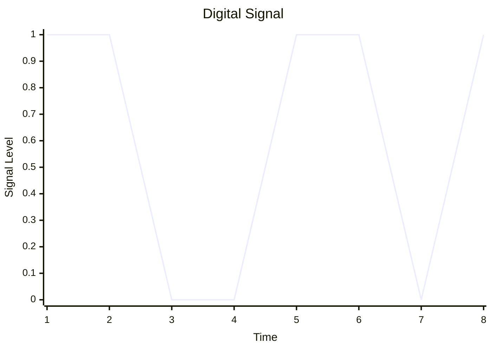
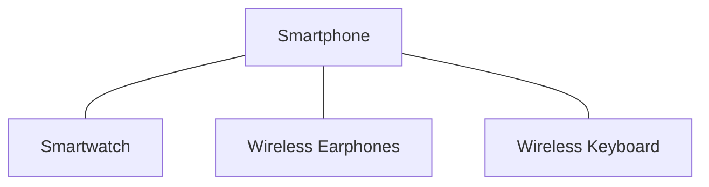
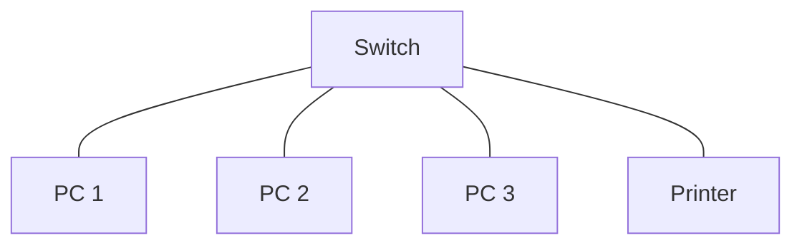
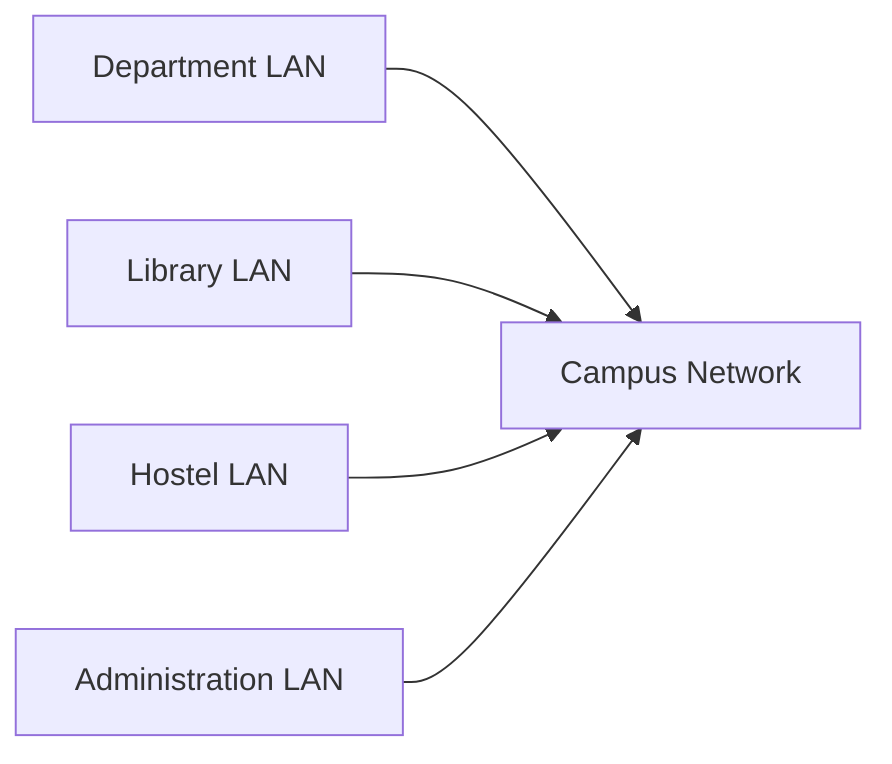
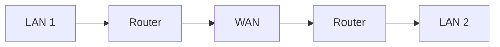
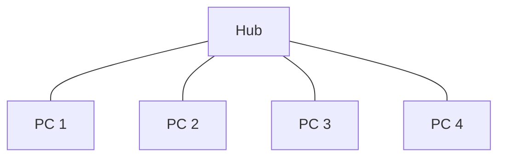
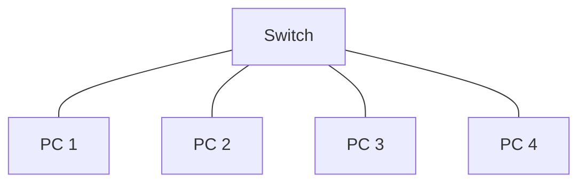
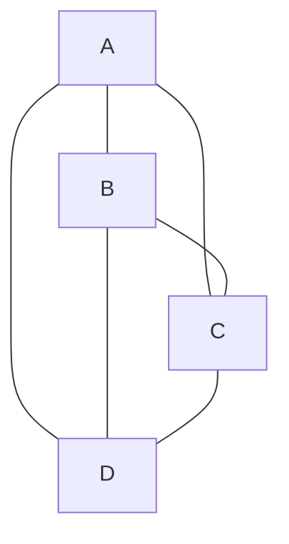
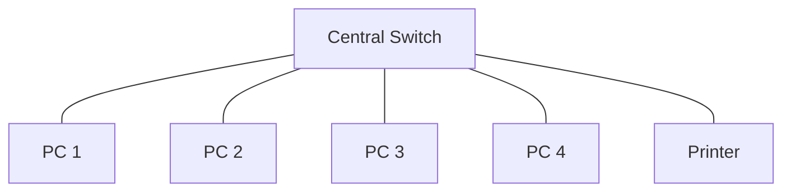
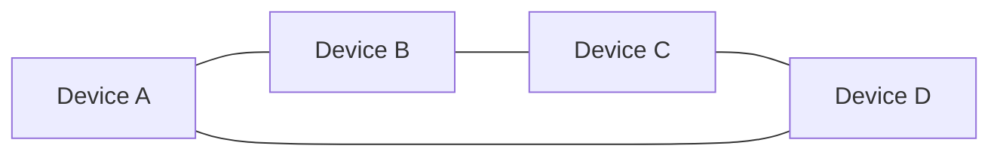

# Computer Networks - Assignment 1

**Subject:** Computer Networks
**Subject Code:** BCO 011A
**Semester:** III
**Total Marks:** 64

The assignment contains Sections A, B, and C as given in the uploaded question paper. 

---

# Section A

## Q1. Define hardware and software in the context of computer networks. Give suitable examples.

### Hardware

Hardware refers to the physical components used in a computer network. These components are responsible for connecting devices and enabling data communication.

**Examples:**

* Router
* Switch
* Hub
* Network Interface Card (NIC)
* Modem
* Ethernet cable
* Wireless Access Point

### Software

Software refers to the programs, protocols, and instructions used to control and manage network communication.

**Examples:**

* TCP/IP
* HTTP
* FTP
* Network operating systems
* Firewall software
* Network management software

Thus, network hardware provides the physical infrastructure, while network software controls and manages communication over that infrastructure.

---

## Q2. Explain the importance of protocols and standards in networking.

A **protocol** is a set of rules that defines how devices communicate and exchange data over a network.

A **standard** is an agreed specification that ensures different network devices and systems can communicate with each other.

### Importance of Protocols and Standards

1. **Reliable Communication:** Protocols define how data is transmitted and received.
2. **Interoperability:** Standards allow devices made by different manufacturers to work together.
3. **Error Handling:** Protocols can define methods for detecting and handling transmission errors.
4. **Security:** Network protocols can provide authentication, encryption, and secure communication.
5. **Data Organization:** Protocols define the format and structure of transmitted data.

### Examples

* TCP/IP - Internet communication
* HTTP - Web communication
* FTP - File transfer
* DNS - Domain name resolution
* Ethernet - LAN communication

Protocols and standards provide a common framework that makes computer networks reliable and interoperable.

---

## Q3. Differentiate between Analog and Digital Transmission with diagrams.

### Analog Transmission

Analog transmission uses a continuous signal whose characteristics vary continuously with time.

```mermaid
xychart-beta
    title "Analog Signal"
    x-axis "Time" [1, 2, 3, 4, 5, 6, 7, 8]
    y-axis "Amplitude" -2 --> 2
    line [0, 1, 1.7, 1, 0, -1, -1.7, -1]
```

### Digital Transmission

Digital transmission uses discrete signal levels to represent digital data, commonly using binary values 0 and 1.



### Difference

| Analog Transmission                                 | Digital Transmission                                             |
| --------------------------------------------------- | ---------------------------------------------------------------- |
| Uses continuous signals.                            | Uses discrete signals.                                           |
| Signal can vary continuously.                       | Signal represents discrete values.                               |
| More susceptible to noise and distortion.           | Generally more resistant to noise and can be regenerated.        |
| Used in traditional radio and telephone systems.    | Used extensively in computer networks and digital communication. |
| Signal quality may degrade gradually over distance. | Digital signals can be regenerated using repeaters.              |

---

## Q4. Discuss transmission impairments and their effects on data communication.

Transmission impairment is the degradation or alteration of a signal while it travels from the sender to the receiver.

The major types of transmission impairment are:

### 1. Attenuation

Attenuation is the loss of signal strength as the signal travels through the transmission medium.


**Effect:** The received signal becomes weaker.

### 2. Distortion

Distortion occurs when different components of a signal experience different delays or propagation characteristics.

**Effect:** The shape of the original signal changes at the receiver.

### 3. Noise

Noise is an unwanted signal that interferes with the original transmitted signal.

Common types include:

* Thermal noise
* Induced noise
* Crosstalk
* Impulse noise

**Effects of Noise:**

* Incorrect data reception
* Bit errors
* Loss of information
* Reduced communication quality

Transmission impairments can therefore reduce the reliability and quality of data communication.

---

## Q5. Explain the role of the Physical Layer in computer networks with real-life applications.

The **Physical Layer** is the lowest layer of the OSI model. It is responsible for transmitting raw bits over a physical communication medium.

### Main Functions

1. Transmits individual bits.
2. Defines electrical, optical, or radio signals.
3. Specifies physical transmission media.
4. Defines connectors and physical interfaces.
5. Defines data transmission rates.
6. Provides synchronization of transmitted bits.

### Real-Life Applications

* Ethernet cables connecting computers to switches.
* Fiber-optic cables used for high-speed Internet.
* Radio signals used for Wi-Fi communication.
* Physical interfaces used to connect networking devices.

The Physical Layer deals with the actual transmission of bits through cables, fiber, or wireless signals.

---

# Section B

## Q1. Describe Guided Transmission and Unguided Transmission Media.

Transmission media is the path through which data travels from a sender to a receiver. It is divided into **guided** and **unguided** transmission media. 

## 1. Guided Transmission Media

In guided transmission, signals travel through a physical medium such as a cable.

### Types of Guided Media

#### a. Twisted Pair Cable

It consists of two insulated copper wires twisted around each other.

**Types:**

* Unshielded Twisted Pair (UTP)
* Shielded Twisted Pair (STP)

**Applications:**

* Telephone networks
* Ethernet LANs

#### b. Coaxial Cable

A coaxial cable consists of a central conductor, insulating layer, metallic shielding, and outer protective covering.

**Applications:**

* Cable television
* Broadband communication

#### c. Optical Fiber

Optical fiber transmits information using light signals through glass or plastic fibers.

**Advantages:**

* High bandwidth
* Low signal loss
* Resistant to electromagnetic interference
* Suitable for long-distance communication

**Applications:**

* Internet backbone
* Long-distance communication
* High-speed networks

### Guided Transmission


---

## 2. Unguided Transmission Media

In unguided transmission, signals travel through air or space without a physical cable.

### Types of Unguided Media

#### a. Radio Waves

Radio waves are used for wireless communication over relatively large areas.

**Applications:**

* Radio broadcasting
* Wi-Fi
* Mobile communication

#### b. Microwaves

Microwaves are high-frequency electromagnetic waves used for wireless communication.

**Applications:**

* Satellite communication
* Cellular networks
* Long-distance wireless links

#### c. Infrared

Infrared communication uses infrared electromagnetic radiation for short-distance communication.

**Applications:**

* Television remote controls
* Short-range device communication

### Comparison

| Guided Media                                                               | Unguided Media                                 |
| -------------------------------------------------------------------------- | ---------------------------------------------- |
| Uses a physical transmission path.                                         | Uses air or space as the medium.               |
| Generally less affected by external interference, depending on the medium. | Can be affected by environmental interference. |
| Requires physical installation.                                            | Does not require physical cables.              |
| Examples: twisted pair, coaxial cable, optical fiber.                      | Examples: radio waves, microwaves, infrared.   |

---

## Q2. Compare Synchronous and Asynchronous Transmission with Examples.

### Synchronous Transmission

In synchronous transmission, data is transmitted as a continuous stream of blocks or frames. The sender and receiver operate using synchronized timing.


**Advantages:**

* Faster transmission
* Efficient for large amounts of data
* Less overhead

**Examples:**

* High-speed network communication
* Ethernet communication

### Asynchronous Transmission

In asynchronous transmission, data is transmitted character by character. Start and stop bits are generally used to identify individual characters.


**Advantages:**

* Simple implementation
* Suitable for irregular data transmission
* Does not require continuous synchronization

**Examples:**

* Keyboard communication
* Serial communication

### Difference

| Synchronous Transmission                              | Asynchronous Transmission                         |
| ----------------------------------------------------- | ------------------------------------------------- |
| Data is transmitted in blocks or frames.              | Data is transmitted character by character.       |
| Requires synchronization between sender and receiver. | Uses start and stop bits.                         |
| Faster and more efficient for continuous data.        | Suitable for irregular data transmission.         |
| Has less overhead.                                    | Has additional overhead from start and stop bits. |
| Suitable for high-speed communication.                | Suitable for simpler communication systems.       |

---

## Q3. Explain the Different Types of Computer Networks with Suitable Examples.

Computer networks can be classified according to their geographical coverage and purpose.

### 1. PAN - Personal Area Network

A Personal Area Network covers a very small area around an individual.

**Example:** Connecting a smartphone to a smartwatch using Bluetooth.



### 2. LAN - Local Area Network

A Local Area Network connects devices within a small geographical area such as a room, building, office, or laboratory.



**Example:** Computer network in a college laboratory.

### 3. CAN - Campus Area Network

A Campus Area Network connects multiple LANs within a campus or organization.

**Example:** A university network connecting different departments and buildings.



### 4. MAN - Metropolitan Area Network

A Metropolitan Area Network covers a city or metropolitan region.

**Example:** A network connecting different offices of an organization across a city.

### 5. WAN - Wide Area Network

A Wide Area Network covers a large geographical area such as countries or continents.

**Example:** The Internet.



### Comparison

| Network | Coverage                | Example                          |
| ------- | ----------------------- | -------------------------------- |
| PAN     | Personal/small area     | Bluetooth devices                |
| LAN     | Building or small area  | College laboratory               |
| CAN     | Campus                  | University network               |
| MAN     | City                    | City-wide organizational network |
| WAN     | Large geographical area | Internet                         |

---

# Section C

## Q1. Explain Data Transmission and Types of Transmission. A data packet of size 1 MB is transmitted over a point-to-point link that has a bandwidth of 8 Mbps. The sender and receiver are separated by a distance of 2000 km, and the signal propagation speed in the medium is 2.0 x 10^8 m/s. Calculate the transmission time, propagation time and RTT.

The question requires explanation of data transmission, its types, and calculation of transmission time, propagation time, and RTT. 

## Data Transmission

Data transmission is the process of transferring data from a sender to a receiver through a communication medium.


## Types of Transmission

### 1. Simplex

In simplex transmission, data flows only in one direction.


**Example:** Television broadcasting.

### 2. Half-Duplex

In half-duplex transmission, data can flow in both directions, but only one direction is active at a time.


**Example:** Walkie-talkie communication.

### 3. Full-Duplex

In full-duplex transmission, data can flow in both directions simultaneously.


**Example:** Telephone communication.

---

## Given Data

```text
Packet size = 1 MB
Bandwidth = 8 Mbps
Distance = 2000 km
Propagation speed = 2.0 x 10^8 m/s
```

### Step 1: Transmission Time

Transmission time is the time required to place all the packet bits onto the communication link.

Using the decimal networking convention:

```text
1 MB = 8 Mb
```

Therefore:

```text
Transmission Time = Packet Size / Bandwidth

                   = 8 Mb / 8 Mbps

                   = 1 second
```

### Step 2: Propagation Time

First convert the distance into metres:

```text
2000 km = 2000 x 1000
        = 2,000,000 m
```

Formula:

```text
Propagation Time = Distance / Propagation Speed
```

Therefore:

```text
Propagation Time = 2,000,000 / (2.0 x 10^8)

                  = 0.01 seconds

                  = 10 ms
```

### Step 3: RTT

RTT stands for **Round Trip Time**. It represents the time taken for a signal to travel from the sender to the receiver and back.

Assuming the return transmission/acknowledgement time is negligible:

```text
RTT = 2 x Propagation Time

    = 2 x 0.01

    = 0.02 seconds

    = 20 ms
```

### Final Answer

```text
Transmission Time = 1 second
Propagation Time  = 0.01 second = 10 ms
RTT               = 0.02 second = 20 ms
```

---

# Q2. Differentiate between Hub, Switch, and Router with suitable diagrams with use cases and also explain network Topologies: Mesh, Star, Ring and Bus.

The assignment specifically asks for a comparison of Hub, Switch, and Router and an explanation of mesh, star, ring, and bus topologies. 

## 1. Hub

A hub is a basic networking device that connects multiple devices. When it receives data, it broadcasts the data to all connected ports.



### Characteristics

* Operates at the Physical Layer.
* Does not examine destination addresses.
* Sends incoming data to all connected ports.
* Creates unnecessary network traffic.

### Use Case

Hubs were used in older small LANs but have largely been replaced by switches.

---

## 2. Switch

A switch connects devices in a LAN and forwards data to the appropriate destination using MAC addresses.



### Characteristics

* Primarily operates at the Data Link Layer.
* Uses MAC addresses.
* Forwards frames toward the intended destination port.
* Reduces unnecessary network traffic compared with a hub.

### Use Case

Switches are commonly used in offices, schools, laboratories, and data centers to connect devices within a LAN.

---

## 3. Router

A router connects different networks and forwards packets using IP addresses.


### Characteristics

* Primarily operates at the Network Layer.
* Uses IP addresses.
* Connects different networks.
* Selects paths for forwarding packets.

### Use Case

A home router connects the local home network to the Internet.

---

## Comparison of Hub, Switch, and Router

| Feature        | Hub                     | Switch                           | Router                           |
| -------------- | ----------------------- | -------------------------------- | -------------------------------- |
| Main OSI Layer | Physical                | Data Link                        | Network                          |
| Address Used   | None                    | MAC address                      | IP address                       |
| Forwarding     | Broadcasts to all ports | Forwards toward destination port | Forwards between networks        |
| Main Purpose   | Connect network devices | Connect devices in a LAN         | Connect different networks       |
| Efficiency     | Low                     | High                             | High                             |
| Common Use     | Older LANs              | Modern LANs                      | Internet/network interconnection |

---

# Network Topologies

Network topology refers to the physical or logical arrangement of devices and communication links in a network.

## 1. Mesh Topology

In mesh topology, devices are connected to multiple other devices. In a full mesh, every device has a direct connection to every other device.



### Advantages

* High reliability
* Multiple paths are available.
* Failure of one link does not necessarily stop communication.

### Disadvantages

* Expensive to install.
* Requires many links and ports.
* Complex to maintain.

### Use Case

Useful in networks where high reliability and redundancy are important.

---

## 2. Star Topology

In star topology, all devices are connected to a central device such as a switch.



### Advantages

* Easy to install.
* Easy to troubleshoot.
* Failure of one connecting cable generally affects only one device.
* Easy to expand.

### Disadvantage

Failure of the central device can disrupt communication for the connected devices.

### Use Case

Modern Ethernet LANs commonly use star or extended-star arrangements.

---

## 3. Ring Topology

In ring topology, each device is connected to two neighboring devices, forming a closed loop.



### Advantages

* Provides an organized communication path.
* Each device has a defined connection to neighboring devices.

### Disadvantages

* Failure of a link or device can affect communication.
* Troubleshooting can be difficult.

### Use Case

Historically used in technologies such as Token Ring.

---

## 4. Bus Topology

In bus topology, all devices share a common communication cable called the backbone.

```mermaid
flowchart LR
    A[PC 1] --- B[Backbone]
    C[PC 2] --- B
    D[PC 3] --- B
    E[PC 4] --- B
```

### Advantages

* Simple design.
* Requires less cable.
* Low installation cost.

### Disadvantages

* Failure of the backbone can affect the entire network.
* Performance can decrease as traffic increases.
* Troubleshooting can be difficult.

### Use Case

Bus topology was used in older Ethernet networks.

---

# Q3. Explain OSI and TCP/IP Layered Architectures with Neat Diagrams and Explain Each OSI Layer with Protocols.

The assignment asks for both layered architectures and an explanation of every OSI layer along with protocols. 

# OSI Model

OSI stands for **Open Systems Interconnection**. It is a seven-layer reference model used to describe and standardize network communication.

## OSI Layered Architecture

```mermaid
flowchart TB
    A[7. Application Layer]
    P[6. Presentation Layer]
    S[5. Session Layer]
    T[4. Transport Layer]
    N[3. Network Layer]
    D[2. Data Link Layer]
    PHY[1. Physical Layer]

    A --> P
    P --> S
    S --> T
    T --> N
    N --> D
    D --> PHY
```

---

# TCP/IP Model

The TCP/IP model is the protocol architecture used as the foundation of Internet communication.

```mermaid
flowchart TB
    A[Application Layer]
    T[Transport Layer]
    I[Internet Layer]
    N[Network Access Layer]

    A --> T
    T --> I
    I --> N
```

## Relationship Between OSI and TCP/IP

```mermaid
flowchart TB
    subgraph OSI["OSI Model"]
        O1[Application]
        O2[Presentation]
        O3[Session]
        O4[Transport]
        O5[Network]
        O6[Data Link]
        O7[Physical]
    end

    subgraph TCP["TCP/IP Model"]
        T1[Application]
        T2[Transport]
        T3[Internet]
        T4[Network Access]
    end

    O1 --> T1
    O2 --> T1
    O3 --> T1
    O4 --> T2
    O5 --> T3
    O6 --> T4
    O7 --> T4
```

---

# OSI Layers

## 1. Physical Layer

The Physical Layer is the lowest layer of the OSI model. It is responsible for transmitting raw bits through the physical communication medium.

### Functions

* Bit transmission
* Signal generation
* Physical interface specifications
* Cable and connector specifications
* Data rate specification

### Examples

* Twisted-pair cables
* Optical fiber
* Physical Ethernet standards
* Physical wireless signaling

---

## 2. Data Link Layer

The Data Link Layer provides communication between devices connected through the same physical network.

### Functions

* Framing
* MAC addressing
* Error detection
* Flow control
* Media access control

### Protocols and Technologies

* Ethernet
* Wi-Fi MAC
* PPP
* HDLC

---

## 3. Network Layer

The Network Layer is responsible for delivering packets between different networks.

### Functions

* Logical addressing
* Routing
* Packet forwarding
* Path selection

### Protocols

* IP
* ICMP
* OSPF
* BGP

---

## 4. Transport Layer

The Transport Layer provides communication between applications running on different hosts.

### Functions

* Segmentation
* Flow control
* Error control
* Reliable delivery
* Port addressing

### Protocols

* TCP
* UDP

### Example

TCP provides reliable, connection-oriented communication, while UDP provides connectionless communication with lower overhead.

---

## 5. Session Layer

The Session Layer establishes, manages, and terminates communication sessions between applications.

### Functions

* Session establishment
* Session management
* Session termination
* Synchronization

### Examples

* RPC-related session management
* NetBIOS session services

---

## 6. Presentation Layer

The Presentation Layer deals with the representation and format of data exchanged between systems.

### Functions

* Data translation
* Encryption and decryption
* Data compression and decompression
* Character encoding

### Examples

* ASCII
* Unicode
* JPEG
* MPEG

---

## 7. Application Layer

The Application Layer is the highest layer of the OSI model. It provides network services directly to applications.

### Functions

* File transfer
* Email services
* Web communication
* Name services
* Network resource access

### Protocols

* HTTP
* HTTPS
* FTP
* SMTP
* DNS
* DHCP

---

# OSI Layer Summary

| OSI Layer       | Main Function                      | Examples                               |
| --------------- | ---------------------------------- | -------------------------------------- |
| 7. Application  | Network services for applications  | HTTP, FTP, SMTP, DNS                   |
| 6. Presentation | Data representation and formatting | ASCII, Unicode, JPEG                   |
| 5. Session      | Establishes and manages sessions   | RPC, NetBIOS                           |
| 4. Transport    | End-to-end communication           | TCP, UDP                               |
| 3. Network      | Routing and logical addressing     | IP, ICMP, OSPF, BGP                    |
| 2. Data Link    | Framing and MAC addressing         | Ethernet, PPP, HDLC                    |
| 1. Physical     | Transmission of raw bits           | Fiber, twisted pair, physical Ethernet |

---

# OSI vs TCP/IP

| OSI Model                                                   | TCP/IP Model                                                          |
| ----------------------------------------------------------- | --------------------------------------------------------------------- |
| Consists of 7 layers.                                       | Commonly represented using 4 layers.                                  |
| Primarily a reference model.                                | Practical protocol architecture used by the Internet.                 |
| Application, Presentation, and Session are separate layers. | These functions are generally combined into the Application layer.    |
| Has a separate Network layer.                               | Has an Internet layer.                                                |
| Data Link and Physical are separate.                        | These functions are generally combined into the Network Access layer. |

The OSI model provides a detailed seven-layer framework for understanding network communication, while the TCP/IP architecture combines related functions into fewer layers and forms the foundation of Internet networking.
