# Computer Networks — Assignment 2

**B.Tech. (Computer Science and Engineering)**
**Semester:** III
**Subject Code:** BCO 011A
**Unit:** 2
**Marks:** 64

This solution follows the questions in the uploaded Unit-2 Assignment-2. 

---

# Section A

## A1. Define Medium Access Control (MAC) and explain its importance in the Link Layer.

**Medium Access Control (MAC)** is a sublayer of the Data Link Layer that controls how multiple devices share access to a common transmission medium.

When several devices use the same communication channel, simultaneous transmission can cause collisions. MAC protocols determine:

$$
\boxed{\text{Who can transmit, when they can transmit, and how collisions are handled}}
$$

### Importance of MAC

MAC is important because it:

* controls access to a shared communication medium,
* reduces or handles frame collisions,
* improves channel utilization,
* provides MAC addresses for local delivery,
* helps coordinate communication among neighboring devices.

For example, in Ethernet and Wi-Fi, MAC mechanisms determine how devices access the shared medium.

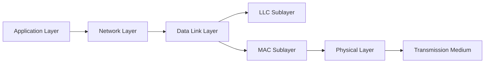

Thus:

$$
\boxed{\text{MAC = control of access to the shared transmission medium}}
$$

---

## A2. Differentiate between Pure ALOHA and Slotted ALOHA.

ALOHA is a random-access protocol in which stations transmit when they have data to send.

| Feature                        | Pure ALOHA                          | Slotted ALOHA                                                |
| ------------------------------ | ----------------------------------- | ------------------------------------------------------------ |
| Transmission time              | A station can transmit at any time. | A station can transmit only at the beginning of a time slot. |
| Synchronization                | Not required.                       | Required.                                                    |
| Vulnerable period              | \(2T\)                              | \(T\)                                                        |
| Maximum theoretical throughput | \(\frac{1}{2e}\approx18.4\%\)       | \(\frac{1}{e}\approx36.8\%\)                                 |
| Collision probability          | Higher                              | Lower                                                        |
| Efficiency                     | Lower                               | Higher                                                       |

Here \(T\) is the time required to transmit one frame.

### Pure ALOHA

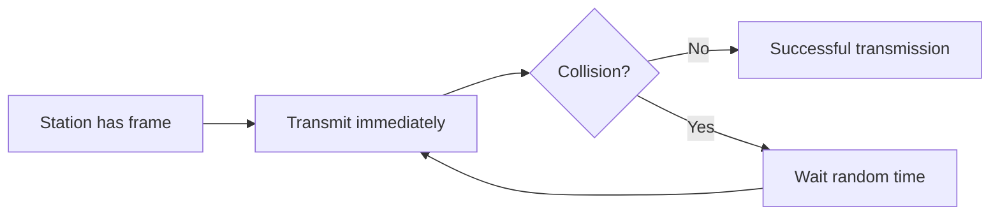

### Slotted ALOHA

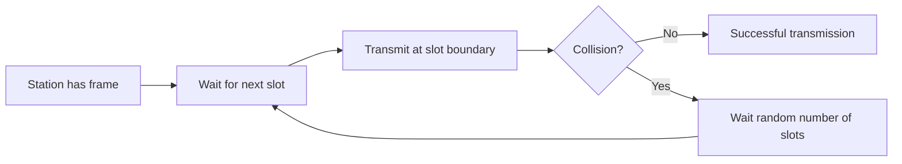

Therefore:

$$
\boxed{\text{Slotted ALOHA is more efficient because it reduces the vulnerable period.}}
$$

---

## A3. What is Ethernet? State its characteristics.

**Ethernet** is a family of wired Local Area Network technologies standardized primarily under the IEEE 802.3 family.

Ethernet defines methods for framing, addressing and transmitting data over a LAN.

### Characteristics of Ethernet

1. Uses **MAC addresses** for local delivery.
2. Uses frames at the Data Link Layer.
3. Commonly uses twisted-pair or optical-fiber media.
4. Modern switched Ethernet supports high data rates.
5. Traditional shared Ethernet used **CSMA/CD**.
6. Modern full-duplex switched Ethernet generally avoids collisions, so CSMA/CD is not used for normal full-duplex operation.

A simplified Ethernet frame is:

Thus:

$$
\boxed{\text{Ethernet is a major LAN technology defined by IEEE 802.3}}
$$

---

## A4. Explain Link Layer addressing and forwarding.

### Link Layer Addressing

At the Data Link Layer, devices on a local network are identified using **MAC addresses**.

A MAC address is associated with a network interface.

For example:

$$
\boxed{\text{Source MAC} \rightarrow \text{Destination MAC}}
$$

An Ethernet frame contains both source and destination MAC addresses.

### Forwarding

**Forwarding** is the process by which a switch determines the outgoing interface through which a frame should be transmitted.

A switch maintains a MAC address table such as:

| MAC Address           | Port |
| --------------------- | ---- |
| \(AA:AA:AA:AA:AA:01\) | 1    |
| \(BB:BB:BB:BB:BB:02\) | 2    |
| \(CC:CC:CC:CC:CC:03\) | 3    |

When a frame arrives, the switch examines:

$$
\boxed{\text{Destination MAC Address}}
$$

and forwards the frame through the corresponding port.

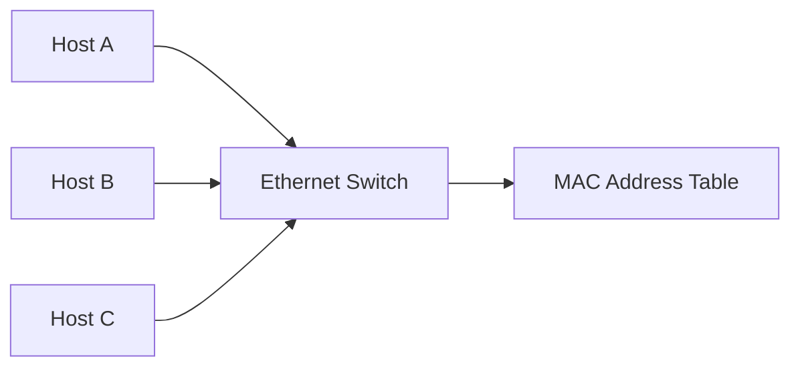

Thus:

$$
\boxed{\text{Addressing identifies the local destination}}
$$

$$
\boxed{\text{Forwarding selects the correct outgoing link}}
$$

---

## A5. Using a parity bit, detect whether there is an error in \(1010110\), assuming even parity.

Given:

$$
\boxed{1010110}
$$

Count the number of \(1\) bits:

$$
1+0+1+0+1+1+0
$$

There are:

$$
4
$$

ones.

Since:

$$
4\equiv0\pmod2
$$

the number of \(1\) bits is even.

For **even parity**, the total number of \(1\) bits must be even.

Therefore:

$$
\boxed{\text{No error is detected}}
$$

---

# Section B

## B1. Explain Multiple Access Protocols with examples such as ALOHA and CSMA/CD.

A **Multiple Access Protocol** determines how multiple devices share a common communication medium.

The main objective is to allow several stations to communicate while minimizing collisions and improving channel utilization.

Common multiple-access approaches include:

$$
\boxed{\text{Random Access}}
$$

$$
\boxed{\text{Controlled Access}}
$$

$$
\boxed{\text{Channelization}}
$$

---

## 1. ALOHA

ALOHA is a random-access protocol.

A station transmits when it has a frame.

If two stations transmit simultaneously, a collision occurs.

### Pure ALOHA

$$
\boxed{\text{Transmit whenever data is ready}}
$$

After a collision, the station waits for a random time and retransmits.

### Slotted ALOHA

Transmission is restricted to discrete time slots:

$$
\boxed{t=0,T,2T,3T,\ldots}
$$

This reduces collisions compared with Pure ALOHA.

---

## 2. CSMA/CD

**Carrier Sense Multiple Access with Collision Detection (CSMA/CD)** was used in traditional shared half-duplex Ethernet.

The station first senses the channel:

$$
\boxed{\text{Carrier Sense}}
$$

If the channel is free, it transmits.

If a collision occurs, the station detects it:

$$
\boxed{\text{Collision Detection}}
$$

and then waits for a random backoff period before retransmitting.

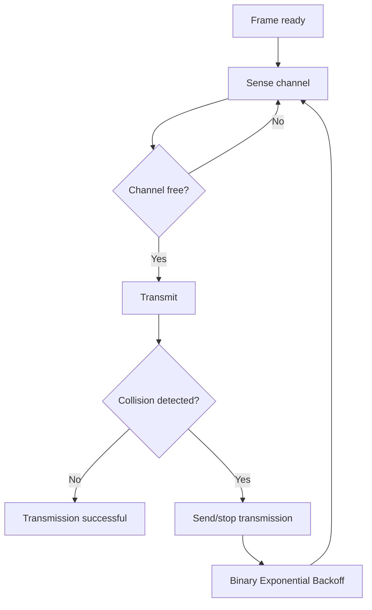

### Comparison

| Protocol      | Basic Idea                                              |
| ------------- | ------------------------------------------------------- |
| Pure ALOHA    | Transmit immediately                                    |
| Slotted ALOHA | Transmit only at slot boundaries                        |
| CSMA/CD       | Sense channel before transmitting and detect collisions |

Modern switched full-duplex Ethernet normally does not use CSMA/CD because each link is not a shared collision domain.

---

## B2. Describe the working of Wireless LANs, Broadband Wireless, and Bluetooth.

The assignment asks for Wireless LANs, Broadband Wireless and Bluetooth. 

# 1. Wireless LAN

A **Wireless LAN (WLAN)** connects devices through radio communication rather than physical Ethernet cables.

IEEE 802.11 is the major WLAN family.

### Working

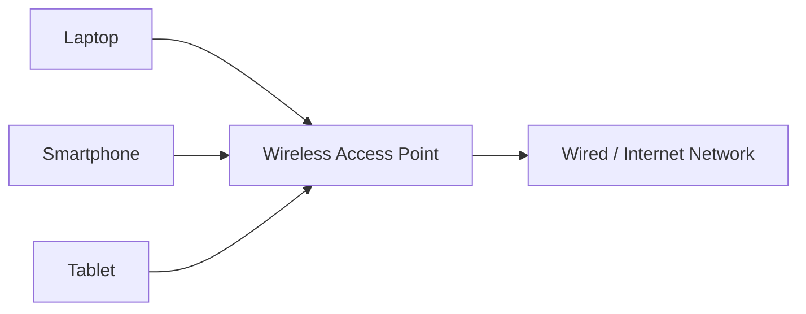

A wireless station communicates with an Access Point (AP), which forwards traffic to the local wired network or other network destinations.

WLAN operation involves:

$$
\boxed{\text{Association} \rightarrow \text{Frame transmission} \rightarrow \text{Reception}}
$$

Wi-Fi networks generally use CSMA/CA rather than CSMA/CD.

---

# 2. Broadband Wireless

Broadband Wireless provides relatively high-speed wireless network access over a larger area than a typical WLAN.

It can be used for:

* fixed wireless Internet,
* wide-area wireless access,
* last-mile connectivity.

A simplified arrangement is:

The base station provides wireless connectivity to subscriber devices and connects them to the provider's network.

---

# 3. Bluetooth

Bluetooth is a short-range wireless technology designed for communication among nearby devices.

Typical applications include:

* wireless keyboards,
* headphones,
* mice,
* smartphones,
* file/data exchange,
* IoT peripherals.

Bluetooth uses the \(2.4\text{ GHz}\) ISM band.

A simple connection can be represented as:

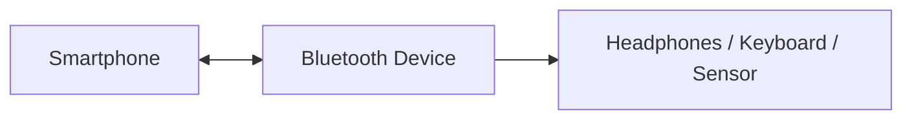

Bluetooth is intended primarily for short-range, relatively low-power communication.

### Comparison

| Feature         | WLAN             | Broadband Wireless    | Bluetooth                     |
| --------------- | ---------------- | --------------------- | ----------------------------- |
| Typical range   | Local area       | Larger area           | Short range                   |
| Main purpose    | LAN connectivity | Broadband access      | Device-to-device connectivity |
| Example         | Wi-Fi            | Fixed wireless access | Wireless headphones           |
| Standard/family | IEEE 802.11      | Various technologies  | Bluetooth                     |

---

## B3. Using CRC, detect error for the data word \(1101011011\) with divisor \(10011\).

The given values are:

$$
\boxed{D=1101011011}
$$

$$
\boxed{G=10011}
$$

The divisor has \(5\) bits, so the degree of the generator polynomial is:

$$
5-1=4
$$

Therefore, append four zeros to the data:

$$
1101011011\,0000
$$

$$
\boxed{11010110110000}
$$

---

### Modulo-2 Division

Perform XOR division using:

$$
10011
$$

The resulting remainder is:

$$
\boxed{1110}
$$

Therefore:

$$
11010110110000\div10011
$$

gives:

$$
\boxed{\text{Remainder}=1110}
$$

### Interpretation

There is an important distinction in the wording of the question.

If \(1101011011\) is the **original data word**, then:

$$
\boxed{\text{CRC bits}=1110}
$$

and the transmitted codeword would be:

$$
\boxed{1101011011\,1110}
$$

If \(1101011011\) is instead intended to be the **received codeword**, it is not a valid codeword for divisor \(10011\) because the required CRC check does not produce zero remainder after division.

Thus, from the supplied data alone:

$$
\boxed{R=1110}
$$

and a non-zero remainder indicates a CRC mismatch when the supplied bit string is being tested as a received codeword.

---

# Section C

## C1. Explain Circuit-Switched and Packet-Switched Networks with Control Signaling, Flow Control and Error Control.

The assignment asks for a comparison of circuit-switched and packet-switched networks and the related control mechanisms. 

# Circuit-Switched Network

In a circuit-switched network, a dedicated communication path is established between the sender and receiver before data transmission begins.

The communication generally has three stages:

$$
\boxed{\text{Setup}\rightarrow\text{Data Transfer}\rightarrow\text{Teardown}}
$$

The path remains reserved during the communication session.

### Example

Traditional telephone networks are a classic example.

### Advantages

* Dedicated path.
* Predictable transmission characteristics after setup.
* Suitable for continuous real-time communication.

### Disadvantages

* Setup delay.
* Bandwidth can remain reserved even when no data is being sent.
* Less efficient for bursty data.

---

# Packet-Switched Network

In packet switching, a message is divided into packets.

Each packet may be forwarded through network links using routers.

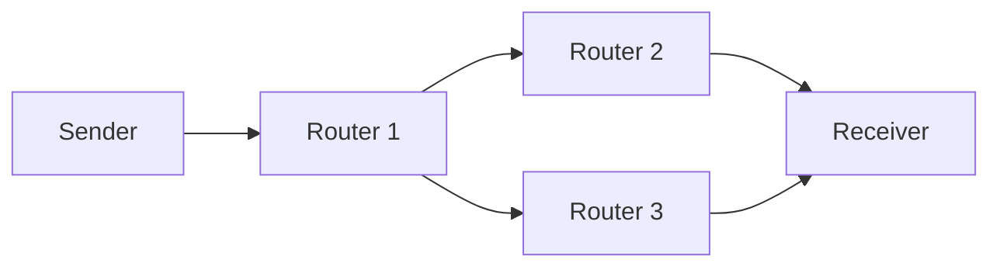

Packets belonging to the same communication can potentially follow different paths.

### Advantages

* Efficient sharing of network resources.
* Well suited to bursty data.
* No dedicated circuit is required before every transmission.

### Disadvantages

* Variable delay.
* Packets may be lost or arrive out of order.
* Congestion can affect performance.

---

# Control Signaling

### Circuit Switching

Control signaling is heavily involved during connection establishment:

$$
\boxed{\text{Call request}\rightarrow\text{Path establishment}\rightarrow\text{Connection}}
$$

The connection is then maintained until termination.

### Packet Switching

Control information is carried through packets, headers, routing information and protocol messages.

There is generally no requirement to reserve one dedicated end-to-end circuit before sending ordinary packets.

---

# Flow Control

**Flow control** prevents a fast sender from overwhelming a slower receiver.

A common technique is the **sliding-window protocol**.

For example:

$$
\boxed{\text{Sender window size}=W}
$$

allows multiple packets/frames to be transmitted before acknowledgements arrive, depending on the protocol.

---

# Error Control

Error control detects or recovers from transmission errors.

Common techniques include:

* parity,
* checksum,
* CRC,
* acknowledgements,
* retransmission.

For example, CRC determines whether received bits correspond to a valid codeword.

---

# Comparison

| Feature                       | Circuit Switching            | Packet Switching                                   |
| ----------------------------- | ---------------------------- | -------------------------------------------------- |
| Path                          | Dedicated path               | Shared network paths                               |
| Setup                         | Required                     | Generally no dedicated setup for each transmission |
| Resource allocation           | Reserved                     | Shared dynamically                                 |
| Delay                         | More predictable after setup | Variable                                           |
| Efficiency for bursty traffic | Lower                        | Higher                                             |
| Example                       | Traditional telephone system | Internet                                           |

---

# C2. Using Hamming Code, detect and correct the error in received code word \(1011011\).

Assume:

$$
\boxed{\text{Even parity}}
$$

and number the bit positions from left to right:

$$
1,2,3,4,5,6,7
$$

Received codeword:

$$
\boxed{1011011}
$$

Therefore:

| Position |  1 |  2 |  3 |  4 |  5 |  6 |  7 |
| -------- | -: | -: | -: | -: | -: | -: | -: |
| Bit      |  1 |  0 |  1 |  1 |  0 |  1 |  1 |

For Hamming \((7,4)\), parity bits occupy positions:

$$
\boxed{1,2,4}
$$

Data bits occupy:

$$
\boxed{3,5,6,7}
$$

---

## Step 1: Check \(P_1\)

\(P_1\) checks positions:

$$
1,3,5,7
$$

Bits:

$$
1,1,0,1
$$

Number of \(1\)s:

$$
3
$$

This is odd, so:

$$
\boxed{P_1=1}
$$

indicating an error in this parity group.

---

## Step 2: Check \(P_2\)

\(P_2\) checks positions:

$$
2,3,6,7
$$

Bits:

$$
0,1,1,1
$$

Number of \(1\)s:

$$
3
$$

This is odd:

$$
\boxed{P_2=1}
$$

---

## Step 3: Check \(P_4\)

\(P_4\) checks positions:

$$
4,5,6,7
$$

Bits:

$$
1,0,1,1
$$

Number of \(1\)s:

$$
3
$$

Therefore:

$$
\boxed{P_4=1}
$$

---

## Step 4: Calculate Syndrome

The syndrome is:

$$
S=P_4P_2P_1
$$

Therefore:

$$
S=111_2
$$

Converting to decimal:

$$
111_2=7_{10}
$$

Thus:

$$
\boxed{\text{Error is at bit position }7}
$$

---

## Step 5: Correct the Error

Received codeword:

$$
1011011
$$

Bit \(7\) is:

$$
1
$$

Flip it:

$$
1\rightarrow0
$$

Therefore, the corrected codeword is:

$$
\boxed{1011010}
$$

---

## Step 6: Extract Data Bits

Data positions are:

$$
3,5,6,7
$$

From the corrected codeword:

| Position      |  1 |  2 |  3 |  4 |  5 |  6 |  7 |
| ------------- | -: | -: | -: | -: | -: | -: | -: |
| Corrected bit |  1 |  0 |  1 |  1 |  0 |  1 |  0 |

Therefore, data bits are:

$$
1,0,1,0
$$

Hence:

$$
\boxed{\text{Corrected data}=1010}
$$

### Final Answer

$$
\boxed{\text{Error position}=7}
$$

$$
\boxed{\text{Corrected codeword}=1011010}
$$

$$
\boxed{\text{Original data}=1010}
$$

---

# C3. Explain Stop-and-Wait and Sliding Window Protocols with neat diagrams.

The assignment asks for Stop-and-Wait and Sliding Window protocols. 

# 1. Stop-and-Wait Protocol

In Stop-and-Wait, the sender transmits one frame and waits for an acknowledgement before sending the next frame.

### Working

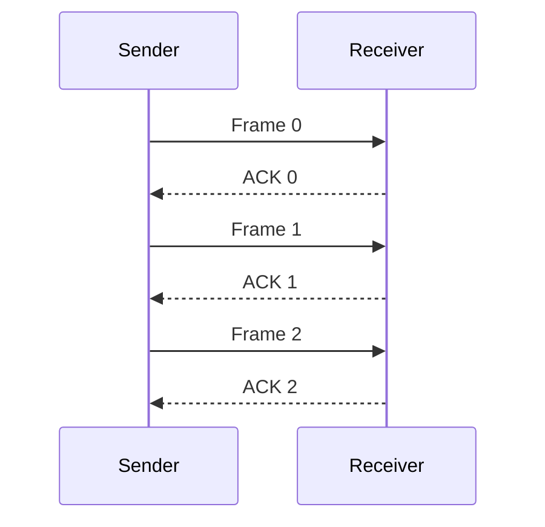

If the acknowledgement is not received within the timeout period, the sender retransmits the frame.

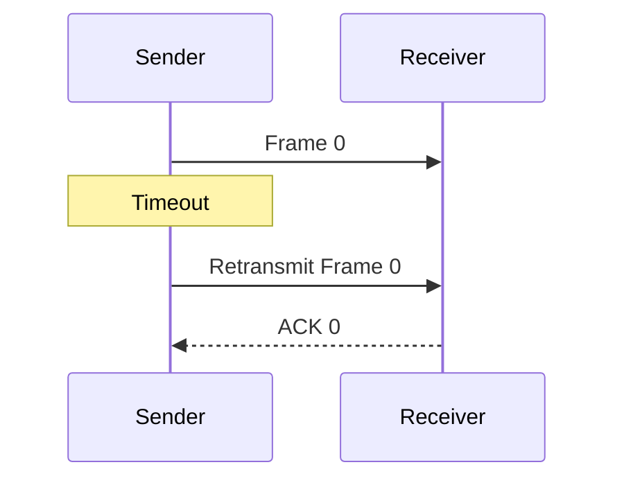

### Characteristics

* Simple implementation.
* Requires little buffer space.
* Only one unacknowledged frame can normally be in transit.
* Poor channel utilization when propagation delay is large.

If the round-trip time is large, the sender spends significant time waiting.

---

# 2. Sliding Window Protocol

In a Sliding Window protocol, the sender can transmit multiple frames before receiving individual acknowledgements.

Let the window size be:

$$
W=4
$$

Initially, the sender may transmit:

$$
\boxed{0,1,2,3}
$$

As acknowledgements arrive, the window moves forward.

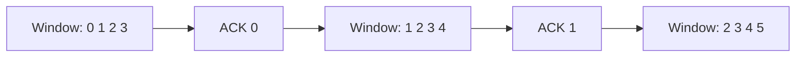

### Basic Working

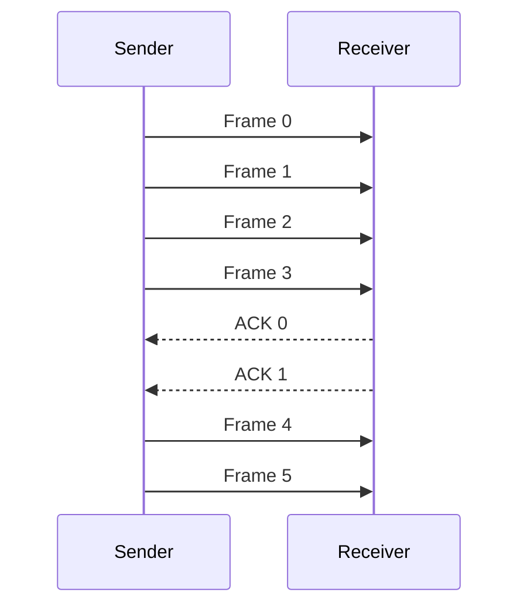

The sender maintains a window representing the frames it is allowed to transmit.

---

## Types of Sliding Window Protocols

### Go-Back-N ARQ

If one frame is lost or corrupted, the sender retransmits that frame and subsequent frames.

For example, if:

$$
0,1,2,3
$$

are sent and frame \(2\) is lost, the sender may retransmit:

$$
2,3
$$

---

### Selective Repeat ARQ

Only the missing or corrupted frame is retransmitted.

If frame \(2\) is lost:

$$
\boxed{\text{Retransmit only Frame 2}}
$$

This can use bandwidth more efficiently but requires more buffering and protocol complexity.

---

## Stop-and-Wait vs Sliding Window

| Feature             | Stop-and-Wait                 | Sliding Window                        |
| ------------------- | ----------------------------- | ------------------------------------- |
| Outstanding frames  | Usually \(1\)                 | Multiple                              |
| Buffer requirement  | Low                           | Higher                                |
| Throughput          | Lower                         | Higher                                |
| Complexity          | Simple                        | More complex                          |
| Channel utilization | Poor on long-delay links      | Better                                |
| Retransmission      | Depends on ARQ implementation | Supports Go-Back-N / Selective Repeat |

### Conclusion

Stop-and-Wait is simple but can leave the communication link idle while waiting for acknowledgements.

Sliding Window improves link utilization by allowing:

$$
\boxed{\text{Multiple frames in transit simultaneously}}
$$

and therefore is much more suitable for high-bandwidth or high-delay networks.

---

# Final Summary

| Topic                  | Key Point                                                |
| ---------------------- | -------------------------------------------------------- |
| MAC                    | Controls access to a shared transmission medium          |
| Pure ALOHA             | Transmit at any time                                     |
| Slotted ALOHA          | Transmit at slot boundaries                              |
| Ethernet               | IEEE 802.3 LAN technology using frames and MAC addresses |
| Link-Layer Addressing  | Uses MAC addresses for local delivery                    |
| Parity for \(1010110\) | No error detected under even parity                      |
| ALOHA / CSMA/CD        | Random-access techniques for shared media                |
| WLAN                   | Wireless LAN, commonly based on IEEE 802.11              |
| Broadband Wireless     | Larger-area wireless broadband connectivity              |
| Bluetooth              | Short-range wireless communication                       |
| CRC                    | \(1101011011\) with \(10011\) gives remainder \(1110\)   |
| Hamming \(1011011\)    | Error at bit \(7\); corrected codeword \(1011010\)       |
| Corrected Hamming data | \(1010\)                                                 |
| Circuit Switching      | Dedicated path                                           |
| Packet Switching       | Packets share network resources                          |
| Stop-and-Wait          | One outstanding frame at a time                          |
| Sliding Window         | Multiple outstanding frames                              |

