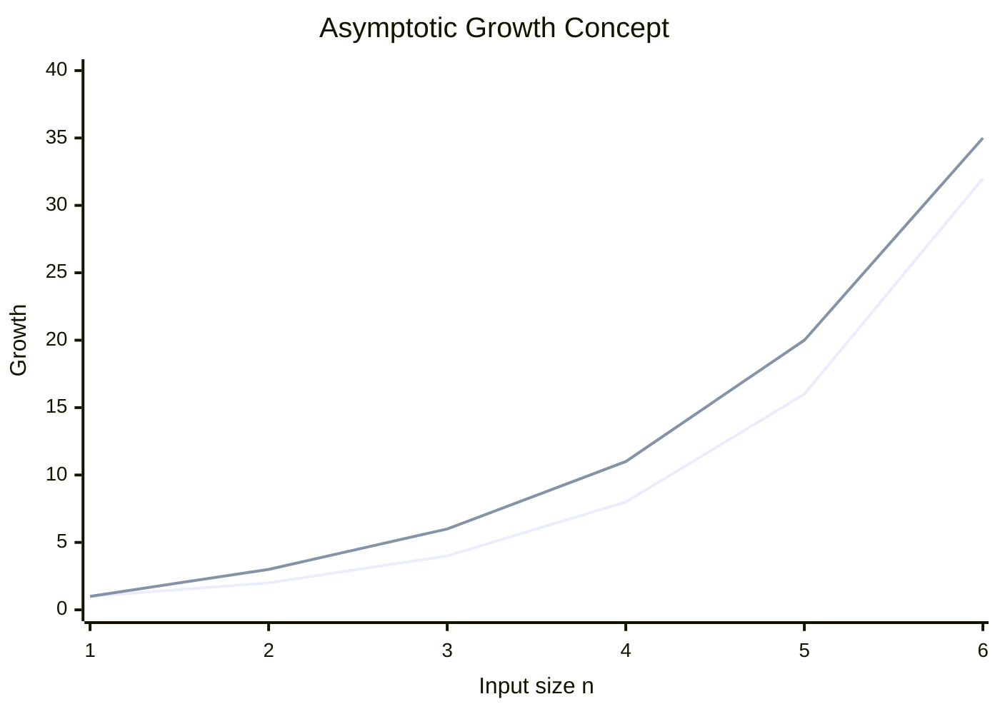

# Data Structures and Algorithm — Tutorial Sheet 1

**B.Tech. (Computer Science and Engineering)**
**Semester:** III
**Subject Code:** BCO002B
**Unit:** 1
**Marks:** 64

The questions below are taken from Tutorial Sheet 1. 

---

# Section A

## A1. Define Abstract Data Type (ADT) and distinguish it from a Data Structure.

An **Abstract Data Type (ADT)** is a mathematical model that defines a set of data and the operations that can be performed on that data without specifying how those operations are implemented.

For example, a **Stack ADT** supports operations such as:

$$
\operatorname{push}(x),\qquad \operatorname{pop}(),\qquad \operatorname{peek}()
$$

A **Data Structure** is the actual method used to store and organize data in memory so that the operations of an ADT can be implemented.

### Difference

| ADT                                          | Data Structure                                            |
| -------------------------------------------- | --------------------------------------------------------- |
| Describes **what** operations are supported. | Describes **how** data and operations are implemented.    |
| Implementation-independent.                  | Implementation-dependent.                                 |
| Example: Stack ADT.                          | Example: Stack implemented using an array or linked list. |

Thus:

$$
\boxed{\text{ADT = logical specification}}
$$

$$
\boxed{\text{Data Structure = physical implementation}}
$$

---

## A2. Differentiate between Time Complexity and Space Complexity.

### Time Complexity

Time complexity measures how the running time of an algorithm grows with input size \(n\).

It is usually expressed using asymptotic notation such as:

$$
O(n),\quad O(n^2),\quad O(\log n)
$$

### Space Complexity

Space complexity measures how much memory an algorithm requires as the input size \(n\) increases.

It includes memory required for variables, data structures, recursion, and other auxiliary storage.

### Difference

| Time Complexity                      | Space Complexity                                          |
| ------------------------------------ | --------------------------------------------------------- |
| Measures execution time.             | Measures memory usage.                                    |
| Concerned with number of operations. | Concerned with memory required.                           |
| Example: Linear Search is \(O(n)\).  | An iterative Linear Search uses \(O(1)\) auxiliary space. |

---

## A3. Define Worst-case and Average-case Complexity with one example each.

### Worst-case Complexity

Worst-case complexity represents the maximum amount of time or resources required for any input of size \(n\).

For Linear Search, if the required element is at the last position:

$$
T(n)=n
$$

Therefore:

$$
\boxed{T_{\text{worst}}(n)=O(n)}
$$

### Average-case Complexity

Average-case complexity represents the expected amount of time required over all possible inputs, assuming a specified probability distribution.

For Linear Search, if the element is equally likely to occur at any of the \(n\) positions, the expected number of comparisons is:

$$
\frac{1+2+\cdots+n}{n}
$$

Using:

$$
1+2+\cdots+n=\frac{n(n+1)}{2}
$$

we get:

$$
\frac{n(n+1)}{2n}
=
\frac{n+1}{2}
$$

Hence:

$$
\boxed{T_{\text{average}}(n)=\Theta(n)}
$$

---

## A4. State the formal mathematical definition of Big-Oh \(O\) notation.

A function \(f(n)\) is said to be:

$$
f(n)=O(g(n))
$$

if there exist positive constants \(c\) and \(n_0\) such that:

$$
\boxed{0\leq f(n)\leq c\,g(n)\quad\text{for all }n\geq n_0}
$$

In set notation:

$$
\boxed{
O(g(n))
=
\{f(n)\mid \exists c>0,\exists n_0>0,\ 0\leq f(n)\leq c\,g(n),\ \forall n\geq n_0\}
}
$$

Big-Oh therefore gives an **asymptotic upper bound**.

---

## A5. What is a stable sorting algorithm? Name any two stable sorting algorithms.

A sorting algorithm is called **stable** if two elements having equal keys retain their original relative order after sorting.

For example, consider:

$$
[(A,5),(B,3),(C,5)]
$$

After stable sorting by the second value:

$$
[(B,3),(A,5),(C,5)]
$$

The relative order of \(A\) and \(C\) is unchanged.

Two stable sorting algorithms are:

$$
\boxed{\text{Insertion Sort}}
$$

$$
\boxed{\text{Bubble Sort}}
$$

---

# Section B

## B1. Explain Big-Oh \(O\), Big-Omega \(\Omega\), and Big-Theta \(\Theta\) with suitable examples.

The three standard asymptotic notations describe the growth of functions as \(n\to\infty\).

### 1. Big-Oh \(O\)

Big-Oh provides an asymptotic **upper bound**.

$$
f(n)=O(g(n))
$$

if there exist constants \(c>0\) and \(n_0>0\) such that:

$$
0\leq f(n)\leq c\,g(n)
$$

for all:

$$
n\geq n_0
$$

### Example

Let:

$$
f(n)=3n^2+5n+7
$$

For \(n\geq1\):

$$
3n^2+5n+7
\leq
3n^2+5n^2+7n^2
=
15n^2
$$

Therefore:

$$
\boxed{3n^2+5n+7=O(n^2)}
$$

---

### 2. Big-Omega \(\Omega\)

Big-Omega provides an asymptotic **lower bound**.

$$
f(n)=\Omega(g(n))
$$

if there exist constants \(c>0\) and \(n_0>0\) such that:

$$
0\leq c\,g(n)\leq f(n)
$$

for all:

$$
n\geq n_0
$$

### Example

For:

$$
f(n)=3n^2+5n+7
$$

we have:

$$
f(n)\geq3n^2
$$

for all \(n\geq1\).

Therefore:

$$
\boxed{3n^2+5n+7=\Omega(n^2)}
$$

---

### 3. Big-Theta \(\Theta\)

Big-Theta gives a **tight asymptotic bound**.

$$
f(n)=\Theta(g(n))
$$

if there exist constants \(c_1,c_2>0\) and \(n_0>0\) such that:

$$
\boxed{
0\leq c_1g(n)\leq f(n)\leq c_2g(n)
}
$$

for all:

$$
n\geq n_0
$$

For:

$$
f(n)=3n^2+5n+7
$$

we can establish both:

$$
f(n)=\Omega(n^2)
$$

and:

$$
f(n)=O(n^2)
$$

Hence:

$$
\boxed{f(n)=\Theta(n^2)}
$$

### Comparison

$$
\boxed{O(g(n))=\text{upper bound}}
$$

$$
\boxed{\Omega(g(n))=\text{lower bound}}
$$

$$
\boxed{\Theta(g(n))=\text{tight bound}}
$$

---

## B2. Trace Insertion Sort on \([38,27,43,3,9,82,10]\) and derive its best, worst and average-case time complexity.

Insertion Sort builds the sorted portion one element at a time.

Initial array:

$$
[38,27,43,3,9,82,10]
$$

### Pass 1

Insert \(27\) into the sorted portion \([38]\):

$$
[27,38,43,3,9,82,10]
$$

### Pass 2

Insert \(43\):

$$
[27,38,43,3,9,82,10]
$$

### Pass 3

Insert \(3\):

$$
[3,27,38,43,9,82,10]
$$

### Pass 4

Insert \(9\):

$$
[3,9,27,38,43,82,10]
$$

### Pass 5

Insert \(82\):

$$
[3,9,27,38,43,82,10]
$$

### Pass 6

Insert \(10\):

$$
[3,9,10,27,38,43,82]
$$

Therefore, the sorted array is:

$$
\boxed{[3,9,10,27,38,43,82]}
$$

### Complexity Derivation

At the \(i\)-th pass, at most \(i\) elements may need to be shifted.

Thus, in the worst case:

$$
T(n)\approx
1+2+3+\cdots+(n-1)
$$

$$
=
\frac{n(n-1)}{2}
$$

Therefore:

$$
\boxed{T_{\text{worst}}(n)=\Theta(n^2)}
$$

### Best Case

If the array is already sorted, each element requires only one comparison and no shifting.

Therefore:

$$
T(n)=n-1
$$

Hence:

$$
\boxed{T_{\text{best}}(n)=\Theta(n)}
$$

### Average Case

For a randomly ordered array, approximately half of the previous elements are shifted on average.

Thus:

$$
T(n)\approx\frac{1}{2}
\left(1+2+\cdots+(n-1)\right)
$$

$$
=
\frac{1}{2}\cdot\frac{n(n-1)}{2}
=
\frac{n(n-1)}{4}
$$

Hence:

$$
\boxed{T_{\text{average}}(n)=\Theta(n^2)}
$$

### Final Complexity

| Case    | Time Complexity |
| ------- | --------------: |
| Best    |   \(\Theta(n)\) |
| Average | \(\Theta(n^2)\) |
| Worst   | \(\Theta(n^2)\) |

---

## B3. Explain the problem of selecting the top \(k\) elements from an unsorted array of \(n\) elements. Give one approach without Quick Sort, Merge Sort or Heap Sort.

The problem is:

Given an unsorted array:

$$
A[0],A[1],\ldots,A[n-1]
$$

find the \(k\) largest elements, where:

$$
1\leq k\leq n
$$

without using Quick Sort, Merge Sort, or Heap Sort.

### Approach: Maintain a Sorted Array of the Top \(k\) Elements

We maintain an auxiliary array containing the current \(k\) largest elements in sorted order.

For every element in the input:

1. Insert it into the appropriate position if it belongs among the current top \(k\).
2. If the auxiliary array contains more than \(k\) elements, remove the smallest one.

A simple implementation can maintain the top \(k\) elements in **ascending order**.

### Pseudocode

```text
TOP-K(A, n, k)

1. Create an empty array T of size at most k.
2. For each element x in A:
3.     Find the correct position of x in T.
4.     Insert x into T.
5.     If size(T) > k:
6.         Delete the smallest element from T.
7. Return T.
```

### Time Complexity

For each of the \(n\) input elements, locating and inserting into a simple array can take:

$$
O(k)
$$

Therefore:

$$
T(n)=O(nk)
$$

Hence:

$$
\boxed{T(n)=O(nk)}
$$

The extra space required is:

$$
\boxed{O(k)}
$$

This approach satisfies the restriction because it does not use Quick Sort, Merge Sort, or Heap Sort.

When:

$$
k\ll n
$$

the method can be substantially smaller in work than fully sorting all \(n\) elements using a quadratic algorithm.

---

# Section C

## C1. Derive and compare the best-case, worst-case and average-case time complexity of Bubble Sort, Selection Sort and Insertion Sort.

The sheet asks for derivations and a comparison table. 

---

## 1. Bubble Sort

Bubble Sort repeatedly compares adjacent elements and swaps them when they are in the wrong order.

### Best Case

With an optimized Bubble Sort using a swap flag, if the array is already sorted, only one pass is required.

Number of comparisons:

$$
n-1
$$

Therefore:

$$
\boxed{T_{\text{best}}(n)=\Theta(n)}
$$

### Worst Case

In reverse order, the number of comparisons is:

$$
(n-1)+(n-2)+\cdots+1
$$

$$
=\frac{n(n-1)}{2}
$$

Hence:

$$
\boxed{T_{\text{worst}}(n)=\Theta(n^2)}
$$

The number of swaps in the worst case is also:

$$
\frac{n(n-1)}{2}
$$

### Average Case

For a random permutation, Bubble Sort performs a quadratic number of comparisons and swaps on average.

Thus:

$$
\boxed{T_{\text{average}}(n)=\Theta(n^2)}
$$

---

## 2. Selection Sort

Selection Sort repeatedly finds the minimum element from the unsorted portion and places it in its correct position.

### Best, Average and Worst Case

The comparisons are independent of the initial ordering.

The total number of comparisons is:

$$
(n-1)+(n-2)+\cdots+1
$$

$$
=\frac{n(n-1)}{2}
$$

Therefore:

$$
\boxed{
T_{\text{best}}(n)
=
T_{\text{average}}(n)
=
T_{\text{worst}}(n)
=
\Theta(n^2)
}
$$

The number of swaps is at most:

$$
n-1
$$

---

## 3. Insertion Sort

Insertion Sort inserts every new element into the correct position in the sorted prefix.

### Best Case

If the array is already sorted, only one comparison is needed for each element.

$$
T(n)=n-1
$$

Hence:

$$
\boxed{T_{\text{best}}(n)=\Theta(n)}
$$

### Worst Case

For reverse-sorted input, the \(i\)-th element needs to be moved across \(i\) previous elements.

Thus:

$$
T(n)\approx1+2+\cdots+(n-1)
$$

$$
=\frac{n(n-1)}{2}
$$

Therefore:

$$
\boxed{T_{\text{worst}}(n)=\Theta(n^2)}
$$

### Average Case

For random input, approximately half of the preceding elements need to be shifted.

Thus:

$$
T(n)\approx
\frac{1}{2}\cdot\frac{n(n-1)}{2}
$$

$$
=\frac{n(n-1)}{4}
$$

Hence:

$$
\boxed{T_{\text{average}}(n)=\Theta(n^2)}
$$

---

## Comparison Table

| Sorting Algorithm |       Best Case |    Average Case |      Worst Case |
| ----------------- | --------------: | --------------: | --------------: |
| Bubble Sort*      |   \(\Theta(n)\) | \(\Theta(n^2)\) | \(\Theta(n^2)\) |
| Selection Sort    | \(\Theta(n^2)\) | \(\Theta(n^2)\) | \(\Theta(n^2)\) |
| Insertion Sort    |   \(\Theta(n)\) | \(\Theta(n^2)\) | \(\Theta(n^2)\) |

$$
\boxed{*}
$$

The \(\Theta(n)\) best case for Bubble Sort assumes the **optimized version with an early-exit/swap flag**. Without that optimization, its best case is also:

$$
\Theta(n^2)
$$

### Space Complexity

All three can be implemented in-place:

$$
\boxed{\text{Auxiliary Space}=\Theta(1)}
$$

for Bubble Sort, Selection Sort, and standard iterative Insertion Sort.

---

# C2. Explain the Lower Bound on comparison-based sorting algorithms and prove it using the decision-tree argument.

The question asks for a lower-bound proof using a decision tree. The standard result is:

$$
\boxed{\Omega(n\log n)}
$$

not \(O(n\log n)\). A lower bound is represented by \(\Omega\), whereas \(O\) represents an upper bound. The tutorial sheet's wording uses \(O(n\log n)\), but the decision-tree argument establishes the \(\Omega(n\log n)\) lower bound. 

## Lower Bound

A lower bound specifies the minimum amount of work that **any algorithm in a given problem class** must perform in the worst case.

For comparison-based sorting, elements are ordered only through comparisons such as:

$$
a_i<a_j
$$

or:

$$
a_i>a_j
$$

The claim is:

$$
\boxed{\text{Every comparison-based sorting algorithm requires }\Omega(n\log n)\text{ comparisons in the worst case.}}
$$

---

## Decision Tree Model

A comparison-based sorting algorithm can be represented as a binary decision tree.

Each internal node represents a comparison:

$$
a_i<a_j?
$$

Each comparison has at most two outcomes, so each internal node has at most two branches.

Each leaf represents a possible final ordering of the \(n\) distinct elements.

### Why are there \(n!\) leaves?

For \(n\) distinct elements, there are:

$$
n!
$$

possible permutations.

Therefore, a correct sorting algorithm must be able to distinguish among all:

$$
n!
$$

possible input orderings.

Thus the decision tree must have at least:

$$
n!
$$

leaves.

---

## Height of the Decision Tree

Suppose the decision tree has height \(h\).

A binary tree of height \(h\) can have at most:

$$
2^h
$$

leaves.

Since at least \(n!\) leaves are required:

$$
2^h\geq n!
$$

Taking \(\log_2\) on both sides:

$$
h\geq\log_2(n!)
$$

Using Stirling's approximation:

$$
n!\approx\sqrt{2\pi n}\left(\frac ne\right)^n
$$

Therefore:

$$
\log_2(n!)
=
\Theta(n\log n)
$$

Hence:

$$
h=\Omega(n\log n)
$$

Since the height of the decision tree represents the maximum number of comparisons made by the algorithm:

$$
\boxed{\text{Worst-case comparisons}=\Omega(n\log n)}
$$

Therefore, no comparison-based sorting algorithm can guarantee a worst-case running time better than:

$$
\boxed{\Omega(n\log n)}
$$

in terms of comparisons.

---

## Significance for \(O(n^2)\) Sorting Algorithms

Bubble Sort, Selection Sort, and Insertion Sort have:

$$
O(n^2)
$$

worst-case time complexity.

Since:

$$
n\log n=o(n^2)
$$

for sufficiently large \(n\), quadratic-time sorting performs asymptotically more comparisons than the comparison-model lower bound requires.

The lower bound does **not** mean Bubble Sort, Selection Sort, or Insertion Sort are incorrect. It means that their \(O(n^2)\) worst-case complexity is not asymptotically optimal among comparison-based sorting algorithms.

---

# C3. Short Notes

The question asks for **any two** of the following. For completeness, all three are provided. 

---

## C3(a). Importance of Algorithms and Data Structures in Efficient Programming

An **algorithm** is a finite sequence of well-defined steps used to solve a problem. A **data structure** is a way of organizing and storing data so that it can be accessed and modified efficiently.

The choice of algorithm and data structure strongly affects program performance.

For example, searching an element in an unsorted array using Linear Search requires:

$$
O(n)
$$

time.

If the data is sorted, Binary Search can reduce the search time to:

$$
O(\log n)
$$

Similarly, choosing an appropriate data structure can significantly improve performance. Searching for a key in a suitable hash table can have expected time:

$$
O(1)
$$

while an inappropriate structure may require:

$$
O(n)
$$

search time.

Algorithms and data structures also influence:

* execution time,
* memory consumption,
* scalability,
* maintainability,
* and responsiveness of software.

For large input sizes, even a small difference in asymptotic complexity can result in a major difference in execution time.

For example:

$$
O(n^2)
$$

grows much faster than:

$$
O(n\log n)
$$

as \(n\) increases.

Therefore, effective programming requires selecting algorithms and data structures according to the problem, input size, memory constraints, and required operations.

---

## C3(b). Complexity Analysis Using Linear Search

Consider the following Linear Search algorithm:

```text
LINEAR_SEARCH(A, n, x)

1. for i = 0 to n - 1
2.     if A[i] == x
3.         return i
4. return -1
```

The algorithm checks each element sequentially until \(x\) is found.

### Best Case

The element is found at the first position.

Number of comparisons:

$$
1
$$

Therefore:

$$
\boxed{T_{\text{best}}(n)=\Theta(1)}
$$

### Worst Case

The element is at the last position or is not present.

Number of comparisons:

$$
n
$$

Therefore:

$$
\boxed{T_{\text{worst}}(n)=\Theta(n)}
$$

### Average Case

Assuming the element is equally likely to be at any of the \(n\) positions:

$$
T_{\text{average}}(n)
=
\frac{1+2+\cdots+n}{n}
$$

$$
=
\frac{n(n+1)}{2n}
$$

$$
=
\frac{n+1}{2}
$$

Therefore:

$$
\boxed{T_{\text{average}}(n)=\Theta(n)}
$$

### Space Complexity

The algorithm uses only a constant number of additional variables.

Hence:

$$
\boxed{S(n)=\Theta(1)}
$$

---

## C3(c). Comparison Between \(O\), \(\Omega\), and \(\Theta\)

The three asymptotic notations describe different relationships between two functions.

### Big-Oh

$$
f(n)=O(g(n))
$$

means:

$$
f(n)\leq c\,g(n)
$$

for sufficiently large \(n\).

It represents an asymptotic upper bound.

### Big-Omega

$$
f(n)=\Omega(g(n))
$$

means:

$$
f(n)\geq c\,g(n)
$$

for sufficiently large \(n\).

It represents an asymptotic lower bound.

### Big-Theta

$$
f(n)=\Theta(g(n))
$$

means that both bounds hold:

$$
c_1g(n)\leq f(n)\leq c_2g(n)
$$

for sufficiently large \(n\).

It represents a tight asymptotic bound.

### Graphical Representation



Conceptually:

$$
\boxed{O(g(n)):\text{ upper bound}}
$$

$$
\boxed{\Omega(g(n)):\text{ lower bound}}
$$

$$
\boxed{\Theta(g(n)):\text{ both upper and lower bound}}
$$

### Example

For:

$$
f(n)=3n^2+5n+7
$$

we have:

$$
\boxed{f(n)=O(n^2)}
$$

$$
\boxed{f(n)=\Omega(n^2)}
$$

and therefore:

$$
\boxed{f(n)=\Theta(n^2)}
$$

---

# Final Complexity Summary

| Algorithm      |       Best Case |    Average Case |      Worst Case | Auxiliary Space |
| -------------- | --------------: | --------------: | --------------: | --------------: |
| Bubble Sort    |  \(\Theta(n)\)* | \(\Theta(n^2)\) | \(\Theta(n^2)\) |   \(\Theta(1)\) |
| Selection Sort | \(\Theta(n^2)\) | \(\Theta(n^2)\) | \(\Theta(n^2)\) |   \(\Theta(1)\) |
| Insertion Sort |   \(\Theta(n)\) | \(\Theta(n^2)\) | \(\Theta(n^2)\) |   \(\Theta(1)\) |
| Linear Search  |   \(\Theta(1)\) |   \(\Theta(n)\) |   \(\Theta(n)\) |   \(\Theta(1)\) |

$$
\boxed{*}
$$

Bubble Sort's \(\Theta(n)\) best case assumes the optimized early-termination version.

