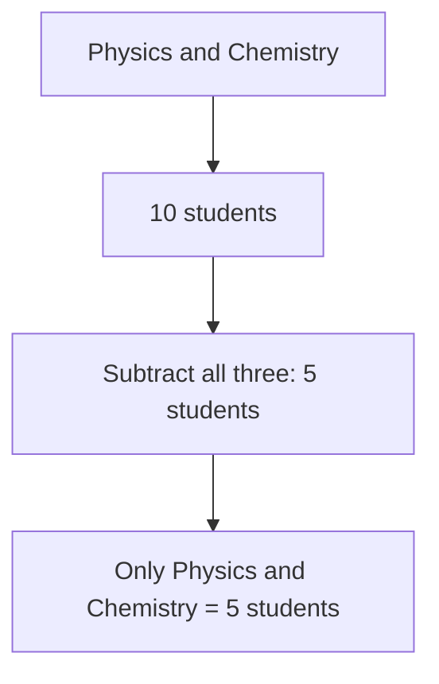

# Discrete Mathematics - Assignment 1

**Subject:** Discrete Mathematics
**Subject Code:** BAS007B
**Semester:** III
**Unit:** 1

This assignment is divided into Part A, Part B, and Part C as given in the uploaded question paper. 

---

# PART A

## A1. If P = {1, 2, 3, 4} and Q = {4, 5, 6, 7}, find P Delta Q and its cardinality.

The symmetric difference of two sets is the set of elements that belong to either P or Q, but not to both.

Given:

```text
P = {1, 2, 3, 4}
Q = {4, 5, 6, 7}
```

The common element is:

```text
P intersection Q = {4}
```

Therefore:

```text
P Delta Q = (P - Q) union (Q - P)
```

```text
P - Q = {1, 2, 3}

Q - P = {5, 6, 7}
```

Hence:

```text
P Delta Q = {1, 2, 3, 5, 6, 7}
```

Therefore, the cardinality is:

```text
|P Delta Q| = 6
```

### Answer

```text
P Delta Q = {1, 2, 3, 5, 6, 7}

|P Delta Q| = 6
```

---

## A2. Find the domain and range of the function f(x) = e^{ {x} }.

Here `{x}` denotes the fractional part of x.

The fractional part of every real number satisfies:

```text
0 <= {x} < 1
```

The function is:

```text
f(x) = e^{ {x} }
```

Since the fractional part is defined for every real number:

```text
Domain = R
```

Now:

```text
0 <= {x} < 1
```

Applying the exponential function:

```text
e^0 <= e^{ {x} } < e^1
```

Therefore:

```text
1 <= f(x) < e
```

### Answer

```text
Domain = R

Range = [1, e)
```

---

## A3. Let U = {1, 2, 3, 4, 5, 6} and A = {2, 4, 6}. Find A^c.

The complement of A with respect to U consists of all elements of U that are not present in A.

Given:

```text
U = {1, 2, 3, 4, 5, 6}

A = {2, 4, 6}
```

Therefore:

```text
A^c = U - A
```

```text
A^c = {1, 3, 5}
```

### Answer

```text
A^c = {1, 3, 5}
```

---

## A4. Write the power set of empty set and the set of natural numbers.

### Power Set of Empty Set

The power set of a set contains all possible subsets of that set.

For the empty set:

```text
P(empty set) = {empty set}
```

Therefore:

```text
P(empty set) = {{}}
```

The empty set has exactly one subset: itself.

### Power Set of Natural Numbers

Assuming:

```text
N = {1, 2, 3, 4, ...}
```

The power set of N is the set of all subsets of N.

```text
P(N) = {S | S is a subset of N}
```

Since N is an infinite set, its power set is also infinite.

Some elements of P(N) are:

```text
empty set
{1}
{2}
{1, 2}
{3, 5}
{1, 2, 3}
...
```

Therefore:

```text
P(N) = set of all subsets of N
```

---

## A5. Find the Cartesian Product of A = {1, 2} and B = {d, e, f}.

The Cartesian product of A and B is the set of all ordered pairs `(a, b)` where:

```text
a belongs to A
b belongs to B
```

It is represented as:

```text
A x B = {(a, b) | a belongs to A and b belongs to B}
```

Given:

```text
A = {1, 2}
B = {d, e, f}
```

Therefore:

```text
A x B = {
    (1, d),
    (1, e),
    (1, f),
    (2, d),
    (2, e),
    (2, f)
}
```

### Answer

```text
A x B = {(1,d), (1,e), (1,f), (2,d), (2,e), (2,f)}
```

The number of ordered pairs is:

```text
|A x B| = |A| x |B|
        = 2 x 3
        = 6
```

---

# PART B

## B1. Let f1(x) = 3x + 1 and f2(x) = x^2 - 2, where f1, f2: R -> R. Find f1 + f2 and f1 o f2.

Given:

```text
f1(x) = 3x + 1

f2(x) = x^2 - 2
```

### 1. Find f1 + f2

By definition:

```text
(f1 + f2)(x) = f1(x) + f2(x)
```

Substituting:

```text
(f1 + f2)(x) = (3x + 1) + (x^2 - 2)
```

Simplifying:

```text
(f1 + f2)(x) = x^2 + 3x - 1
```

Therefore:

```text
f1 + f2 = x^2 + 3x - 1
```

### 2. Find f1 o f2

The composition `f1 o f2` means:

```text
(f1 o f2)(x) = f1(f2(x))
```

Since:

```text
f2(x) = x^2 - 2
```

Substitute this into f1:

```text
f1(f2(x)) = 3(x^2 - 2) + 1
```

```text
= 3x^2 - 6 + 1
```

```text
= 3x^2 - 5
```

### Answer

```text
(f1 + f2)(x) = x^2 + 3x - 1

(f1 o f2)(x) = 3x^2 - 5
```

---

## B2. Let f: R -> R be defined by f(x) = 2x + 5. Is f invertible? If yes, find the inverse.

Given:

```text
f(x) = 2x + 5
```

The function is linear with a non-zero coefficient of x.

Since the coefficient of x is:

```text
2 != 0
```

the function is one-to-one. Also, for every real value y, there exists a real x such that:

```text
y = 2x + 5
```

Therefore, f is invertible.

### Finding the Inverse

Let:

```text
y = 2x + 5
```

Interchange x and y:

```text
x = 2y + 5
```

Solve for y:

```text
x - 5 = 2y
```

```text
y = (x - 5) / 2
```

Therefore:

```text
f^(-1)(x) = (x - 5) / 2
```

### Verification

```text
f(f^(-1)(x))
= 2((x - 5)/2) + 5
= x - 5 + 5
= x
```

Hence, f is invertible.

### Answer

```text
Yes, f is invertible.

f^(-1)(x) = (x - 5) / 2
```

---

## B3. Let f(x) = x + 1 and g(x) = 2x - 3, both functions from Z to Z. Find the compositions f o g and g o f.

Given:

```text
f(x) = x + 1

g(x) = 2x - 3
```

### 1. Find f o g

By definition:

```text
(f o g)(x) = f(g(x))
```

Substitute:

```text
f(g(x)) = f(2x - 3)
```

Since:

```text
f(x) = x + 1
```

we get:

```text
f(2x - 3) = (2x - 3) + 1
```

```text
= 2x - 2
```

Therefore:

```text
(f o g)(x) = 2x - 2
```

### 2. Find g o f

```text
(g o f)(x) = g(f(x))
```

Substitute:

```text
g(f(x)) = g(x + 1)
```

Since:

```text
g(x) = 2x - 3
```

we get:

```text
g(x + 1) = 2(x + 1) - 3
```

```text
= 2x + 2 - 3
```

```text
= 2x - 1
```

Therefore:

```text
(g o f)(x) = 2x - 1
```

### Answer

```text
(f o g)(x) = 2x - 2

(g o f)(x) = 2x - 1
```

---

# PART C

## C1. In a group of 120 students, 50 study Mathematics, 60 study Physics, and 40 study Chemistry. It was found that 20 study both Mathematics and Physics, 15 study Mathematics and Chemistry, 10 study Physics and Chemistry, and 5 study all three subjects. Find the number of students who study only Physics and Chemistry but not Mathematics.

Let:

```text
M = Mathematics
P = Physics
C = Chemistry
```

Given:

```text
|M| = 50
|P| = 60
|C| = 40

|M intersection P| = 20
|M intersection C| = 15
|P intersection C| = 10

|M intersection P intersection C| = 5
```

We need students who study **Physics and Chemistry but not Mathematics**.

The students who study both Physics and Chemistry include those who also study Mathematics.

Therefore:

```text
Only P and C = |P intersection C| - |M intersection P intersection C|
```

Substituting:

```text
Only P and C = 10 - 5
```

```text
Only P and C = 5
```

### Venn Diagram Representation



### Answer

```text
Number of students who study only Physics and Chemistry = 5
```

---

## C2. In a language survey, it was found that among 1000 students: 600 know English, 500 know French, and 400 know German. Also, 200 know English and French, 150 know French and German, 100 know English and German, and 50 know all three languages. Find:

### Given

Let:

```text
E = English
F = French
G = German
```

Given:

```text
Total students = 1000

|E| = 600
|F| = 500
|G| = 400

|E intersection F| = 200
|F intersection G| = 150
|E intersection G| = 100

|E intersection F intersection G| = 50
```

---

### (a) Number of students who know French only

The number who know French includes students who know:

* French only
* English and French
* French and German
* All three languages

Therefore:

```text
French only
= |F| - |E intersection F| - |F intersection G| + |E intersection F intersection G|
```

Substituting:

```text
French only
= 500 - 200 - 150 + 50
```

```text
= 200
```

### Answer

```text
French only = 200 students
```

---

### (b) Number of students who know at least one language

Using the principle of inclusion and exclusion:

```text
|E union F union G|
= |E| + |F| + |G|
  - |E intersection F|
  - |F intersection G|
  - |E intersection G|
  + |E intersection F intersection G|
```

Substituting:

```text
= 600 + 500 + 400 - 200 - 150 - 100 + 50
```

```text
= 1100
```

### Answer According to the Given Data

```text
At least one language = 1100 students
```

However, the question states that there are only **1000 students**.

Therefore, the given data is inconsistent because the number knowing at least one language cannot exceed the total number of students.

```text
Calculated union = 1100
Total students = 1000
```

Thus, there is likely an error in one or more values provided in the question.

---

### (c) Number of students who know exactly two languages

Students knowing exactly two languages are:

```text
English and French only
= |E intersection F| - |E intersection F intersection G|
= 200 - 50
= 150
```

```text
French and German only
= |F intersection G| - |E intersection F intersection G|
= 150 - 50
= 100
```

```text
English and German only
= |E intersection G| - |E intersection F intersection G|
= 100 - 50
= 50
```

Therefore:

```text
Exactly two languages
= 150 + 100 + 50
= 300
```

### Answer

```text
Exactly two languages = 300 students
```

---

### (d) Number of students who know none of the three languages

The formula is:

```text
None = Total students - Number knowing at least one language
```

Using the calculated union:

```text
None = 1000 - 1100
```

```text
None = -100
```

A negative number of students is impossible.

### Conclusion

The given data in the question is inconsistent.

The calculations give:

```text
French only       = 200
At least one      = 1100
Exactly two       = 300
None              = -100
```

Since the total population is only 1000, the values for "at least one language" and "none" cannot be valid simultaneously. The question likely contains an incorrect value in the given data. 

---

## C3. Define Exponential Function, Logarithm Function, Floor Function, Ceiling Function, Mod Function, and Div Function with Domain, Range, and Examples.

## 1. Exponential Function

An exponential function is a function in which the variable appears in the exponent.

### Definition

```text
f(x) = a^x
```

where:

```text
a > 0
a != 1
```

### Domain

```text
R
```

### Range

```text
(0, infinity)
```

### Example

```text
f(x) = 2^x
```

Some values are:

```text
f(0) = 1
f(1) = 2
f(2) = 4
f(3) = 8
```

---

## 2. Logarithm Function

A logarithm is the inverse of an exponential function.

### Definition

```text
f(x) = log_a(x)
```

where:

```text
a > 0
a != 1
x > 0
```

### Domain

```text
(0, infinity)
```

### Range

```text
R
```

### Example

```text
log_2(8) = 3
```

because:

```text
2^3 = 8
```

---

## 3. Floor Function

The floor function gives the greatest integer less than or equal to a given real number.

It is represented by:

```text
floor(x)
```

### Domain

```text
R
```

### Range

```text
Z
```

### Examples

```text
floor(3.7) = 3
floor(5.2) = 5
floor(-2.3) = -3
```

For negative numbers, the floor is the next smaller integer.

---

## 4. Ceiling Function

The ceiling function gives the smallest integer greater than or equal to a given real number.

It is represented by:

```text
ceil(x)
```

### Domain

```text
R
```

### Range

```text
Z
```

### Examples

```text
ceil(3.2) = 4
ceil(5.8) = 6
ceil(-2.3) = -2
```

---

## 5. Mod Function

The modulo function gives the remainder obtained after integer division.

It is represented by:

```text
a mod b
```

### Domain

For integers:

```text
a belongs to Z
b belongs to Z, b != 0
```

### Range

For positive divisor b, the remainder satisfies:

```text
0 <= a mod b < b
```

### Example

```text
17 mod 5 = 2
```

because:

```text
17 = 5 x 3 + 2
```

Therefore, the remainder is:

```text
2
```

---

## 6. Div Function

The Div function gives the integer quotient obtained when one integer is divided by another.

It is represented as:

```text
a div b
```

### Domain

For integers:

```text
a belongs to Z
b belongs to Z, b != 0
```

### Range

```text
Z
```

### Example

```text
17 div 5 = 3
```

because:

```text
17 = 5 x 3 + 2
```

Therefore:

```text
17 div 5 = 3
17 mod 5 = 2
```

---

## Summary Table

| Function    | Definition        | Domain          | Range           | Example          |
| ----------- | ----------------- | --------------- | --------------- | ---------------- |
| Exponential | `f(x) = a^x`      | R               | `(0, infinity)` | `2^3 = 8`        |
| Logarithm   | `f(x) = log_a(x)` | `(0, infinity)` | R               | `log_2(8) = 3`   |
| Floor       | `floor(x)`        | R               | Z               | `floor(3.7) = 3` |
| Ceiling     | `ceil(x)`         | R               | Z               | `ceil(3.2) = 4`  |
| Mod         | `a mod b`         | Z, b != 0       | Remainders      | `17 mod 5 = 2`   |
| Div         | `a div b`         | Z, b != 0       | Z               | `17 div 5 = 3`   |

### Important Relationship Between Div and Mod

For integers `a` and `b`, where `b != 0`:

```text
a = (a div b) x b + (a mod b)
```

For example:

```text
17 = (17 div 5) x 5 + (17 mod 5)

17 = 3 x 5 + 2
```

Thus:

```text
17 div 5 = 3
17 mod 5 = 2
```

