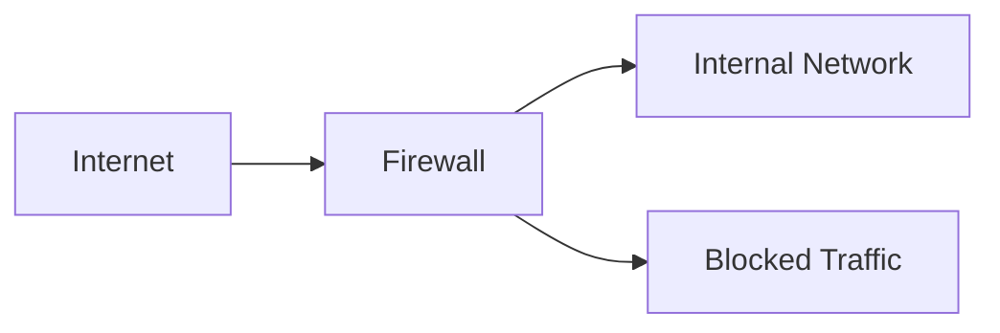
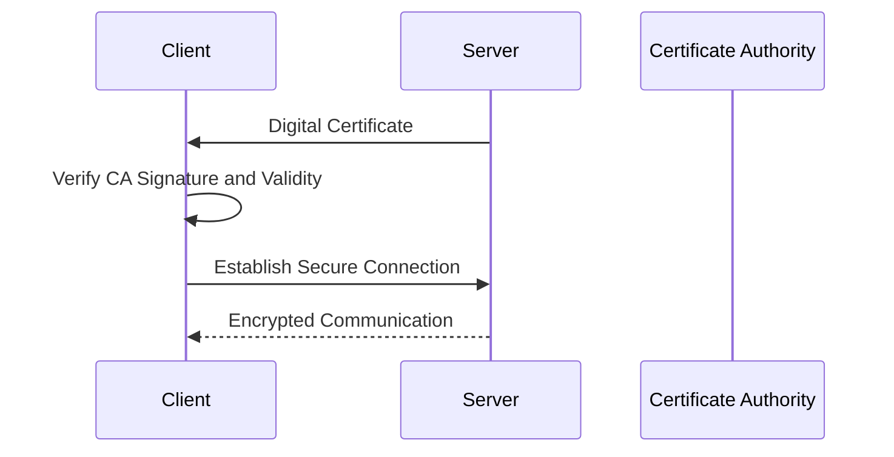
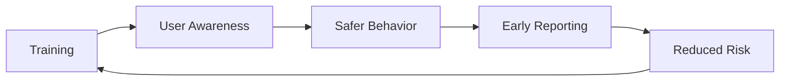
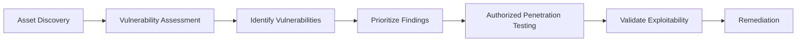
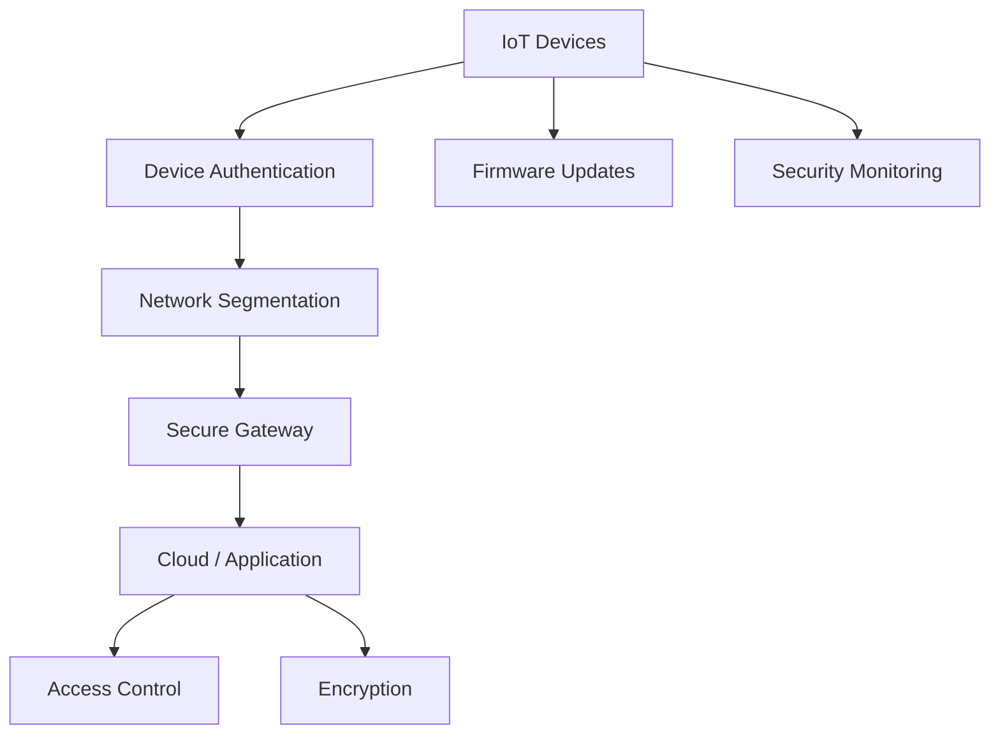
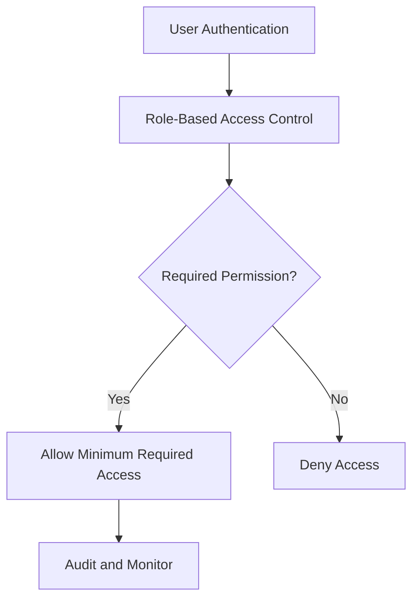
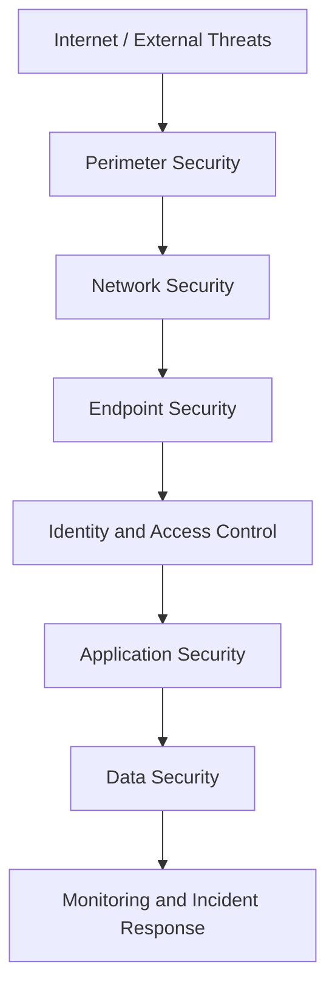
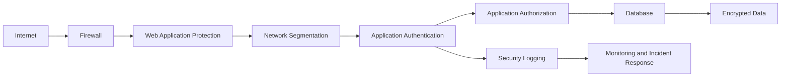

# ECSS — Assignment (Unit 1)

**Subject:** ECSS
**Marks:** 64
**Unit:** 1

The following answers are based on the uploaded Unit-1 assignment, which contains 5 questions in Section A, 3 in Section B, and 3 in Section C. 

---

# SECTION A

## A1. Define social engineering and provide two examples of social engineering attacks.

**Social engineering** is the practice of manipulating people into revealing confidential information, performing an unsafe action, or granting unauthorized access.

Instead of directly attacking a technical system, an attacker exploits human behavior such as trust, fear, curiosity, or urgency.

### Examples

**1. Phishing**

An attacker sends a fraudulent email pretending to be a trusted organization and attempts to obtain credentials or other sensitive information.

**2. Pretexting**

An attacker creates a false identity or story, such as pretending to be an employee, bank representative, or technical-support agent, to convince a victim to disclose information.

Thus:

$$
\boxed{\text{Social Engineering}=\text{Exploitation of human behavior for unauthorized access or information}}
$$

---

## A2. What is the purpose of a firewall in network security? Explain briefly.

A **firewall** is a security mechanism that monitors and controls network traffic according to predefined security rules.

It can filter traffic based on factors such as:

* source and destination addresses,
* ports,
* protocols,
* connection state,
* application-level characteristics in some firewall types.

A simplified representation is:

The firewall can:

$$
\boxed{\text{Allow legitimate traffic}}
$$

and:

$$
\boxed{\text{Block unauthorized or prohibited traffic}}
$$

Therefore, a firewall helps reduce unauthorized network access and can limit exposure of internal systems.

---

## A3. Differentiate between symmetric and asymmetric encryption algorithms.

### Symmetric Encryption

Symmetric encryption uses the **same secret key** for encryption and decryption.

$$
\boxed{C=E_K(P)}
$$

$$
\boxed{P=D_K(C)}
$$

where \(P\) is plaintext, \(C\) is ciphertext, and \(K\) is the shared secret key.

Examples:

* AES
* ChaCha20

### Asymmetric Encryption

Asymmetric encryption uses a **key pair**:

$$
\boxed{K_{\text{public}},K_{\text{private}}}
$$

For encryption:

$$
\boxed{C=E_{K_{\text{public}}}(P)}
$$

and decryption:

$$
\boxed{P=D_{K_{\text{private}}}(C)}
$$

Examples:

* RSA
* Elliptic-curve cryptographic systems

### Difference

| Symmetric Encryption                       | Asymmetric Encryption                                |
| ------------------------------------------ | ---------------------------------------------------- |
| Uses one shared secret key.                | Uses a public/private key pair.                      |
| Generally faster.                          | Generally more computationally expensive.            |
| Key distribution is a major consideration. | Public key can be distributed openly.                |
| Common for bulk data encryption.           | Common for key establishment and digital signatures. |
| Example: AES                               | Example: RSA                                         |

---

## A4. What is the role of a digital certificate in securing online transactions?

A **digital certificate** is an electronic credential that binds a public key to an identity, such as a website or organization.

It is issued and digitally signed by a **Certificate Authority (CA)**.

A certificate can contain information such as:

* subject identity,
* public key,
* issuer,
* validity period,
* digital signature of the issuer.

During HTTPS communication, certificates help a client verify that the server's public key is associated with the intended identity.

A simplified process is:

Therefore:

$$
\boxed{\text{Digital Certificate}=\text{Identity binding + Public-key authentication}}
$$

---

## A5. Explain the concept of penetration testing and its importance in cybersecurity.

**Penetration testing** is an authorized security assessment in which security professionals simulate realistic attacks against systems, applications, networks, or other assets to identify and validate vulnerabilities.

The objective is to discover weaknesses before malicious attackers exploit them.

A typical high-level process is:

### Importance

Penetration testing helps organizations:

* identify exploitable vulnerabilities,
* validate existing security controls,
* understand potential attack paths,
* prioritize remediation,
* improve overall security posture.

It must always be conducted with appropriate authorization and an agreed scope.

---

# SECTION B

## B1. Describe the steps involved in a typical cyber attack lifecycle.

A cyber attack lifecycle describes the sequence of activities that may occur from initial information gathering through achieving an attacker's objective and maintaining access.

A generalized lifecycle can be represented as:

### 1. Reconnaissance

The attacker gathers information about the target.

Examples include identifying:

* domains,
* systems,
* exposed services,
* technologies,
* publicly available information.

### 2. Resource Development

The attacker prepares resources needed for the operation, such as infrastructure, accounts, or malicious components.

### 3. Initial Access

The attacker attempts to gain an initial foothold.

Possible methods include:

* phishing,
* exploitation of vulnerable services,
* compromised credentials.

### 4. Execution

The attacker attempts to run malicious commands or code on the target.

### 5. Persistence

The attacker attempts to maintain access after events such as logout, reboot, or credential changes.

### 6. Privilege Escalation

The attacker attempts to obtain higher privileges than initially obtained.

For example:

$$
\text{Standard User}\rightarrow\text{Administrator}
$$

### 7. Defense Evasion

The attacker attempts to avoid detection or bypass security controls.

### 8. Discovery

The attacker identifies available systems, users, applications, services, and resources.

### 9. Collection

Relevant information is gathered from compromised systems.

### 10. Command and Control

The compromised system may communicate with attacker-controlled infrastructure.

### 11. Impact or Objective

The final objective may include:

* data theft,
* service disruption,
* fraud,
* unauthorized modification,
* destructive activity.

### Defensive Importance

Understanding the lifecycle allows defenders to place controls at multiple stages rather than focusing only on preventing initial access.

---

## B2. Discuss the importance of security awareness training in organizations. How can it mitigate cybersecurity risks?

Security awareness training teaches employees how to recognize, avoid, and report common cybersecurity threats.

Human actions can affect organizational security even when strong technical controls are present. For this reason, employees form an important part of an organization's defensive security strategy.

### Importance of Security Awareness Training

### 1. Phishing Awareness

Employees learn how to recognize suspicious:

* emails,
* links,
* attachments,
* login requests,
* urgent messages.

### 2. Password Security

Training can encourage:

$$
\boxed{\text{Strong, unique passwords}}
$$

and the use of password managers and MFA where available.

### 3. Safe Handling of Data

Employees learn how to properly handle:

* confidential information,
* customer information,
* credentials,
* organizational documents.

### 4. Social Engineering Awareness

Employees can learn to recognize manipulation techniques involving:

* urgency,
* impersonation,
* fear,
* authority,
* unusual requests.

### 5. Incident Reporting

Employees should know how and when to report suspicious activity.

For example:

$$
\text{Suspicious Email}
\rightarrow
\text{Do Not Interact}
\rightarrow
\text{Report}
$$

### 6. Device and Network Security

Training can cover:

* secure workstation practices,
* software updates,
* removable media,
* public Wi-Fi risks,
* device locking.

### 7. Reducing Human Error

Regular training can reduce mistakes that may lead to:

$$
\boxed{\text{Credential compromise}}
$$

$$
\boxed{\text{Malware infection}}
$$

$$
\boxed{\text{Unauthorized data disclosure}}
$$

### Security Awareness Cycle

Therefore, security awareness training complements technical controls and helps create a security-conscious organizational culture.

---

## B3. Explain the difference between vulnerability assessment and penetration testing. Provide examples to illustrate each.

A **vulnerability assessment** and a **penetration test** are related but different security activities.

### Vulnerability Assessment

A vulnerability assessment systematically identifies and evaluates weaknesses in systems, applications, networks, or configurations.

The primary focus is:

$$
\boxed{\text{Identify and prioritize vulnerabilities}}
$$

### Example

An organization scans its web servers and discovers:

$$
\text{Outdated Software Version}
$$

$$
\text{Weak TLS Configuration}
$$

$$
\text{Missing Security Patch}
$$

The findings are documented and prioritized for remediation.

---

### Penetration Testing

Penetration testing is an authorized attempt to validate whether identified weaknesses can actually be exploited and what impact could result.

The primary focus is:

$$
\boxed{\text{Validate exploitability and potential impact}}
$$

### Example

Suppose a vulnerability assessment identifies an outdated application component.

A penetration tester, within the approved scope, may safely validate whether the weakness is exploitable and determine what level of access could result.

### Difference

| Vulnerability Assessment                    | Penetration Testing                                           |
| ------------------------------------------- | ------------------------------------------------------------- |
| Focuses on identifying vulnerabilities.     | Focuses on validating exploitable weaknesses.                 |
| Often uses automated scanners.              | Usually involves more manual analysis and testing.            |
| Broad coverage is common.                   | Typically more targeted and scenario-driven.                  |
| Produces a list of findings and priorities. | Produces validated findings and evidence of potential impact. |
| May be performed frequently.                | Often performed periodically or for specific objectives.      |

### Relationship

Thus, vulnerability assessment answers:

$$
\boxed{\text{"What weaknesses exist?"}}
$$

while penetration testing asks, within an authorized scope:

$$
\boxed{\text{"Can these weaknesses be exploited, and what could their impact be?"}}
$$

---

# SECTION C

## C1. Analyze the security risks associated with Internet of Things (IoT) devices. How can these risks be mitigated?

The Unit-1 assignment specifically asks for an analysis of IoT security risks and their mitigation. 

The **Internet of Things (IoT)** consists of interconnected devices that collect, process, and exchange data over networks.

Examples include:

* smart cameras,
* smart locks,
* sensors,
* industrial devices,
* smart appliances,
* medical devices.

IoT introduces security challenges because devices may have limited resources, long deployment lifetimes, diverse software, and network connectivity.

---

### Major IoT Security Risks

## 1. Weak or Default Credentials

Devices may use weak, reused, or default passwords.

This can allow unauthorized users to gain access.

### Mitigation

$$
\boxed{\text{Unique strong credentials + MFA where supported}}
$$

---

## 2. Unpatched Vulnerabilities

IoT devices may continue running outdated firmware containing known security weaknesses.

### Mitigation

* Maintain firmware inventories.
* Apply vendor updates.
* Replace unsupported devices.

---

## 3. Insecure Communication

Unencrypted communications may expose sensitive information.

### Mitigation

Use appropriate cryptographic protection for data in transit.

$$
\boxed{\text{Authenticated and encrypted communication}}
$$

---

## 4. Poor Device Configuration

Unnecessary services, ports, or privileges can increase the attack surface.

### Mitigation

Apply secure configurations and disable unnecessary functionality.

---

## 5. Lack of Device Visibility

Organizations may not know all IoT devices connected to their networks.

### Mitigation

Maintain an inventory containing:

$$
\boxed{\text{Device identity, owner, location, firmware and network status}}
$$

---

## 6. Insecure APIs and Applications

IoT devices often interact with mobile applications, cloud services, and APIs.

Weak authentication or authorization can expose device data or control functions.

### Mitigation

Use:

* strong authentication,
* authorization controls,
* input validation,
* API security testing.

---

## 7. Physical Tampering

Devices deployed in public or uncontrolled environments may be physically accessed.

### Mitigation

Use:

* secure enclosures,
* tamper detection,
* secure boot,
* protection of debugging interfaces.

---

## 8. Privacy Risks

IoT devices may collect sensitive information such as:

* location,
* audio,
* video,
* usage patterns,
* environmental data.

### Mitigation

Collect only required data and protect it using appropriate access controls and encryption.

---

## 9. Compromised Devices as Attack Platforms

A vulnerable IoT device may be compromised and used as part of a larger attack, such as a botnet or network intrusion.

### Mitigation

Use:

* network segmentation,
* monitoring,
* secure credentials,
* regular patching,
* least privilege.

---

## IoT Security Architecture

### Effective IoT Security Strategy

A complete approach should include:

$$
\boxed{
\text{Inventory}
\rightarrow
\text{Secure Configuration}
\rightarrow
\text{Authentication}
\rightarrow
\text{Encryption}
\rightarrow
\text{Segmentation}
\rightarrow
\text{Monitoring}
\rightarrow
\text{Patching}
}
$$

IoT security therefore requires both device-level and network-level controls.

---

# C2. Discuss the principles of Least Privilege and Need-to-Know in access control mechanisms. How do they contribute to overall security?

**Least privilege** and **need-to-know** are access-control principles designed to limit unnecessary access to resources and information.

The assignment asks specifically how these principles contribute to overall security. 

---

## Principle of Least Privilege

The **Principle of Least Privilege (PoLP)** states that a user, process, application, or device should receive only the minimum permissions required to perform its authorized task.

For example, if an employee only needs to read a document, granting write or administrative permissions is unnecessary.

Conceptually:

$$
\boxed{
\text{Granted Privileges}
\approx
\text{Privileges Required for the Task}
}
$$

### Example

Suppose a database application only needs permission to:

$$
\{\text{SELECT}\}
$$

It should not automatically receive:

$$
\{\text{INSERT, UPDATE, DELETE, DROP}\}
$$

unless those operations are actually required.

---

## Principle of Need-to-Know

The **Need-to-Know principle** limits access to information based on whether the user genuinely requires that information to perform an authorized responsibility.

A user may have access to a particular system but still not require access to every piece of information within it.

### Example

An HR employee may need access to employee records but may not need access to an organization's source-code repository.

Thus:

$$
\boxed{\text{Access to system}\neq\text{Access to every resource}}
$$

---

## Difference

| Least Privilege                                         | Need-to-Know                                                         |
| ------------------------------------------------------- | -------------------------------------------------------------------- |
| Limits permissions and capabilities.                    | Limits access to information.                                        |
| Applies to users, processes, services and applications. | Primarily concerns information access.                               |
| Focuses on what actions an entity may perform.          | Focuses on what information an entity may access.                    |
| Example: read-only database access.                     | Example: HR staff can access HR records but not engineering secrets. |

---

## Security Benefits

### 1. Reduces Attack Surface

Fewer permissions mean fewer opportunities for misuse.

### 2. Limits Damage from Compromised Accounts

If an account is compromised, the attacker inherits only the permissions available to that account.

### 3. Limits Insider Risk

Employees cannot automatically access information outside their responsibilities.

### 4. Reduces Privilege Escalation Impact

Restricting permissions can reduce the consequences of compromised applications or accounts.

### 5. Supports Separation of Duties

Sensitive operations can be divided among multiple roles instead of giving one user unrestricted control.

---

## Example

Consider a university system:

For example:

| Role                 | Required Access                 |
| -------------------- | ------------------------------- |
| Student              | Own academic records            |
| Faculty              | Assigned course/student records |
| Finance Staff        | Fee-related records             |
| System Administrator | Administrative functions        |

Applying least privilege and need-to-know reduces unnecessary access.

Therefore:

$$
\boxed{\text{Least Privilege + Need-to-Know} \rightarrow \text{Reduced unauthorized access and reduced impact of compromise}}
$$

---

# C3. Explain the concept of Defense-in-Depth in cybersecurity. Provide a layered approach example.

**Defense-in-depth** is a cybersecurity strategy in which multiple independent or complementary security controls are placed at different layers of a system.

The objective is not to rely on a single security mechanism.

If one control fails, additional controls remain available.

The assignment specifically asks for a layered defense-in-depth approach. 

---

## Principle of Defense-in-Depth

Instead of:

$$
\boxed{\text{One Security Control}}
$$

an organization uses:

$$
\boxed{
\text{Multiple Security Layers}
}
$$

For example:

---

## Layer 1: Perimeter Security

Controls can include:

* firewalls,
* secure gateways,
* network filtering.

Purpose:

$$
\boxed{\text{Control unwanted external traffic}}
$$

---

## Layer 2: Network Security

Examples:

* network segmentation,
* intrusion detection/prevention,
* secure network configurations.

Segmentation can limit movement between systems.

---

## Layer 3: Endpoint Security

Endpoints can be protected using:

* anti-malware,
* endpoint detection and response,
* host firewalls,
* secure configuration,
* patch management.

---

## Layer 4: Identity and Access Control

Controls include:

* strong authentication,
* MFA,
* least privilege,
* role-based access control.

The goal is:

$$
\boxed{\text{Only authorized entities receive required access}}
$$

---

## Layer 5: Application Security

Application security can include:

* secure coding,
* input validation,
* authentication and authorization,
* dependency management,
* security testing.

---

## Layer 6: Data Security

Data can be protected through:

$$
\boxed{\text{Encryption}}
$$

$$
\boxed{\text{Access Control}}
$$

$$
\boxed{\text{Backups}}
$$

$$
\boxed{\text{Data Loss Prevention}}
$$

---

## Layer 7: Monitoring and Incident Response

Security logs and monitoring can help detect suspicious activity.

Organizations can use:

* centralized logging,
* security monitoring,
* alerting,
* incident-response procedures.

---

## Example of Defense-in-Depth

Consider an organization's web application.

Suppose an attacker bypasses the firewall.

The attacker may still encounter:

$$
\boxed{\text{Application protection}}
$$

Then:

$$
\boxed{\text{Authentication}}
$$

Then:

$$
\boxed{\text{Authorization}}
$$

Then:

$$
\boxed{\text{Database access controls}}
$$

and finally:

$$
\boxed{\text{Monitoring and incident response}}
$$

Thus, failure of one layer does not automatically mean complete system compromise.

---

## Benefits of Defense-in-Depth

### 1. Reduces Single Points of Failure

No single control is responsible for the complete security of the environment.

### 2. Limits Attack Impact

Compromising one layer does not necessarily provide unrestricted access.

### 3. Improves Detection

Different security controls can generate different signals and logs.

### 4. Supports Resilience

Multiple protective layers allow an organization to continue defending systems even when a particular control fails.

Therefore:

$$
\boxed{
\text{Defense-in-Depth}
=
\text{Multiple Complementary Security Controls}
}
$$

---

# Final Summary

| Topic                    | Key Point                                                                  |
| ------------------------ | -------------------------------------------------------------------------- |
| Social Engineering       | Manipulates people to obtain information or access                         |
| Firewall                 | Filters and controls network traffic                                       |
| Symmetric Encryption     | Uses a shared secret key                                                   |
| Asymmetric Encryption    | Uses public/private key pair                                               |
| Digital Certificate      | Binds identity to a public key                                             |
| Penetration Testing      | Authorized testing to validate exploitable weaknesses                      |
| Attack Lifecycle         | Reconnaissance through objective/impact                                    |
| Security Awareness       | Reduces risks caused by human error and social engineering                 |
| Vulnerability Assessment | Identifies and prioritizes weaknesses                                      |
| Penetration Testing      | Validates exploitability and impact                                        |
| IoT Security             | Requires authentication, patching, segmentation, encryption and monitoring |
| Least Privilege          | Gives only required permissions                                            |
| Need-to-Know             | Gives access only to required information                                  |
| Defense-in-Depth         | Uses multiple layers of security controls                                  |

