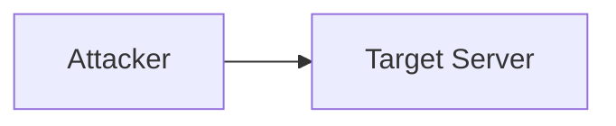
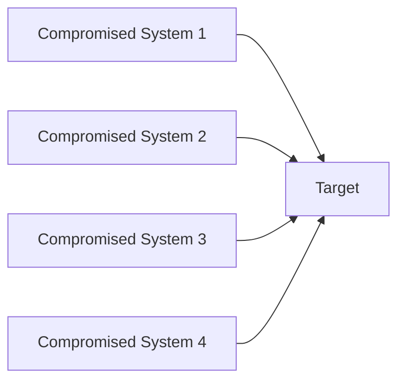
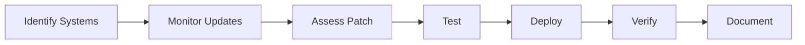
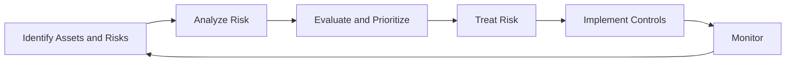
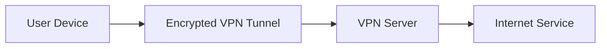
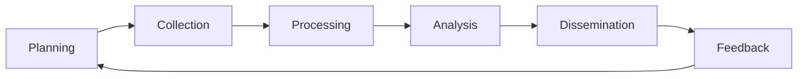
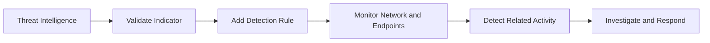

# ECSS — Assignment (Unit 2)

**Subject:** ECSS
**Marks:** 64
**Unit:** 2

The following answers are based on the uploaded Unit-2 assignment. 

---

# SECTION A

## A1. What is malware? Provide three examples of common types of malware.

**Malware** stands for **malicious software**. It is software intentionally designed to disrupt systems, damage data, gain unauthorized access, or perform other harmful activities.

Three common types are:

### 1. Virus

A virus is malicious code that attaches itself to a legitimate file or program and executes when the infected host is run.

### 2. Worm

A worm is malware capable of spreading from one system to another, often without requiring a user to execute an infected file.

### 3. Trojan Horse

A Trojan is malicious software disguised as a legitimate or useful application.

Thus:

$$
\boxed{\text{Malware}=\text{Software intentionally designed to perform malicious actions}}
$$

---

## A2. Explain the concept of phishing and discuss techniques to identify phishing emails.

**Phishing** is a social-engineering technique in which an attacker attempts to deceive a victim into revealing sensitive information or performing an unsafe action, commonly through fraudulent emails or messages.

Common goals include obtaining:

* usernames,
* passwords,
* financial information,
* authentication codes.

### Techniques to Identify Phishing Emails

### 1. Check the Sender Address

Examine the complete sender address rather than relying only on the displayed name.

For example, a message claiming to be from a legitimate organization may come from an unrelated or look-alike domain.

### 2. Inspect Links

Hover over links before opening them and verify the actual destination.

A displayed link such as:

```text
https://example.com/login
```

may point to a completely different domain.

### 3. Look for Urgent or Threatening Language

Phishing messages often create artificial urgency, such as:

* "Your account will be closed today."
* "Immediate verification required."

### 4. Be Careful with Unexpected Attachments

Unexpected attachments can contain malicious files or links.

### 5. Check for Suspicious Requests

Be cautious when an email unexpectedly requests:

* passwords,
* OTPs,
* payment,
* confidential documents.

### 6. Check Spelling and Formatting

Poor grammar, unusual formatting, or inconsistent branding can be warning signs.

### 7. Verify Through an Independent Channel

For sensitive requests, contact the organization using a trusted website or phone number rather than replying directly to the suspicious message.

---

# A3. Define encryption and describe the difference between encryption in transit and encryption at rest.

**Encryption** is the process of transforming readable data, called plaintext, into an unreadable form called ciphertext using a cryptographic algorithm and key.

Conceptually:

$$
\boxed{C=E_K(P)}
$$

where:

* \(P\) = plaintext,
* \(K\) = key,
* \(C\) = ciphertext.

Decryption recovers the original data:

$$
\boxed{P=D_K(C)}
$$

### Encryption in Transit

Encryption in transit protects data while it is being transmitted between systems or networks.

Examples include:

$$
\boxed{\text{HTTPS/TLS}}
$$

and encrypted network connections.

Its purpose is to prevent unauthorized parties from reading or modifying information while it is moving across a network.

### Encryption at Rest

Encryption at rest protects data while it is stored on:

* hard drives,
* SSDs,
* databases,
* cloud storage,
* backup media.

### Difference

| Encryption in Transit                              | Encryption at Rest                                   |
| -------------------------------------------------- | ---------------------------------------------------- |
| Protects data while moving.                        | Protects stored data.                                |
| Used during communication.                         | Used in storage systems.                             |
| Example: TLS/HTTPS.                                | Example: encrypted disk or database.                 |
| Protects against interception during transmission. | Protects against unauthorized access to stored data. |

---

## A4. What is a Denial of Service (DoS) attack? How does it differ from a Distributed Denial of Service (DDoS) attack?

A **Denial of Service (DoS)** attack attempts to make a service, application, server, or network resource unavailable to legitimate users by exhausting resources or otherwise disrupting normal operation.

A **Distributed Denial of Service (DDoS)** attack performs the same general objective using traffic or requests originating from multiple systems.

### DoS



### DDoS



### Difference

| DoS                                                          | DDoS                                                           |
| ------------------------------------------------------------ | -------------------------------------------------------------- |
| Attack traffic typically originates from one primary source. | Attack traffic originates from multiple distributed sources.   |
| Easier to identify the source in some cases.                 | Source identification and filtering can be more difficult.     |
| Generally smaller attack infrastructure.                     | Can involve many compromised or otherwise coordinated systems. |

Therefore:

$$
\boxed{\text{DoS}=\text{Denial of service from a single primary source}}
$$

$$
\boxed{\text{DDoS}=\text{Distributed denial of service from multiple sources}}
$$

---

## A5. Describe the role of Multi-Factor Authentication (MFA) in enhancing authentication security.

**Multi-Factor Authentication (MFA)** requires a user to provide two or more different authentication factors before access is granted.

The factors generally belong to categories such as:

1. **Something you know** — password or PIN.
2. **Something you have** — security key or authentication device.
3. **Something you are** — biometric characteristic.

For example:

$$
\boxed{\text{Password}+\text{Authentication Code}}
$$

An attacker who obtains the password may still be unable to authenticate without the additional factor.

### Importance

MFA:

* reduces dependence on passwords alone,
* provides additional protection against stolen credentials,
* strengthens account security,
* makes unauthorized access more difficult.

Thus:

$$
\boxed{\text{MFA}=\text{Authentication using multiple independent factors}}
$$

---

# SECTION B

## B1. Discuss the importance of keeping software and operating systems updated in maintaining cybersecurity hygiene.

The assignment specifically asks about maintaining cybersecurity hygiene through software and operating-system updates. 

Software and operating systems frequently contain vulnerabilities. Vendors release security updates and patches to fix known issues and improve security.

Regularly updating software is therefore an important cybersecurity practice.

### Importance of Updates

### 1. Fixes Known Vulnerabilities

Security patches can correct vulnerabilities that attackers may otherwise exploit.

Conceptually:

$$
\boxed{\text{Vulnerability}\rightarrow\text{Security Patch}\rightarrow\text{Reduced Exposure}}
$$

### 2. Reduces Attack Surface

Removing outdated or vulnerable software components can reduce the number of exploitable weaknesses in a system.

### 3. Protects Against Known Threats

Attackers often target publicly known vulnerabilities in outdated software.

### 4. Improves Security Features

Updates may introduce stronger:

* authentication mechanisms,
* encryption support,
* access controls,
* security monitoring capabilities.

### 5. Maintains Vendor Support

Unsupported operating systems and applications may stop receiving security fixes.

### 6. Protects Applications and Data

A vulnerable application may provide attackers with access to sensitive information or system functionality.

---

## Good Patch-Management Practices

Organizations should:

1. Maintain an inventory of systems and software.
2. Monitor vendor security advisories.
3. Prioritize security-critical patches.
4. Test updates where necessary.
5. Deploy patches systematically.
6. Verify successful installation.
7. Track systems that remain unpatched.

### Patch Management Cycle



Therefore:

$$
\boxed{\text{Regular patching}\rightarrow\text{Reduced exposure to known vulnerabilities}}
$$

---

# B2. Explain the concept of risk management in cybersecurity. What are the key steps involved?

**Cybersecurity risk management** is the continuous process of identifying, analyzing, treating, and monitoring risks that could affect an organization's information systems, data, and operations.

A simplified relationship is:

$$
\boxed{\text{Risk} \approx \text{Likelihood}\times\text{Impact}}
$$

### Key Steps

## 1. Identify Assets

Determine what needs protection.

Examples:

* servers,
* applications,
* databases,
* networks,
* sensitive information.

## 2. Identify Threats

Determine possible sources of harm.

Examples:

* malware,
* phishing,
* unauthorized access,
* insider threats,
* hardware failure.

## 3. Identify Vulnerabilities

Find weaknesses that threats could exploit.

Examples:

* outdated software,
* weak passwords,
* insecure configurations,
* missing access controls.

## 4. Analyze and Assess Risk

Estimate the likelihood and potential impact of identified risks.

For example:

$$
R=L\times I
$$

where:

* \(R\) = risk,
* \(L\) = likelihood,
* \(I\) = impact.

Organizations may use qualitative categories such as:

$$
\boxed{\text{Low, Medium, High}}
$$

or quantitative approaches where suitable.

## 5. Treat the Risk

Possible risk responses include:

$$
\boxed{\text{Avoid}}
$$

$$
\boxed{\text{Reduce}}
$$

$$
\boxed{\text{Transfer}}
$$

$$
\boxed{\text{Accept}}
$$

### Examples

Installing security controls may reduce risk.

Cyber-insurance may transfer some financial consequences.

Changing a risky business process may avoid a risk.

## 6. Implement Security Controls

Examples include:

* MFA,
* firewalls,
* encryption,
* backups,
* access control,
* network segmentation.

## 7. Monitor and Review

Risk changes over time as systems, threats, vulnerabilities, and business processes change.

### Risk Management Lifecycle



Thus:

$$
\boxed{\text{Risk Management}=\text{Identify}\rightarrow\text{Assess}\rightarrow\text{Treat}\rightarrow\text{Monitor}}
$$

---

# B3. Describe the differences between black-box and white-box testing in cybersecurity assessments.

The assignment asks for a comparison of black-box and white-box testing. 

## Black-Box Testing

In black-box testing, the tester has little or no internal knowledge of the target system.

The assessment is performed primarily from the perspective of an external user or attacker.

### Characteristics

* Limited internal information.
* Tests externally observable behavior.
* Represents an external attack perspective.
* Often useful for evaluating exposed interfaces.

### Example

A security tester is given only:

$$
\boxed{\text{Target URL + authorized scope}}
$$

and must assess the application without source-code access.

---

## White-Box Testing

In white-box testing, the tester has substantial internal information about the system.

This may include:

* source code,
* architecture,
* configuration,
* credentials,
* documentation.

### Characteristics

* Extensive internal knowledge.
* Allows deeper assessment.
* Can identify implementation-level weaknesses.
* Useful for detailed application security testing.

### Example

A tester receives:

$$
\boxed{\text{Source Code + Architecture + Test Credentials}}
$$

and performs an in-depth security review.

---

## Comparison

| Black-Box Testing                                      | White-Box Testing                     |
| ------------------------------------------------------ | ------------------------------------- |
| Little or no internal knowledge.                       | Extensive internal knowledge.         |
| Simulates an external perspective.                     | Allows internal examination.          |
| Limited visibility.                                    | High visibility.                      |
| Often requires more time to discover system structure. | Can directly examine implementation.  |
| Example: external application assessment.              | Example: source-code security review. |

---

# SECTION C

## C1. Analyze the security implications of using public Wi-Fi networks. What steps can users take to protect their data?

The Unit-2 assignment asks specifically about public Wi-Fi security risks and protection measures. 

Public Wi-Fi is often available in places such as:

* airports,
* hotels,
* cafés,
* libraries,
* shopping centers.

Because users may not control the underlying network infrastructure, security risks can be greater than on a trusted network.

---

## Security Risks

### 1. Untrusted Network

The user has limited control over who operates the network or how it is configured.

### 2. Eavesdropping

If communication is not properly encrypted, attackers on the network may be able to observe traffic.

### 3. Rogue Access Points

An attacker may create a malicious wireless network designed to resemble a legitimate hotspot.

For example:

```text
Legitimate_WiFi
```

versus:

```text
Legitimate_WiFi_Free
```

A user who connects to the malicious network may expose traffic or credentials.

### 4. Man-in-the-Middle Attacks

An attacker positioned between the user and destination may attempt to intercept or manipulate communications.

### 5. Session Hijacking

Poorly protected sessions can potentially be abused if authentication tokens or session information are exposed.

### 6. Malware and Network Attacks

An insecure local network may increase exposure to attacks against vulnerable devices.

---

## Protection Measures

### 1. Use HTTPS

Users should access websites using secure HTTPS connections.

$$
\boxed{\text{HTTPS}\rightarrow\text{Encrypted client-server communication}}
$$

### 2. Use a Trusted VPN When Appropriate

A VPN can create an encrypted tunnel between the device and the VPN endpoint.



A VPN does not make the endpoint or every application automatically secure; it primarily protects the connection between the device and VPN endpoint.

### 3. Disable Automatic Wi-Fi Connection

Avoid automatically joining unknown wireless networks.

### 4. Verify the Network

Confirm the network name through a trusted source when possible.

### 5. Avoid Sensitive Transactions on Untrusted Networks

Particularly avoid entering sensitive information if the connection or website security cannot be verified.

### 6. Keep Devices Updated

Install current operating-system and application security updates.

### 7. Use MFA

MFA provides an additional authentication factor if credentials are compromised.

### 8. Disable File Sharing When Unnecessary

Unneeded sharing services should not be exposed on untrusted networks.

### 9. Use Device Security Controls

Maintain:

* firewall protection,
* endpoint security,
* secure screen lock.

---

## Safe Public Wi-Fi Flow


Therefore, public Wi-Fi should be treated as an **untrusted network environment**, and users should rely on encryption, authentication, secure device configuration, and careful browsing practices.

---

# C2. Discuss the role of encryption in securing data transmission over networks. How does end-to-end encryption enhance security?

The assignment asks specifically about encryption during network transmission and the role of end-to-end encryption. 

**Encryption** protects information by transforming plaintext into ciphertext so that unauthorized parties cannot readily understand the transmitted information.

$$
\boxed{C=E_K(P)}
$$

The authorized recipient uses the appropriate key to recover the plaintext:

$$
\boxed{P=D_K(C)}
$$

---

## Role of Encryption in Network Communication

### 1. Confidentiality

Encryption helps prevent unauthorized parties from reading network traffic.

For example:

$$
\text{Plaintext}
\rightarrow
\text{Encryption}
\rightarrow
\text{Ciphertext}
$$

An interceptor sees ciphertext rather than the original readable data.

### 2. Integrity

Secure communication protocols can combine encryption with authentication/integrity mechanisms to detect unauthorized modification.

### 3. Authentication

Protocols such as TLS can use certificates and cryptographic mechanisms to authenticate endpoints.

### 4. Protection of Sensitive Information

Encryption helps protect:

* passwords,
* personal information,
* financial information,
* business data,
* authentication credentials.

---

# End-to-End Encryption

**End-to-End Encryption (E2EE)** means that data is encrypted on the originating endpoint and decrypted at the intended receiving endpoint.

Conceptually:


Intermediate network systems generally relay the ciphertext rather than possessing the plaintext required to read the content.

### Example

Suppose:

$$
P=\text{"Hello"}
$$

The sender encrypts it:

$$
C=E_K(P)
$$

The encrypted data travels across the network.

The receiver then performs:

$$
P=D_K(C)
$$

---

## Why E2EE Enhances Security

### 1. Protects Data from Network Intermediaries

Intermediate systems cannot simply read plaintext while forwarding encrypted data.

### 2. Reduces Exposure During Transmission

Compromised network infrastructure has less direct visibility into the encrypted content.

### 3. Protects Confidentiality

Only the intended endpoints are designed to possess the keys required to decrypt the content.

### 4. Helps Protect Against Interception

An attacker who captures encrypted traffic generally obtains ciphertext rather than plaintext.

---

## Important Limitation

End-to-end encryption protects the communication content while it is encrypted, but it does not automatically protect:

* compromised endpoints,
* malware on the sender's device,
* malware on the receiver's device,
* insecure key management,
* metadata that may remain observable depending on the system.

Therefore:

$$
\boxed{
\text{E2EE}=\text{Strong protection of message content between endpoints}
}
$$

but it is not a complete cybersecurity solution by itself.

---

# C3. Explain threat intelligence in cybersecurity. How can organizations leverage threat intelligence to enhance their security posture?

The Unit-2 assignment asks for the concept of threat intelligence and how organizations can use it to strengthen security. 

**Threat intelligence** is the collection, processing, analysis, and use of information about cyber threats, threat actors, attack techniques, indicators, and vulnerabilities to support security decisions.

It converts raw security information into information that can be used for defensive action.

---

## Types of Threat Intelligence

### 1. Strategic Intelligence

Provides high-level information for:

* executives,
* risk management,
* security planning.

It focuses on broader trends and their potential business implications.

### 2. Tactical Intelligence

Describes attacker techniques, tactics, and procedures.

For example:

$$
\boxed{\text{TTPs}=\text{Tactics, Techniques and Procedures}}
$$

This helps security teams understand how attacks may be conducted.

### 3. Operational Intelligence

Provides information about ongoing or emerging attack campaigns.

### 4. Technical Intelligence

Focuses on technical indicators such as:

* IP addresses,
* domain names,
* file hashes,
* URLs,
* malware indicators.

---

## Threat Intelligence Lifecycle



### 1. Planning

Determine what intelligence is required.

### 2. Collection

Gather information from relevant sources.

Sources may include:

* security logs,
* vulnerability data,
* threat reports,
* malware analysis,
* security feeds,
* incident investigations.

### 3. Processing

Organize, normalize, and prepare collected information for analysis.

### 4. Analysis

Determine what the information means and whether it represents a relevant threat.

### 5. Dissemination

Share useful intelligence with the appropriate teams.

### 6. Feedback

Security teams assess whether the intelligence met operational requirements and adjust future collection accordingly.

---

# How Organizations Can Leverage Threat Intelligence

## 1. Improve Detection

Indicators and behavioral information can be incorporated into monitoring and detection systems.

For example:

$$
\text{Threat Indicator}
\rightarrow
\text{Detection Rule}
\rightarrow
\text{Security Alert}
$$

## 2. Prioritize Vulnerabilities

Threat intelligence can help organizations understand which vulnerabilities are being actively targeted and prioritize remediation accordingly.

## 3. Improve Incident Response

During an incident, intelligence about attacker behavior can help responders understand:

* likely techniques,
* affected infrastructure,
* possible indicators,
* additional systems to investigate.

## 4. Enhance Security Monitoring

Threat data can be integrated into:

* SIEM platforms,
* endpoint security systems,
* network monitoring systems,
* firewalls.

## 5. Support Threat Hunting

Security teams can search for indicators and behaviors associated with known threats.

## 6. Improve Security Awareness

Threat intelligence can inform employees and security teams about relevant attack patterns, particularly phishing and social-engineering campaigns.

## 7. Support Strategic Decision-Making

Security leadership can use threat information to identify changing risks and prioritize defensive investments.

---

## Example

Suppose an organization receives credible intelligence that a particular malicious domain is being used in a phishing campaign.

The organization can:



The organization may also use the information to improve phishing awareness training and review whether any users interacted with related messages.

Thus:

$$
\boxed{
\text{Threat Intelligence}
\rightarrow
\text{Better Detection}
\rightarrow
\text{Faster Response}
\rightarrow
\text{Improved Security Posture}
}
$$

---

# Final Summary

| Topic                 | Key Point                                                                   |
| --------------------- | --------------------------------------------------------------------------- |
| Malware               | Malicious software designed to perform harmful or unauthorized actions      |
| Phishing              | Deceptive social engineering to obtain information or induce unsafe actions |
| Encryption            | Converts plaintext into ciphertext using cryptographic mechanisms           |
| Encryption in Transit | Protects data while being transmitted                                       |
| Encryption at Rest    | Protects stored data                                                        |
| DoS                   | Denial of service from a single primary source                              |
| DDoS                  | Denial of service using multiple distributed sources                        |
| MFA                   | Uses multiple authentication factors                                        |
| Software Updates      | Reduce exposure to known vulnerabilities                                    |
| Risk Management       | Identify, assess, treat and monitor cybersecurity risks                     |
| Black-Box Testing     | Testing with little or no internal knowledge                                |
| White-Box Testing     | Testing with substantial internal knowledge                                 |
| Public Wi-Fi          | Should be treated as an untrusted network                                   |
| E2EE                  | Protects message content between communicating endpoints                    |
| Threat Intelligence   | Converts threat information into actionable security knowledge              |

