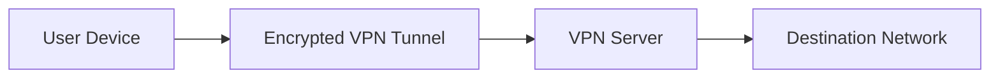
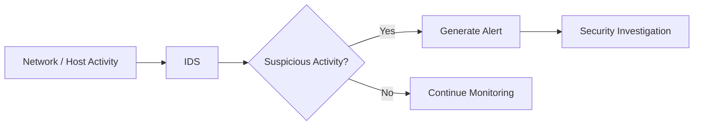
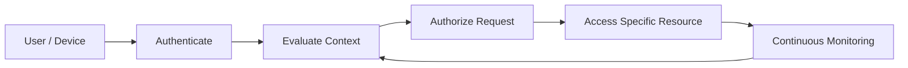
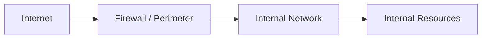
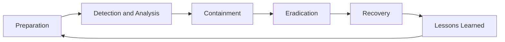
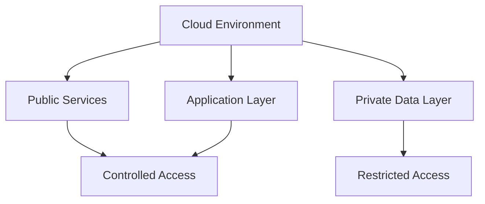
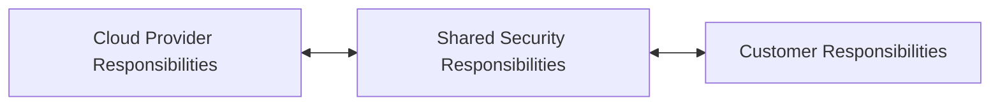
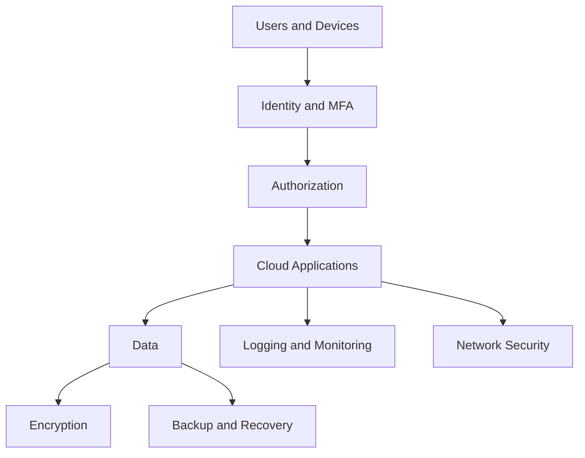
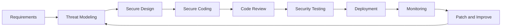
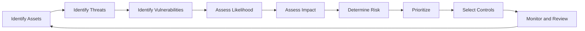

# ECSS — Assignment (Unit 3)

**Subject:** ECSS
**Marks:** 64
**Unit:** 3

The following answers are based on the uploaded Unit-3 assignment. 

---

# SECTION A

## A1. Define the term "Phishing" and provide two examples of phishing techniques.

**Phishing** is a social-engineering attack in which an attacker impersonates a legitimate person or organization to deceive a victim into revealing sensitive information or performing an unsafe action.

Common targets include:

* usernames and passwords,
* banking information,
* authentication codes,
* personal information.

### Two Phishing Techniques

**1. Email Phishing**

The attacker sends a fraudulent email that appears to come from a legitimate organization and asks the victim to click a link, open an attachment, or provide credentials.

**2. Spear Phishing**

A spear-phishing attack is specifically targeted at a particular individual or organization. The attacker uses information about the target to make the fraudulent message appear more trustworthy.

Thus:

$$
\boxed{\text{Phishing}=\text{Deceptive communication intended to obtain information or induce an unsafe action}}
$$

---

## A2. Differentiate between Symmetric and Asymmetric Encryption Algorithms.

### Symmetric Encryption

Symmetric encryption uses the **same secret key** for encryption and decryption.

$$
\boxed{C=E_K(P)}
$$

$$
\boxed{P=D_K(C)}
$$

where:

* \(P\) = plaintext,
* \(C\) = ciphertext,
* \(K\) = secret key.

Examples include:

$$
\boxed{\text{AES}}
$$

and:

$$
\boxed{\text{ChaCha20}}
$$

### Asymmetric Encryption

Asymmetric encryption uses two related keys:

$$
\boxed{K_{\text{public}},\ K_{\text{private}}}
$$

For encryption:

$$
C=E_{K_{\text{public}}}(P)
$$

and decryption:

$$
P=D_{K_{\text{private}}}(C)
$$

Examples include RSA and elliptic-curve public-key systems.

### Difference

| Symmetric Encryption                              | Asymmetric Encryption                                       |
| ------------------------------------------------- | ----------------------------------------------------------- |
| Uses one shared secret key.                       | Uses public and private keys.                               |
| Generally faster.                                 | Generally slower for bulk encryption.                       |
| Secret-key distribution must be managed securely. | Public key can be distributed openly.                       |
| Commonly used for bulk data encryption.           | Commonly used for key establishment and digital signatures. |
| Example: AES                                      | Example: RSA                                                |

---

## A3. Explain the concept of Social Engineering and its relevance in Cybersecurity.

**Social engineering** is the manipulation of people into revealing confidential information, granting access, or performing actions that compromise security.

Instead of exploiting only technical vulnerabilities, social engineering exploits human behavior such as:

$$
\boxed{\text{Trust, urgency, fear, curiosity, and authority}}
$$

### Examples

* Phishing emails
* Fake technical-support calls
* Impersonation
* Pretexting

### Relevance in Cybersecurity

Social engineering is important because even strong technical security controls can be undermined when users are manipulated into:

* revealing passwords,
* approving fraudulent requests,
* opening malicious attachments,
* transferring money,
* disclosing confidential information.

Therefore:

$$
\boxed{\text{Cybersecurity}=\text{Technical Controls}+\text{Human Awareness}}
$$

Security awareness training, MFA, verification procedures, and access controls can reduce the impact of social-engineering attacks.

---

## A4. What is the purpose of a Virtual Private Network (VPN) in network security?

A **Virtual Private Network (VPN)** creates an encrypted connection between a user's device and a VPN endpoint across an underlying network.

Conceptually:



### Main Purposes

* Protect data while it travels across an untrusted network.
* Reduce exposure to local network interception.
* Provide secure remote access to organizational resources.
* Help protect confidentiality of network traffic between the device and VPN endpoint.

Therefore:

$$
\boxed{\text{VPN}=\text{Secure encrypted tunnel over an underlying network}}
$$

A VPN does not automatically secure a compromised endpoint or guarantee the security of every website or service accessed through it.

---

## A5. Describe the role of Intrusion Detection Systems (IDS) in cybersecurity.

An **Intrusion Detection System (IDS)** monitors systems or network activity for suspicious or potentially malicious behavior.

An IDS can:

* inspect network traffic,
* analyze system activity,
* detect known attack patterns,
* identify suspicious behavior,
* generate alerts for security teams.



IDS can generally be divided into:

### Network-Based IDS (NIDS)

Monitors network traffic.

### Host-Based IDS (HIDS)

Monitors activity on an individual host or system.

Thus:

$$
\boxed{\text{IDS}=\text{Detection and alerting mechanism}}
$$

It primarily detects and reports suspicious activity rather than automatically blocking it.

---

# SECTION B

## B1. Discuss the concept of Zero-Trust Security Architecture. How does it differ from traditional perimeter-based security?

The Unit-3 assignment asks for a comparison between zero-trust architecture and traditional perimeter-based security. 

## Zero-Trust Security

**Zero Trust** is a security architecture based on the principle that access should not be granted simply because a user or device is inside a traditional network boundary.

The fundamental idea is commonly expressed as:

$$
\boxed{\text{Never trust implicitly; verify explicitly}}
$$

Access decisions consider factors such as:

* user identity,
* device state,
* requested resource,
* context,
* authentication,
* authorization.

### Basic Zero-Trust Flow



---

## Traditional Perimeter-Based Security

Traditional security models often emphasize a strong boundary around a trusted internal network.

Conceptually:



The model traditionally places significant trust in the internal network after a user or device passes the perimeter.

---

## Comparison

| Zero Trust                                                     | Traditional Perimeter-Based Security                                           |
| -------------------------------------------------------------- | ------------------------------------------------------------------------------ |
| Trust is not automatically granted based on network location.  | Internal network may be treated as relatively trusted after perimeter checks.  |
| Access is verified for specific requests.                      | Strong emphasis on the network boundary.                                       |
| Supports users and devices operating from different locations. | Traditionally designed around a defined internal network perimeter.            |
| Continuous evaluation and monitoring are emphasized.           | Perimeter controls are central to the security model.                          |
| Least privilege is strongly emphasized.                        | Access may be broader within the internal network depending on implementation. |

### Core Zero-Trust Principles

$$
\boxed{\text{Verify explicitly}}
$$

$$
\boxed{\text{Use least privilege}}
$$

$$
\boxed{\text{Assume breach}}
$$

The objective is to limit unauthorized access and reduce the impact of a compromised account or device.

---

## B2. Explain the importance of Incident Response Planning in cybersecurity. What are the key components of an Incident Response Plan?

Incident response planning establishes how an organization will prepare for, detect, contain, investigate, recover from, and learn from cybersecurity incidents.

The assignment specifically asks for its importance and key components. 

Without a defined plan, organizations may respond inconsistently during an incident, increasing delays and potential damage.

### Importance

Incident response planning helps organizations:

* respond quickly,
* define responsibilities,
* reduce confusion during incidents,
* limit damage,
* preserve evidence,
* restore services,
* improve future security.

---

## Key Components

### 1. Preparation

Before an incident occurs, the organization should establish:

* policies,
* response procedures,
* tools,
* communication channels,
* response teams.

### 2. Identification

Determine whether an event is actually a security incident.

Sources may include:

* IDS alerts,
* endpoint alerts,
* logs,
* user reports.

### 3. Containment

Contain the incident to prevent further spread.

Containment may involve isolating affected systems or restricting compromised accounts.

### 4. Eradication

Remove the cause of the incident, such as:

* malware,
* malicious accounts,
* vulnerable configurations.

### 5. Recovery

Restore systems to normal operation and verify that they are secure.

### 6. Lessons Learned

After the incident, review:

* what happened,
* how it happened,
* what worked,
* what failed,
* what should be improved.

### Incident Response Lifecycle



### Key Elements of an Incident Response Plan

| Component                  | Purpose                                                 |
| -------------------------- | ------------------------------------------------------- |
| Roles and responsibilities | Defines who performs each task                          |
| Incident classification    | Categorizes incidents                                   |
| Communication plan         | Defines internal and external communication             |
| Escalation procedure       | Determines when incidents require higher-level response |
| Evidence handling          | Protects investigation data                             |
| Recovery procedures        | Restores systems and services                           |
| Documentation              | Records actions, findings and decisions                 |

Therefore:

$$
\boxed{\text{Incident Response Planning}\rightarrow\text{Faster, organized and more consistent response}}
$$

---

## B3. Describe the differences between Black-Hat, White-Hat and Grey-Hat Hackers. Provide examples of each.

The assignment asks for the differences among black-hat, white-hat and grey-hat hackers. 

### 1. Black-Hat Hacker

A **black-hat hacker** performs unauthorized activities with malicious, fraudulent, destructive, or other harmful objectives.

Example:

An attacker illegally gains access to an organization's server and steals confidential information.

---

### 2. White-Hat Hacker

A **white-hat hacker** performs security testing with authorization from the owner of the system.

Their purpose is to identify vulnerabilities and help improve security.

Example:

An organization authorizes a penetration tester to assess its web application.

---

### 3. Grey-Hat Hacker

A **grey-hat hacker** operates in a manner that falls between common white-hat and black-hat descriptions, often involving unauthorized testing or access without malicious intent.

Example:

A person discovers a vulnerability in a website without authorization and reports the vulnerability to the organization without exploiting it further.

Authorization remains an important distinction in professional security testing.

### Comparison

| Black Hat                          | White Hat                                       | Grey Hat                                                        |
| ---------------------------------- | ----------------------------------------------- | --------------------------------------------------------------- |
| Unauthorized malicious activity.   | Authorized security testing.                    | Often unauthorized activity with mixed or non-malicious intent. |
| May steal, damage or disrupt.      | Identifies and helps remediate vulnerabilities. | May discover vulnerabilities outside formal authorization.      |
| Violates authorization boundaries. | Operates within defined scope and permission.   | Authorization may be absent or unclear.                         |

The legal and ethical status of security testing depends heavily on authorization and applicable law.

---

# SECTION C

## C1. Analyze the Security Challenges Associated with Cloud Computing. How Can Organizations Ensure the Security of Their Data in the Cloud?

The Unit-3 assignment specifically asks for cloud-computing security challenges and ways to protect cloud data. 

**Cloud computing** provides computing resources such as storage, applications, servers, databases, and networking through cloud platforms.

Its distributed architecture introduces several security considerations.

---

## Security Challenges

### 1. Misconfiguration

Incorrect cloud configurations can expose:

* storage,
* databases,
* applications,
* network services.

Examples include overly broad permissions or publicly exposed resources.

### 2. Identity and Access Management

Compromised credentials can provide unauthorized access to cloud resources.

Weak authentication or excessive privileges increase the risk.

### 3. Data Breaches

Sensitive information stored in cloud systems may be exposed through vulnerabilities, compromised accounts, or misconfiguration.

### 4. Insecure APIs

Cloud services often rely heavily on APIs.

Weak API authentication, authorization, validation, or configuration can create security risks.

### 5. Data Loss

Data may be lost through:

* accidental deletion,
* ransomware,
* system failure,
* incorrect configuration.

### 6. Multi-Tenancy

Cloud infrastructure may serve multiple customers using shared underlying infrastructure.

Strong isolation between customers is therefore important.

### 7. Insider Threats

Authorized users, administrators, or compromised accounts may misuse legitimate access.

### 8. Compliance and Privacy

Organizations may have requirements concerning:

* where data is stored,
* who can access it,
* how long it is retained,
* how it is protected.

### 9. Limited Visibility and Control

Cloud customers may not directly control every layer of the infrastructure.

This makes monitoring, configuration management, and understanding the provider's security responsibilities important.

---

# Securing Data in the Cloud

## 1. Strong Identity and Access Management

Use:

$$
\boxed{\text{MFA + Least Privilege + Strong Authentication}}
$$

Users and services should receive only the permissions they require.

---

## 2. Encryption

Protect sensitive data both:

$$
\boxed{\text{At Rest}}
$$

and:

$$
\boxed{\text{In Transit}}
$$

Encryption keys should also be securely managed.

---

## 3. Secure Configuration

Organizations should continuously review:

* storage permissions,
* network settings,
* IAM policies,
* exposed services.

---

## 4. Network Segmentation

Separate sensitive workloads and resources where appropriate.



---

## 5. Continuous Monitoring

Monitor:

* authentication activity,
* configuration changes,
* network traffic,
* API activity,
* suspicious behavior.

Security logs can be centralized for analysis.

---

## 6. Regular Backups

Maintain appropriate backups and test restoration procedures.

A backup strategy helps recover from events such as accidental deletion or ransomware.

---

## 7. Vulnerability Management

Regularly assess cloud workloads, applications, dependencies, and configurations for security weaknesses.

---

## 8. Secure APIs

Use:

* strong authentication,
* authorization,
* input validation,
* rate limiting where appropriate,
* logging and monitoring.

---

## 9. Understand the Shared Responsibility Model

Security responsibilities are divided between the cloud provider and customer depending on the service model.



Organizations must clearly understand which security controls they are responsible for implementing.

---

## Cloud Security Architecture



Therefore:

$$
\boxed{
\text{Cloud Security}
=
\text{IAM}
+
\text{Encryption}
+
\text{Secure Configuration}
+
\text{Monitoring}
+
\text{Backup}
+
\text{Vulnerability Management}
}
$$

---

# C2. Discuss the Principles of Secure Coding Practices. How Can Developers Write Secure Code to Prevent Common Vulnerabilities?

The Unit-3 assignment asks specifically about secure coding practices and preventing common vulnerabilities. 

**Secure coding** is the practice of designing and implementing software so that security vulnerabilities are prevented or minimized throughout the development process.

---

## 1. Input Validation

Applications should validate input according to expected:

* type,
* length,
* format,
* range.

For example, if an input is expected to be an integer:

$$
\boxed{x\in\mathbb{Z}}
$$

unexpected data should not automatically be treated as valid input.

---

## 2. Output Encoding

Data should be appropriately encoded before being inserted into contexts such as HTML or JavaScript.

This helps reduce the risk of attacks such as Cross-Site Scripting (XSS).

---

## 3. Parameterized Queries

Applications should avoid constructing database queries directly from untrusted input.

Unsafe conceptual pattern:

```text
"SELECT ... WHERE id = " + user_input
```

Parameterized queries separate SQL structure from data.

This helps prevent SQL injection.

---

## 4. Strong Authentication

Applications should use secure authentication mechanisms.

Good practices include:

* strong password policies,
* MFA where appropriate,
* secure session management,
* protection against credential attacks.

---

## 5. Authorization

Authentication determines:

$$
\boxed{\text{Who are you?}}
$$

Authorization determines:

$$
\boxed{\text{What are you allowed to do?}}
$$

Every sensitive operation should verify authorization.

---

## 6. Least Privilege

Applications and services should operate using only the permissions they need.

For example, a web application that only needs to read database records should not automatically receive unrestricted administrative privileges.

---

## 7. Secure Error Handling

Error messages should provide enough information for legitimate debugging without exposing sensitive internal details such as:

* passwords,
* secret keys,
* database credentials,
* internal stack traces.

---

## 8. Secure Session Management

Sessions should be protected using appropriate:

* secure cookies,
* expiration,
* session invalidation,
* authentication controls.

---

## 9. Cryptographic Security

Developers should use established cryptographic algorithms and libraries instead of implementing cryptographic primitives themselves.

Sensitive information should be appropriately protected using encryption and secure password hashing mechanisms.

---

## 10. Dependency Management

Third-party libraries may contain vulnerabilities.

Developers should:

* track dependencies,
* update them,
* remove unnecessary packages,
* monitor known vulnerabilities.

---

## 11. Avoid Hard-Coded Secrets

Passwords, API keys and cryptographic secrets should not be embedded directly into source code.

Instead, use appropriate secret-management mechanisms.

---

## 12. Logging and Monitoring

Security-relevant activities should be logged appropriately so that suspicious behavior can be detected and investigated.

---

# Secure Development Lifecycle

Security should be integrated throughout the software-development lifecycle instead of being added only after deployment.



### Security Activities by Stage

| Development Stage | Security Activity                                            |
| ----------------- | ------------------------------------------------------------ |
| Requirements      | Identify security requirements                               |
| Design            | Threat modeling and secure architecture                      |
| Coding            | Input validation, authentication, authorization, secure APIs |
| Code Review       | Manual and automated security review                         |
| Testing           | SAST, DAST, dependency analysis and security testing         |
| Deployment        | Secure configuration and secrets management                  |
| Maintenance       | Monitoring, patching and vulnerability remediation           |

---

# Common Vulnerabilities and Prevention

| Vulnerability           | Prevention                               |
| ----------------------- | ---------------------------------------- |
| SQL Injection           | Parameterized queries                    |
| XSS                     | Output encoding and input validation     |
| Broken Access Control   | Authorization checks and least privilege |
| Credential Theft        | MFA and secure authentication            |
| Sensitive Data Exposure | Encryption and secure key management     |
| Insecure Dependencies   | Dependency scanning and updates          |
| Command Injection       | Strict input validation and safe APIs    |
| Hard-Coded Secrets      | Secure secret-management systems         |

Therefore:

$$
\boxed{
\text{Secure Coding}
=
\text{Secure Design}
+
\text{Safe Implementation}
+
\text{Security Testing}
+
\text{Continuous Maintenance}
}
$$

---

# C3. Explain the Concept of Risk Assessment in Cybersecurity. What Methodologies Are Used for Conducting Risk Assessments?

The Unit-3 assignment asks about cybersecurity risk assessment and the methodologies used to perform it. 

**Cybersecurity risk assessment** is the systematic process of identifying assets, threats, vulnerabilities and potential impacts in order to determine and prioritize security risks.

A simple conceptual model is:

$$
\boxed{\text{Risk}\approx\text{Likelihood}\times\text{Impact}}
$$

---

## Risk Assessment Process

### 1. Identify Assets

Identify systems and information that require protection.

Examples:

* databases,
* servers,
* applications,
* networks,
* intellectual property.

### 2. Identify Threats

Identify possible events or actors that could cause harm.

Examples:

* malware,
* phishing,
* unauthorized access,
* insider threats,
* system failures.

### 3. Identify Vulnerabilities

Determine weaknesses that may be exploited.

Examples:

* outdated software,
* weak authentication,
* insecure configurations,
* excessive privileges.

### 4. Determine Likelihood

Estimate how likely a threat is to exploit a vulnerability.

A qualitative scale may be:

$$
\boxed{\text{Low, Medium, High}}
$$

### 5. Determine Impact

Estimate the consequences if the event occurs.

Impact may involve:

* confidentiality,
* integrity,
* availability,
* financial loss,
* legal or regulatory consequences,
* operational disruption.

### 6. Calculate or Classify Risk

A simple model is:

$$
R=L\times I
$$

where:

$$
R=\text{Risk}
$$

$$
L=\text{Likelihood}
$$

$$
I=\text{Impact}
$$

### 7. Prioritize Risks

Organizations determine which risks require attention first based on their risk criteria.

### 8. Recommend Controls

Controls may include:

* MFA,
* encryption,
* firewalls,
* patching,
* backups,
* access controls,
* network segmentation.

### 9. Monitor and Review

Risk assessments should be revisited as systems and threats change.

---

# Risk Assessment Lifecycle



---

# Risk Assessment Methodologies

Different organizations use different formal frameworks and approaches.

## 1. Qualitative Risk Assessment

Risks are categorized using descriptive scales.

For example:

$$
\boxed{\text{Low}}
$$

$$
\boxed{\text{Medium}}
$$

$$
\boxed{\text{High}}
$$

A simple risk matrix can be represented as:

| Likelihood | Low Impact | Medium Impact | High Impact |
| ---------- | ---------- | ------------- | ----------- |
| Low        | Low        | Low           | Medium      |
| Medium     | Low        | Medium        | High        |
| High       | Medium     | High          | High        |

This approach is relatively simple and useful when precise numerical data is unavailable.

---

## 2. Quantitative Risk Assessment

Quantitative assessment uses numerical estimates.

For example:

$$
\boxed{ALE=SLE\times ARO}
$$

where:

* \(ALE\) = Annual Loss Expectancy,
* \(SLE\) = Single Loss Expectancy,
* \(ARO\) = Annual Rate of Occurrence.

This approach attempts to express potential losses numerically.

---

## 3. Scenario-Based Assessment

The organization considers specific threat scenarios and evaluates their likelihood and consequences.

For example:

$$
\text{Phishing Attack}
\rightarrow
\text{Credential Theft}
\rightarrow
\text{Unauthorized Access}
\rightarrow
\text{Data Exposure}
$$

The organization evaluates controls at each stage.

---

## 4. Vulnerability-Based Assessment

The assessment focuses on identifying technical weaknesses and determining their potential risk.

Examples include:

* vulnerability scanning,
* configuration reviews,
* penetration testing.

---

## 5. Framework-Based Assessment

Organizations may structure assessments around recognized cybersecurity frameworks and standards.

Such frameworks provide organized approaches for:

* identifying risks,
* implementing controls,
* assessing security posture,
* monitoring improvement.

---

# Example Risk Assessment

Suppose an organization has a publicly accessible application containing sensitive information.

### Asset

$$
\boxed{\text{Customer Database}}
$$

### Threat

$$
\boxed{\text{Unauthorized Access}}
$$

### Vulnerability

$$
\boxed{\text{Weak Authentication}}
$$

### Likelihood

$$
\boxed{\text{High}}
$$

### Impact

$$
\boxed{\text{High}}
$$

Therefore, the resulting risk would receive a high priority under a qualitative risk matrix.

Possible controls include:

$$
\boxed{\text{MFA + Strong Authorization + Monitoring + Secure Configuration}}
$$

---

# Final Summary

| Topic                   | Key Point                                                                      |
| ----------------------- | ------------------------------------------------------------------------------ |
| Phishing                | Deceptive technique used to obtain information or induce unsafe actions        |
| Symmetric Encryption    | Same secret key for encryption/decryption                                      |
| Asymmetric Encryption   | Public/private key pair                                                        |
| Social Engineering      | Exploits human behavior                                                        |
| VPN                     | Creates an encrypted connection to a VPN endpoint                              |
| IDS                     | Detects and alerts on suspicious activity                                      |
| Zero Trust              | Explicit verification and least-privilege access                               |
| Incident Response       | Preparation, detection, containment, eradication, recovery and lessons learned |
| Black Hat               | Unauthorized malicious activity                                                |
| White Hat               | Authorized security testing                                                    |
| Grey Hat                | Often operates outside formal authorization with mixed intent                  |
| Cloud Security          | Requires IAM, encryption, secure configuration, monitoring and recovery        |
| Secure Coding           | Integrates security throughout development                                     |
| Risk Assessment         | Identifies and evaluates cybersecurity risks                                   |
| Qualitative Assessment  | Uses categories such as Low/Medium/High                                        |
| Quantitative Assessment | Uses numerical estimates                                                       |
| Risk Formula            | \(R=L\times I\)                                                                |

