# ECSS — Assignment (Unit 4)

**Subject:** ECSS
**Marks:** 64
**Unit:** 4

The following answers are based on the uploaded Unit-4 assignment. 

---

# SECTION A

## A1. What is malware? Provide examples of two different types of malware.

**Malware** is a type of software intentionally created to perform unauthorized or harmful activities on a computer system, network, or device.

Two common types are:

### 1. Virus

A **virus** is malicious code that attaches itself to a legitimate file or program and executes when the infected file is executed.

### 2. Worm

A **worm** is malware that can replicate and spread from one system to another, often without requiring the user to manually execute an infected file.

Other examples include:

$$
\boxed{\text{Trojan, Ransomware, Spyware, Rootkit}}
$$

Therefore:

$$
\boxed{\text{Malware}=\text{Software designed to perform malicious or unauthorized actions}}
$$

---

## A2. Explain the concept of a firewall in network security. How does it help in preventing unauthorized access?

A **firewall** is a security mechanism that monitors and controls incoming and outgoing network traffic according to predefined rules.

It acts as a security boundary between trusted and untrusted networks.

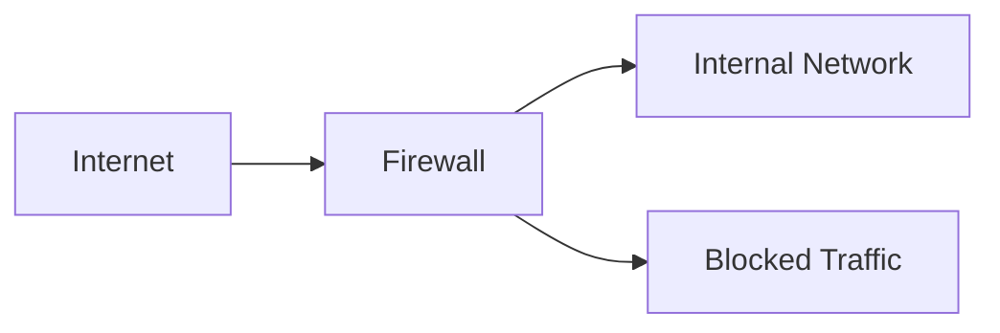

### Working

When traffic reaches the firewall, it evaluates the traffic against configured rules.

For example:

$$
\text{Incoming Packet}
\rightarrow
\text{Firewall Rule Check}
$$

Then:

$$
\boxed{\text{Allow}}
$$

or:

$$
\boxed{\text{Block}}
$$

### Firewall Helps Prevent Unauthorized Access By

* blocking unauthorized connections,
* restricting access to specific ports and services,
* filtering traffic based on addresses and protocols,
* enforcing network security policies,
* limiting exposure of internal systems.

For example, an organization may allow:

$$
\boxed{\text{TCP port }443}
$$

for HTTPS while blocking unnecessary services.

Thus:

$$
\boxed{\text{Firewall}=\text{Traffic filtering and access-control mechanism}}
$$

---

## A3. Define encryption and describe its importance in securing data.

**Encryption** is the process of converting readable data, called **plaintext**, into an unreadable form called **ciphertext** using a cryptographic algorithm and key.

Conceptually:

$$
\boxed{C=E_K(P)}
$$

where:

* \(P\) = plaintext,
* \(K\) = cryptographic key,
* \(C\) = ciphertext.

The recipient uses the appropriate key to recover the plaintext:

$$
\boxed{P=D_K(C)}
$$

### Importance of Encryption

Encryption helps provide:

### 1. Confidentiality

Unauthorized users cannot readily read encrypted information.

### 2. Protection During Transmission

Encryption can protect data while it travels across networks.

### 3. Protection of Stored Data

Encryption can protect files, databases and storage devices.

### 4. Protection of Sensitive Information

It can protect:

* passwords,
* financial information,
* personal data,
* business information,
* confidential communications.

Therefore:

$$
\boxed{\text{Encryption}\rightarrow\text{Protection of data confidentiality}}
$$

---

## A4. Differentiate between Vulnerability Scanning and Penetration Testing.

### Vulnerability Scanning

Vulnerability scanning is the systematic identification of known weaknesses in systems, applications, networks, or configurations.

It often uses automated tools to identify issues such as:

* outdated software,
* missing patches,
* insecure configurations,
* known vulnerabilities.

### Penetration Testing

Penetration testing is an authorized security assessment in which testers attempt to validate whether identified weaknesses can be exploited and what consequences could result.

### Difference

| Vulnerability Scanning                      | Penetration Testing                                           |
| ------------------------------------------- | ------------------------------------------------------------- |
| Primarily identifies vulnerabilities.       | Attempts to validate and demonstrate exploitability.          |
| Often highly automated.                     | Usually involves more manual analysis and testing.            |
| Can cover many systems quickly.             | Usually has a defined target and testing scope.               |
| Produces identified vulnerability findings. | Produces validated findings and evidence of potential impact. |
| Often performed regularly.                  | Usually conducted periodically or for a specific objective.   |

Conceptually:

$$
\boxed{\text{Scanning}=\text{Find weaknesses}}
$$

$$
\boxed{\text{Penetration Testing}=\text{Validate weaknesses under authorization}}
$$

---

## A5. Discuss the role of access control mechanisms in ensuring confidentiality and integrity of data.

**Access control** determines which users, processes, or systems are allowed to access particular resources and what actions they are permitted to perform.

Access control supports:

$$
\boxed{\text{Confidentiality}}
$$

by preventing unauthorized users from viewing data.

It supports:

$$
\boxed{\text{Integrity}}
$$

by restricting who can modify or delete data.

### Main Access Control Components

* Authentication
* Authorization
* Least privilege
* Role-based access control
* Access logging

For example:

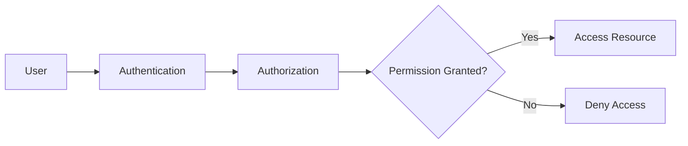

### Example

Suppose a student is allowed to:

$$
\boxed{\text{Read own academic records}}
$$

but is not allowed to:

$$
\boxed{\text{Modify examination results}}
$$

This protects both confidentiality and integrity.

Therefore:

$$
\boxed{\text{Access Control}\rightarrow\text{Authorized access + restricted unauthorized actions}}
$$

---

# SECTION B

## B1. Discuss the significance of Security Awareness Training in organizations. How can it help in mitigating cybersecurity threats?

The Unit-4 assignment asks specifically about security-awareness training and threat mitigation. 

**Security awareness training** educates employees about cybersecurity risks, organizational policies, and safe security practices.

Technology alone cannot prevent every security incident because users may be targeted through phishing, social engineering, or other forms of manipulation.

### Importance of Security Awareness Training

## 1. Phishing Awareness

Employees learn how to identify suspicious:

* emails,
* links,
* attachments,
* login requests.

## 2. Social Engineering Awareness

Training helps employees recognize attempts involving:

* impersonation,
* urgency,
* fear,
* authority,
* deception.

## 3. Password Security

Employees learn the importance of:

$$
\boxed{\text{Strong and unique passwords}}
$$

and using MFA where available.

## 4. Safe Data Handling

Employees learn how to properly protect:

* confidential documents,
* credentials,
* customer information,
* organizational data.

## 5. Safe Device Usage

Training can address:

* device locking,
* software updates,
* removable media,
* public Wi-Fi,
* unauthorized applications.

## 6. Incident Reporting

Employees should know how to report suspicious activity quickly.

For example:

$$
\text{Suspicious Email}
\rightarrow
\text{Do Not Interact}
\rightarrow
\text{Report}
$$

## 7. Reducing Human Error

Awareness can reduce mistakes that contribute to:

$$
\boxed{\text{Credential compromise}}
$$

$$
\boxed{\text{Malware infections}}
$$

$$
\boxed{\text{Unauthorized disclosure}}
$$

### Awareness Cycle

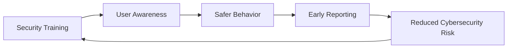

### Effective Training Program

Organizations should conduct:

* regular awareness sessions,
* simulated phishing exercises,
* role-specific training,
* periodic policy reminders,
* incident-reporting exercises.

Thus:

$$
\boxed{\text{Security Awareness}\rightarrow\text{Better user behavior}\rightarrow\text{Reduced cybersecurity risk}}
$$

---

# B2. Explain the concept of Privilege Escalation in cybersecurity. How can organizations prevent privilege escalation attacks?

**Privilege escalation** occurs when a user, process, or attacker obtains permissions or access privileges beyond those originally authorized.

There are two major forms.

### 1. Vertical Privilege Escalation

A low-privileged user obtains higher privileges.

For example:

$$
\boxed{\text{Standard User}\rightarrow\text{Administrator}}
$$

### 2. Horizontal Privilege Escalation

A user accesses another user's resources while remaining at approximately the same privilege level.

For example:

$$
\boxed{\text{User A}\rightarrow\text{User B's Data}}
$$

without authorization.

---

## Causes of Privilege Escalation

Possible causes include:

* software vulnerabilities,
* excessive permissions,
* weak access controls,
* insecure configurations,
* stolen administrator credentials,
* vulnerable services.

---

## Prevention

### 1. Principle of Least Privilege

Users and applications should receive only the permissions required for their tasks.

$$
\boxed{\text{Minimum Required Privileges}}
$$

### 2. Patch Management

Keep operating systems and applications updated to reduce exposure to known vulnerabilities.

### 3. Strong Authentication

Use strong authentication and MFA, especially for privileged accounts.

### 4. Privileged Account Management

Separate privileged and standard user accounts.

For example:

```text
Normal Account → Daily Activities
Admin Account  → Administrative Tasks
```

### 5. Access Reviews

Regularly review permissions and remove unnecessary privileges.

### 6. Application Security

Secure applications against vulnerabilities that may allow unauthorized privilege changes.

### 7. Monitoring

Monitor privileged activity for suspicious behavior.

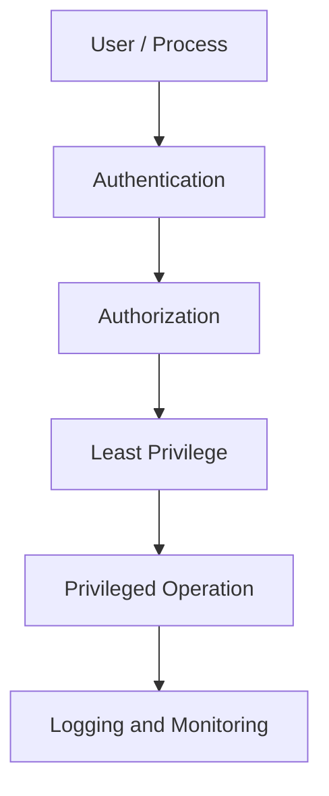

Therefore:

$$
\boxed{
\text{Least Privilege}
+
\text{Patching}
+
\text{MFA}
+
\text{Monitoring}
\rightarrow
\text{Reduced Privilege-Escalation Risk}
}
$$

---

# B3. Describe the steps involved in conducting a Cybersecurity Risk Assessment.

A **cybersecurity risk assessment** identifies assets, threats, vulnerabilities, likelihood, impact, and appropriate security controls.

The assignment asks for the steps involved in performing such an assessment. 

## Step 1: Identify Assets

Identify the resources that require protection.

Examples:

* servers,
* databases,
* applications,
* networks,
* confidential information.

---

## Step 2: Identify Threats

Identify potential events or actors that could cause harm.

Examples:

$$
\boxed{\text{Malware}}
$$

$$
\boxed{\text{Phishing}}
$$

$$
\boxed{\text{Unauthorized Access}}
$$

$$
\boxed{\text{Insider Threat}}
$$

---

## Step 3: Identify Vulnerabilities

Determine weaknesses that threats could exploit.

Examples:

* unpatched software,
* weak passwords,
* insecure configuration,
* excessive privileges.

---

## Step 4: Determine Likelihood

Estimate how likely a threat is to exploit a vulnerability.

A simple qualitative scale is:

$$
\boxed{\text{Low, Medium, High}}
$$

---

## Step 5: Determine Impact

Estimate the consequences if the threat occurs.

Impact may involve:

* confidentiality,
* integrity,
* availability,
* financial loss,
* operational disruption,
* legal consequences.

---

## Step 6: Determine Risk

A simple model is:

$$
\boxed{R=L\times I}
$$

where:

$$
R=\text{Risk}
$$

$$
L=\text{Likelihood}
$$

$$
I=\text{Impact}
$$

---

## Step 7: Prioritize Risks

Higher-priority risks should receive appropriate attention and resources.

---

## Step 8: Select Security Controls

Possible controls include:

* firewalls,
* MFA,
* encryption,
* access control,
* patch management,
* backups,
* network segmentation.

---

## Step 9: Monitor and Review

Cybersecurity risks change over time, so assessments should be periodically reviewed.

### Risk Assessment Lifecycle

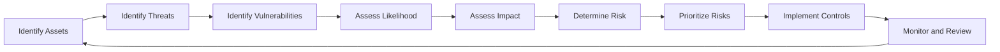

Thus:

$$
\boxed{
\text{Risk Assessment}
=
\text{Identify}
\rightarrow
\text{Analyze}
\rightarrow
\text{Prioritize}
\rightarrow
\text{Control}
\rightarrow
\text{Review}
}
$$

---

# SECTION C

## C1. Analyze the security risks associated with Bring Your Own Device (BYOD) policies in organizations. How can these risks be mitigated?

The Unit-4 assignment asks specifically about security risks created by BYOD and methods of mitigation. 

**Bring Your Own Device (BYOD)** is a policy that allows employees to use personally owned devices, such as smartphones, laptops, or tablets, to access organizational resources.

BYOD can improve flexibility, but it introduces additional security risks.

---

## Security Risks

### 1. Loss or Theft of Devices

A lost or stolen device may contain:

* business information,
* authentication tokens,
* saved credentials,
* sensitive files.

### Mitigation

Use:

* device encryption,
* screen locks,
* remote wipe,
* MFA.

---

## 2. Unpatched Devices

Personal devices may run outdated operating systems or applications.

An attacker may exploit known vulnerabilities.

### Mitigation

Require minimum security standards and supported software versions.

---

## 3. Malware

A personally owned device may become infected with malicious software and subsequently connect to organizational systems.

### Mitigation

Use endpoint protection and security checks before allowing access to organizational resources.

---

## 4. Weak Authentication

Users may reuse passwords or use weak credentials.

### Mitigation

Use:

$$
\boxed{\text{MFA + Strong Authentication}}
$$

---

## 5. Data Leakage

Sensitive organizational information may be copied to:

* personal storage,
* personal applications,
* unauthorized cloud services.

### Mitigation

Use:

* data-loss-prevention controls,
* application restrictions,
* organizational storage policies.

---

## 6. Privacy Issues

Personal devices may contain private information belonging to the employee.

Security controls such as monitoring or remote wiping must therefore be designed carefully.

### Mitigation

Clearly define:

* what data is monitored,
* what data can be remotely deleted,
* employee privacy protections.

---

## 7. Untrusted Networks

Employees may connect devices to:

* public Wi-Fi,
* unsecured home networks,
* unknown networks.

### Mitigation

Use:

* secure VPN connections where appropriate,
* HTTPS,
* endpoint security,
* secure configuration.

---

## 8. Lack of Organizational Control

The organization may have less direct control over a personal device than a company-owned device.

### Mitigation

Use **Mobile Device Management (MDM)** or equivalent device-management controls where appropriate.

---

## BYOD Security Architecture

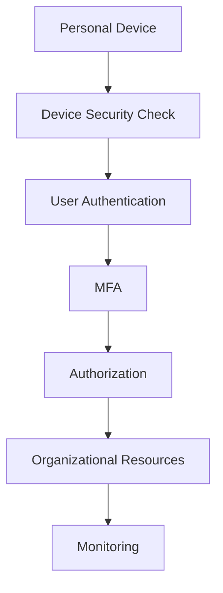

### BYOD Security Policy Should Include

* device registration,
* minimum OS/security requirements,
* MFA,
* encryption,
* screen-lock requirements,
* remote-wipe procedures,
* acceptable-use policies,
* separation of personal and organizational data,
* incident-reporting procedures.

Therefore:

$$
\boxed{
\text{Secure BYOD}
=
\text{Device Security}
+
\text{Strong Authentication}
+
\text{Access Control}
+
\text{Data Protection}
+
\text{Monitoring}
}
$$

---

# C2. Discuss the importance of Network Segmentation in enhancing network security. Provide examples of different segmentation techniques.

The assignment asks for the importance of network segmentation and examples of segmentation techniques. 

**Network segmentation** divides a network into separate logical or physical sections so that communication between segments can be controlled.

Instead of placing every system on one large network:

$$
\boxed{\text{Single Network}}
$$

the organization creates multiple security zones.

---

## Importance of Network Segmentation

### 1. Limits Lateral Movement

If an attacker compromises one system, segmentation can restrict movement toward other systems.

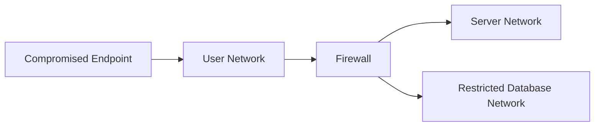

### 2. Protects Sensitive Systems

Critical servers and databases can be placed in restricted network segments.

### 3. Reduces Attack Surface

Unnecessary communication between systems can be blocked.

### 4. Improves Access Control

Rules can be created between network zones.

For example:

$$
\text{User Network}\not\rightarrow\text{Database Network}
$$

unless explicitly authorized.

### 5. Improves Monitoring

Different segments can have different monitoring and security policies.

---

# Segmentation Techniques

## 1. VLAN Segmentation

A **Virtual Local Area Network (VLAN)** separates devices into logical Layer-2 networks.

For example:

$$
\boxed{\text{VLAN 10 = Students}}
$$

$$
\boxed{\text{VLAN 20 = Faculty}}
$$

$$
\boxed{\text{VLAN 30 = Administration}}
$$

Traffic between VLANs can be controlled using Layer-3 devices and security policies.

---

## 2. Subnet Segmentation

A network can be divided into different IP subnets.

For example:

$$
192.168.10.0/24
$$

for one department and:

$$
192.168.20.0/24
$$

for another.

Routing and firewall rules can then control communication between subnets.

---

## 3. Firewall-Based Segmentation

Firewalls can separate network zones and enforce traffic policies.

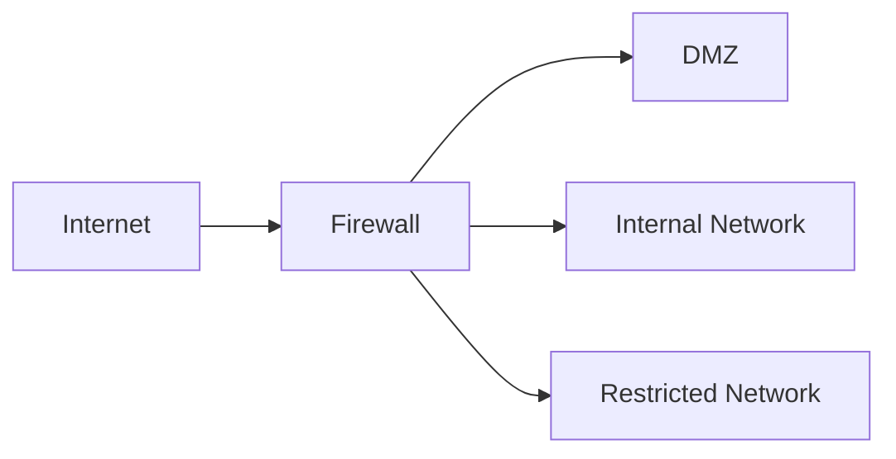

---

## 4. DMZ

A **Demilitarized Zone (DMZ)** is a network segment used for services that need to be accessible from external networks while remaining separated from the internal network.

Typical examples include:

* public web servers,
* mail gateways,
* DNS services.

---

## 5. Micro-Segmentation

Micro-segmentation applies security controls at a more granular level, potentially between individual workloads, applications, or services.

For example:

$$
\text{Application A}\not\rightarrow\text{Database B}
$$

unless explicitly authorized.

---

## Example Enterprise Network

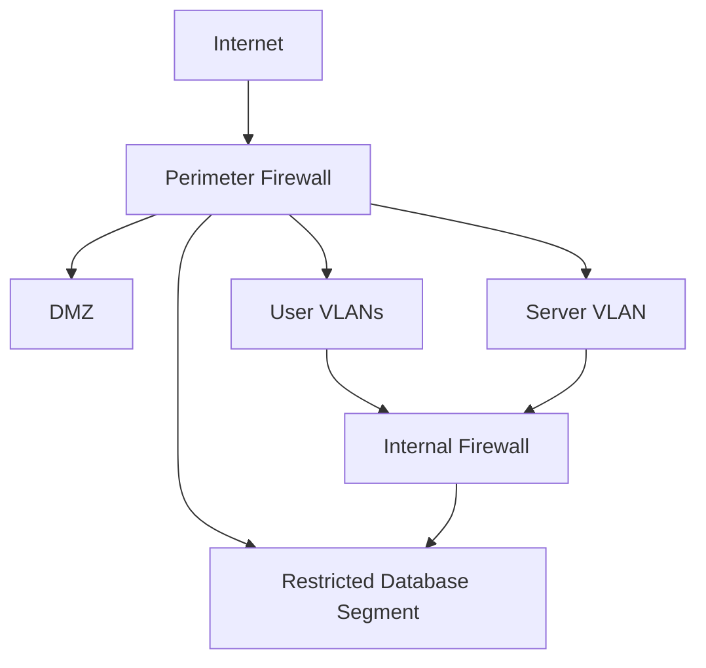

Segmentation can therefore provide:

$$
\boxed{\text{Isolation + Access Control + Reduced Lateral Movement}}
$$

---

# C3. Explain the concept of Digital Forensics in cybersecurity investigations. What are the key steps involved in conducting a digital forensic analysis?

The Unit-4 assignment specifically asks about digital forensics and the key steps involved in forensic analysis. 

**Digital forensics** is the process of identifying, collecting, preserving, examining, analyzing, and reporting digital evidence for an investigation.

Digital forensic investigations may involve:

* computers,
* mobile devices,
* servers,
* storage devices,
* network traffic,
* cloud environments.

The goal is to obtain reliable evidence while maintaining its integrity and documenting how it was handled.

---

# Key Steps in Digital Forensic Analysis

## 1. Identification

First, identify:

* the incident,
* relevant systems,
* potential evidence sources.

For example:

$$
\boxed{\text{Computer + Mobile Device + Server Logs}}
$$

may all contain relevant evidence.

---

## 2. Preservation

Evidence must be protected from alteration or destruction.

Investigators should document the condition of the evidence and use appropriate procedures to preserve its integrity.

---

## 3. Collection

Relevant digital evidence is acquired using approved forensic procedures.

Examples may include:

* disk images,
* memory captures,
* log files,
* network captures,
* mobile-device data.

---

## 4. Examination

Collected evidence is processed to identify relevant information.

Investigators may examine:

* files,
* timestamps,
* logs,
* browser artifacts,
* deleted data,
* system activity.

---

## 5. Analysis

Investigators correlate evidence and attempt to determine:

* what happened,
* when it happened,
* which systems were involved,
* what actions occurred,
* what evidence supports the findings.

For example:

$$
\text{Login Record}
+
\text{File Timestamp}
+
\text{Network Log}
$$

may help establish a sequence of events.

---

## 6. Documentation

All investigative actions should be recorded.

Documentation may include:

* evidence identifiers,
* acquisition details,
* tools used,
* timestamps,
* findings,
* analytical steps.

---

## 7. Reporting

The investigator prepares a clear report describing:

* scope,
* methodology,
* evidence,
* findings,
* conclusions supported by the evidence.

---

## 8. Presentation

Where required, forensic findings may be presented to:

* management,
* incident-response teams,
* legal teams,
* regulatory authorities,
* courts.

---

# Digital Forensic Process

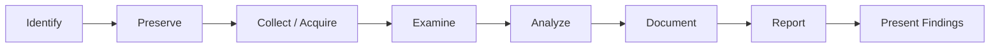

---

# Importance of Evidence Integrity

Digital evidence can be easily modified, so investigators must maintain its integrity.

A common technique is to calculate a cryptographic hash of acquired evidence.

For example:

$$
\boxed{H=\operatorname{Hash}(\text{Evidence})}
$$

After acquisition, the hash can be recorded.

If the evidence is unchanged, recalculating the hash should produce the same result:

$$
\boxed{H_{\text{original}}=H_{\text{verified}}}
$$

A mismatch may indicate that the data changed.

---

# Chain of Custody

The **chain of custody** records the handling of evidence from collection through examination and reporting.

A simplified process is:

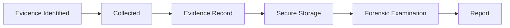

It should record information such as:

* who collected the evidence,
* when it was collected,
* where it was stored,
* who accessed it,
* what actions were performed.

This helps demonstrate that evidence was handled systematically and that its integrity was maintained.

Therefore:

$$
\boxed{
\text{Digital Forensics}
=
\text{Identification}
+
\text{Preservation}
+
\text{Collection}
+
\text{Examination}
+
\text{Analysis}
+
\text{Reporting}
}
$$

---

# Final Summary

| Topic                  | Key Point                                                                 |
| ---------------------- | ------------------------------------------------------------------------- |
| Malware                | Software designed for malicious or unauthorized activity                  |
| Firewall               | Filters and controls network traffic                                      |
| Encryption             | Protects data by transforming plaintext into ciphertext                   |
| Vulnerability Scanning | Identifies known weaknesses                                               |
| Penetration Testing    | Authorized validation of security weaknesses                              |
| Access Control         | Restricts who can access and modify resources                             |
| Security Awareness     | Reduces human-related cybersecurity risks                                 |
| Privilege Escalation   | Obtaining unauthorized higher or unrelated privileges                     |
| Risk Assessment        | Identifies, analyzes and prioritizes cybersecurity risks                  |
| BYOD                   | Requires controls for personal devices accessing organizational resources |
| Network Segmentation   | Divides networks to isolate systems and control communication             |
| VLAN                   | Logical Layer-2 network segmentation                                      |
| DMZ                    | Isolated zone for externally accessible services                          |
| Micro-Segmentation     | Fine-grained segmentation of workloads/services                           |
| Digital Forensics      | Collection and analysis of digital evidence                               |
| Evidence Integrity     | Maintained through controlled handling and verification                   |
| Chain of Custody       | Documents evidence handling throughout an investigation                   |

