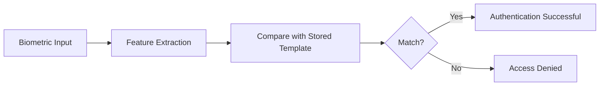
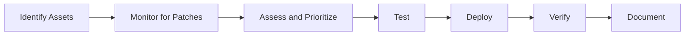
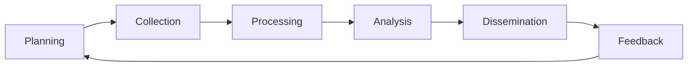
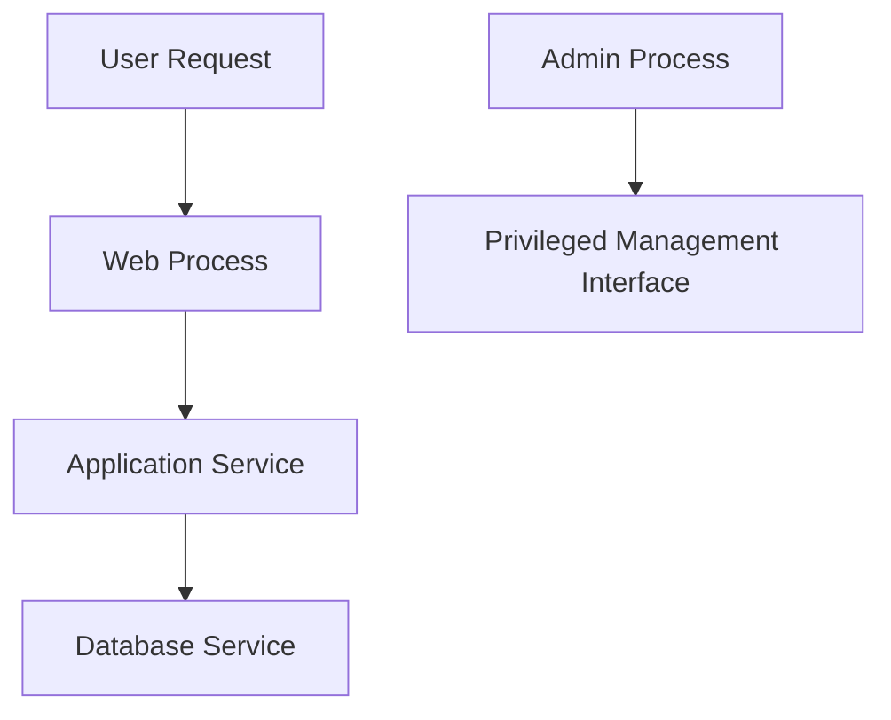
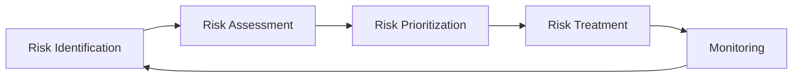
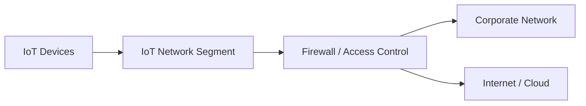
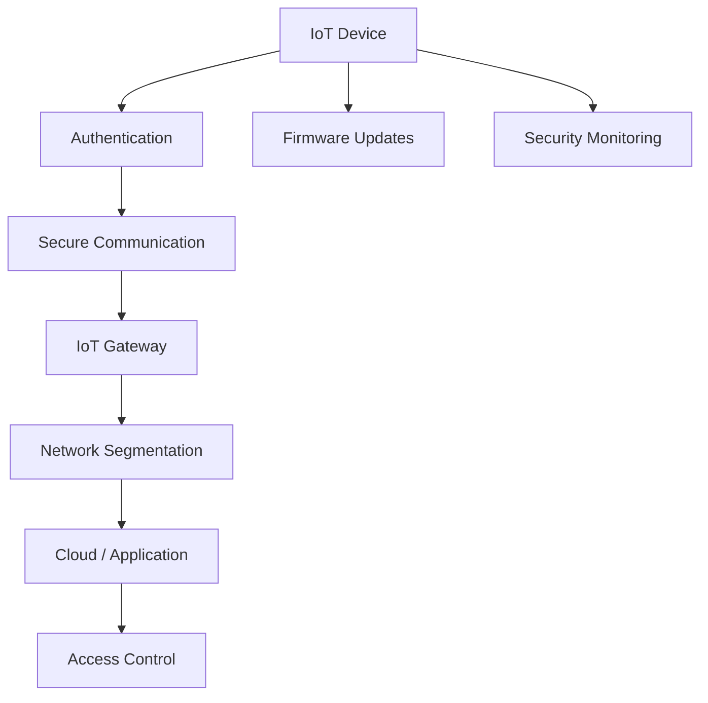
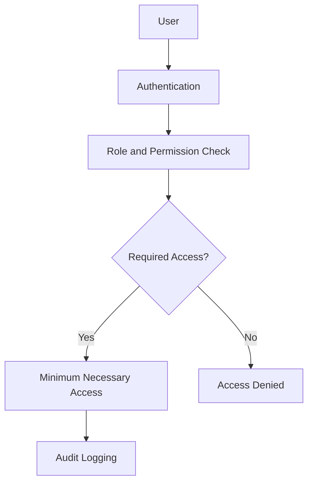
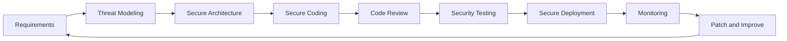
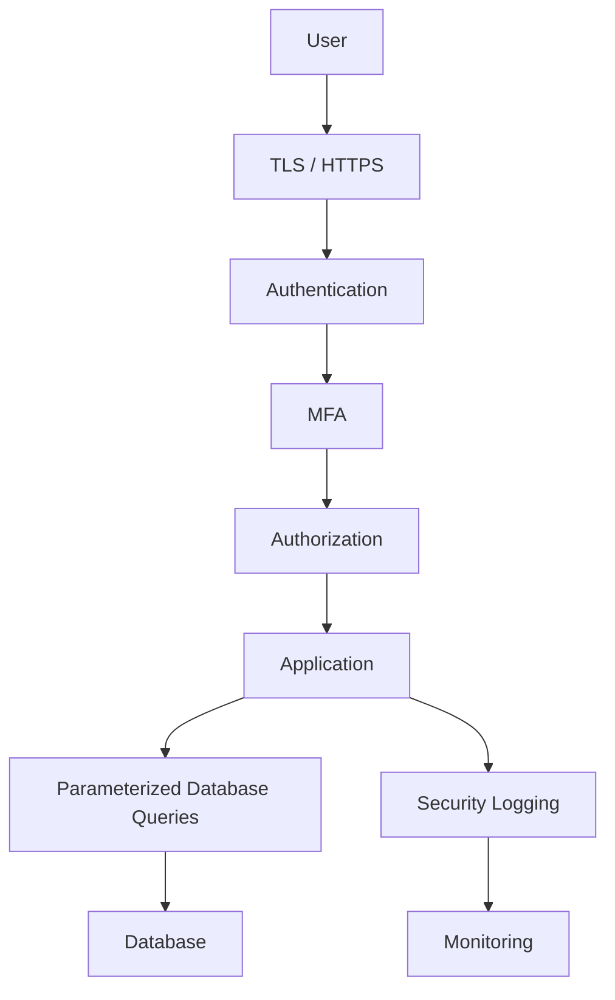

# ECSS — Assignment (Unit 5)

**Subject:** ECSS
**Marks:** 64
**Unit:** 5

The following answers are based on the uploaded Unit-5 assignment. 

---

# SECTION A

## A1. What is Social Engineering? Provide two examples of Social Engineering Attacks.

**Social engineering** is a technique in which an attacker manipulates a person into revealing confidential information, providing unauthorized access, or performing an unsafe action.

It exploits human behavior rather than relying only on technical vulnerabilities.

### Examples

**1. Phishing**

An attacker sends a fraudulent email or message that appears to come from a trusted organization and tries to obtain credentials or other sensitive information.

**2. Pretexting**

An attacker creates a false identity or believable story to persuade a victim to reveal information or perform an action.

For example, an attacker may pretend to be a technical-support employee and request account information.

Therefore:

$$
\boxed{\text{Social Engineering}=\text{Manipulation of people to achieve an unauthorized security objective}}
$$

---

## A2. Define Phishing and discuss common techniques used in Phishing Attacks.

**Phishing** is a cyberattack in which an attacker uses deceptive communications or websites to trick victims into disclosing sensitive information or performing an unsafe action.

Common targets include:

$$
\boxed{\text{Usernames, passwords, financial information, OTPs and personal data}}
$$

### Common Phishing Techniques

### 1. Email Phishing

Fraudulent emails are sent to a large number of users while impersonating a trusted organization.

### 2. Spear Phishing

A phishing message is specifically designed for an individual or organization.

### 3. Whaling

Whaling targets high-value individuals such as executives or senior employees.

### 4. Smishing

Phishing conducted through SMS or text messages.

### 5. Vishing

Phishing conducted through voice calls.

### 6. Fake Websites

An attacker creates a fraudulent website resembling a legitimate login or payment page.

### 7. Malicious Links and Attachments

The victim is encouraged to open a malicious attachment or visit a fraudulent URL.

### Identifying Warning Signs

Users should check:

* sender address,
* actual URL destination,
* unusual requests,
* unexpected attachments,
* urgency or threats,
* spelling and formatting,
* requests for credentials or financial information.

Thus:

$$
\boxed{\text{Phishing}=\text{Deception used to obtain information or induce unsafe actions}}
$$

---

## A3. Explain the difference between Symmetric and Asymmetric Encryption Algorithms.

### Symmetric Encryption

Symmetric encryption uses the same secret key for encryption and decryption.

$$
\boxed{C=E_K(P)}
$$

$$
\boxed{P=D_K(C)}
$$

where:

* \(P\) = plaintext,
* \(C\) = ciphertext,
* \(K\) = secret key.

Examples:

$$
\boxed{\text{AES, ChaCha20}}
$$

### Asymmetric Encryption

Asymmetric encryption uses a pair of mathematically related keys:

$$
\boxed{K_{\text{public}},K_{\text{private}}}
$$

Data encrypted using the appropriate public-key operation can be decrypted using the corresponding private key.

For a public-key encryption example:

$$
\boxed{C=E_{K_{\text{public}}}(P)}
$$

$$
\boxed{P=D_{K_{\text{private}}}(C)}
$$

Examples include:

$$
\boxed{\text{RSA}}
$$

and elliptic-curve public-key cryptography.

### Difference

| Symmetric Encryption                    | Asymmetric Encryption                                       |
| --------------------------------------- | ----------------------------------------------------------- |
| Uses one shared secret key.             | Uses a public/private key pair.                             |
| Generally faster.                       | Generally more computationally expensive.                   |
| Secret key must be securely shared.     | Public key may be openly distributed.                       |
| Commonly used for bulk data encryption. | Commonly used for key establishment and digital signatures. |
| Example: AES                            | Example: RSA                                                |

---

## A4. Describe the Purpose of Biometric Authentication in Cybersecurity.

**Biometric authentication** verifies a person's identity using a measurable biological or behavioral characteristic.

Examples include:

* fingerprint,
* facial characteristics,
* iris characteristics,
* voice characteristics.

The basic process is:



### Purpose

Biometric authentication can:

* provide an additional authentication factor,
* make impersonation more difficult,
* reduce dependence on passwords,
* provide convenient user verification.

However, biometric characteristics are not secrets in the same way passwords are, and biometric authentication should be implemented with appropriate security and privacy protections.

Therefore:

$$
\boxed{\text{Biometric Authentication}=\text{Identity verification using biological or behavioral characteristics}}
$$

---

## A5. Discuss the Role of Patch Management in Maintaining System Security.

**Patch management** is the process of identifying, evaluating, testing, deploying, and verifying software updates and security patches.

The purpose is to reduce exposure to known vulnerabilities.

### Importance

### 1. Fixes Known Vulnerabilities

Security patches correct vulnerabilities discovered in operating systems and applications.

### 2. Reduces Attack Surface

Unpatched software may provide attackers with exploitable weaknesses.

### 3. Improves System Security

Updates may improve:

* security controls,
* authentication,
* software behavior,
* compatibility.

### 4. Supports Compliance

Organizations may have requirements to keep systems securely maintained.

### Patch Management Process



Thus:

$$
\boxed{\text{Effective Patch Management}\rightarrow\text{Reduced Exposure to Known Vulnerabilities}}
$$

---

# SECTION B

## B1. Discuss the Importance of Threat Intelligence in Cybersecurity Operations. How Can Organizations Effectively Leverage Threat Intelligence?

The Unit-5 assignment asks specifically about the importance and practical use of threat intelligence. 

**Threat intelligence** is information about threats, threat actors, attack techniques, indicators, vulnerabilities, and campaigns that has been collected, processed, and analyzed to support cybersecurity decisions.

Instead of treating security information as isolated data, threat intelligence converts it into useful knowledge for defenders.

---

## Importance of Threat Intelligence

### 1. Improves Threat Detection

Threat intelligence can provide indicators and behaviors that security teams can use to identify suspicious activity.

Examples include:

$$
\boxed{\text{Malicious IP addresses}}
$$

$$
\boxed{\text{Suspicious domains}}
$$

$$
\boxed{\text{File hashes}}
$$

$$
\boxed{\text{Known attack techniques}}
$$

---

### 2. Supports Vulnerability Prioritization

Organizations face many vulnerabilities.

Threat intelligence can provide information about which weaknesses are being actively targeted, helping security teams prioritize remediation.

---

### 3. Improves Incident Response

During an incident, threat intelligence can help analysts understand:

* likely attacker techniques,
* related indicators,
* possible affected systems,
* potential attack paths.

---

### 4. Supports Threat Hunting

Security teams can search systems for indicators or behaviors associated with known threats.

---

### 5. Improves Security Monitoring

Threat intelligence can be integrated with:

* SIEM systems,
* endpoint-security tools,
* firewalls,
* intrusion-detection systems.

---

### 6. Supports Strategic Decision-Making

Management can use threat intelligence to understand changing threats and decide where security resources should be applied.

---

# How Organizations Can Leverage Threat Intelligence

### Step 1: Define Intelligence Requirements

Determine what information is needed.

For example:

$$
\boxed{\text{Which threats are relevant to our organization?}}
$$

### Step 2: Collect Intelligence

Sources may include:

* security logs,
* threat reports,
* vulnerability information,
* incident data,
* malware analysis,
* threat feeds.

### Step 3: Process the Information

Collected information is normalized and organized.

### Step 4: Analyze

Security teams determine whether information is relevant and actionable.

### Step 5: Apply Intelligence

Useful intelligence can be used to:

* update detection rules,
* block malicious indicators,
* prioritize patches,
* improve incident-response procedures,
* perform threat hunting.

### Threat Intelligence Lifecycle



Therefore:

$$
\boxed{
\text{Threat Intelligence}
\rightarrow
\text{Better Detection}
+
\text{Better Response}
+
\text{Better Risk Decisions}
}
$$

---

## B2. Explain the Concept of Privilege Separation in Access Control Mechanisms. How Does It Contribute to Security?

The assignment asks about privilege separation and its security contribution. 

**Privilege separation** is a security design principle in which different functions, processes, or users operate with different and limited privileges rather than giving one component unrestricted access.

The core idea is:

$$
\boxed{\text{Separate sensitive operations and restrict privileges to what is required}}
$$

### Example

Consider a web application.

Instead of running the complete application as an administrator:

```text id="qf5k8m"
Web Application → Administrator Privileges
```

it can be designed so that:

```text id="dvzhfk"
Web Process → Limited Privileges
Database Service → Separate Account
Administrative Functions → Restricted Account
```

---

## How Privilege Separation Improves Security

### 1. Limits the Impact of Compromise

If one component is compromised, the attacker may receive only the privileges of that component.

### 2. Reduces Attack Surface

Fewer privileged operations are exposed to low-trust components.

### 3. Supports Least Privilege

Each process or account receives only the permissions required for its function.

### 4. Separates Sensitive Functions

Critical operations can be isolated from ordinary application functions.

### 5. Limits Lateral Movement

An attacker who compromises one low-privileged component may not automatically gain access to highly privileged resources.

### Example Architecture



Different components operate with different levels of authority.

---

## Privilege Separation vs Least Privilege

The two principles are closely related.

$$
\boxed{\text{Least Privilege}=\text{Minimum permissions}}
$$

$$
\boxed{\text{Privilege Separation}=\text{Separate and isolate different privilege levels/functions}}
$$

Together they reduce the potential impact of unauthorized access.

---

## B3. Describe the Differences Between Risk Assessment and Risk Management in Cybersecurity.

The assignment specifically asks for the difference between risk assessment and risk management. 

### Risk Assessment

**Risk assessment** is the process of identifying and analyzing risks.

It examines:

* assets,
* threats,
* vulnerabilities,
* likelihood,
* impact.

A simple model is:

$$
\boxed{R=L\times I}
$$

where:

$$
R=\text{Risk}
$$

$$
L=\text{Likelihood}
$$

$$
I=\text{Impact}
$$

The purpose is to understand and prioritize risks.

---

### Risk Management

**Risk management** is the broader, continuous process of identifying, assessing, treating, monitoring, and reviewing risks.

Risk treatment can involve:

$$
\boxed{\text{Avoid}}
$$

$$
\boxed{\text{Reduce}}
$$

$$
\boxed{\text{Transfer}}
$$

$$
\boxed{\text{Accept}}
$$

### Difference

| Risk Assessment                              | Risk Management                                     |
| -------------------------------------------- | --------------------------------------------------- |
| Identifies and analyzes risks.               | Manages risks throughout their lifecycle.           |
| Determines likelihood and impact.            | Selects and implements responses.                   |
| Primarily concerned with understanding risk. | Concerned with controlling and monitoring risk.     |
| Produces prioritized risk information.       | Uses that information to make and manage decisions. |
| One component of risk management.            | Broader continuous process.                         |

### Relationship



Thus:

$$
\boxed{\text{Risk Assessment}\subset\text{Risk Management}}
$$

---

# SECTION C

## C1. Analyze the Security Challenges Posed by Internet of Things (IoT) Devices. How Can Organizations Secure IoT Deployments Effectively?

The Unit-5 assignment asks for an analysis of IoT security challenges and effective security measures. 

**Internet of Things (IoT)** refers to interconnected physical devices that collect, process, transmit, or receive data through networks.

Examples include:

* smart cameras,
* sensors,
* smart appliances,
* industrial controllers,
* medical devices,
* smart locks.

IoT environments can have large numbers of heterogeneous devices, making security management difficult.

---

## Security Challenges

### 1. Weak Credentials

Some devices may use weak, reused, or default credentials.

An attacker who obtains these credentials may gain unauthorized access.

### Mitigation

Use:

$$
\boxed{\text{Unique credentials + Strong Authentication}}
$$

and MFA where supported.

---

## 2. Outdated Firmware

Many IoT devices remain deployed for long periods and may not receive timely security updates.

Unpatched vulnerabilities can increase the risk of compromise.

### Mitigation

Maintain:

* firmware inventories,
* patch schedules,
* supported device lists,
* replacement procedures for unsupported devices.

---

## 3. Limited Computing Resources

Some IoT devices have limited:

* CPU,
* memory,
* storage,
* battery capacity.

This may restrict the security controls they can support.

### Mitigation

Use security mechanisms appropriate to device capabilities and protect devices at the network and gateway levels.

---

## 4. Insecure Communication

Poorly protected network traffic can expose sensitive information.

### Mitigation

Use authenticated and encrypted communication where supported.

$$
\boxed{\text{Secure Communication}}
$$

---

## 5. Poor Device Configuration

Unnecessary services, open interfaces, or excessive permissions may increase attack surface.

### Mitigation

Disable unnecessary services and apply secure configurations.

---

## 6. Insecure APIs

IoT ecosystems frequently depend on:

* mobile applications,
* cloud platforms,
* APIs.

Weak authentication or authorization can expose device functions and data.

### Mitigation

Use:

* strong authentication,
* authorization,
* input validation,
* API monitoring.

---

## 7. Physical Attacks

Devices deployed in public or uncontrolled locations may be physically accessible.

Attackers may attempt to tamper with hardware or access exposed interfaces.

### Mitigation

Use:

* secure enclosures,
* tamper resistance,
* secure boot,
* protection of debugging interfaces.

---

## 8. Privacy Risks

IoT devices may collect sensitive data such as:

* location,
* audio,
* video,
* behavior patterns,
* environmental information.

### Mitigation

Organizations should apply:

$$
\boxed{\text{Data Minimization + Access Control + Encryption}}
$$

---

## 9. IoT Devices as Entry Points

A compromised IoT device may provide a path into other network resources.

### Mitigation

Use network segmentation to isolate IoT devices.



---

# Effective IoT Security Strategy

## 1. Asset Inventory

Maintain a complete inventory of:

$$
\boxed{\text{Device ID, Owner, Location, Firmware, Network Access}}
$$

## 2. Secure Authentication

Replace default credentials and use stronger authentication mechanisms.

## 3. Least Privilege

Devices should communicate only with systems they actually require.

## 4. Regular Patching

Keep device firmware and associated software updated.

## 5. Network Segmentation

Place IoT devices in dedicated network segments where appropriate.

## 6. Encryption

Protect data in transit and at rest where required.

## 7. Secure Development

Manufacturers and developers should incorporate security from the beginning of the device lifecycle.

## 8. Continuous Monitoring

Monitor device behavior and network activity for anomalies.

## 9. Secure Decommissioning

When devices reach end-of-life, credentials, certificates, keys, and stored data should be handled securely.

### IoT Security Architecture



Therefore:

$$
\boxed{
\text{IoT Security}
=
\text{Authentication}
+
\text{Patching}
+
\text{Encryption}
+
\text{Segmentation}
+
\text{Monitoring}
+
\text{Secure Configuration}
}
$$

---

# C2. Discuss the Principles of Least Privilege and Need-to-Know in Access Control. How Do They Enhance Security?

The Unit-5 assignment asks specifically about least privilege and need-to-know principles. 

## Principle of Least Privilege

The **Principle of Least Privilege (PoLP)** states that a user, process, service, or device should have only the permissions necessary to perform its authorized function.

Conceptually:

$$
\boxed{
\text{Permissions Granted}
\approx
\text{Permissions Required}
}
$$

### Example

Suppose a reporting application only needs to read a database.

It may require:

$$
\boxed{\operatorname{SELECT}}
$$

It should not automatically have:

$$
\boxed{\operatorname{DELETE},\operatorname{DROP},\operatorname{ALTER}}
$$

unless those operations are actually required.

---

# Principle of Need-to-Know

The **Need-to-Know principle** states that a person should receive access to information only when that information is necessary for their assigned duties.

For example, an employee working in the finance department may require access to financial records but not to confidential source code.

Thus:

$$
\boxed{\text{Access to a system does not imply access to all information in that system}}
$$

---

# Difference

| Least Privilege                                         | Need-to-Know                                                     |
| ------------------------------------------------------- | ---------------------------------------------------------------- |
| Limits permissions and capabilities.                    | Limits access to information.                                    |
| Applies to users, processes, applications and services. | Primarily governs information access.                            |
| Focuses on actions an entity may perform.               | Focuses on information an entity may see.                        |
| Example: read-only database access.                     | Example: employee can access only records needed for their role. |

---

# Security Benefits

## 1. Limits Damage from Compromised Accounts

If an account is compromised, the attacker receives only the permissions assigned to that account.

## 2. Reduces Attack Surface

Fewer permissions mean fewer possible actions available to an attacker.

## 3. Protects Sensitive Information

Need-to-know prevents unnecessary exposure of confidential information.

## 4. Limits Insider Risk

Employees cannot automatically access all organizational data.

## 5. Reduces Privilege Escalation Impact

Restricting privileges can reduce the impact of vulnerabilities.

## 6. Supports Separation of Duties

Sensitive operations can be divided between different users or roles.

---

# Example

Consider an organization:



For example:

| Role                 | Possible Required Access |
| -------------------- | ------------------------ |
| Student              | Own academic records     |
| Faculty              | Assigned course records  |
| Finance Staff        | Fee-related information  |
| System Administrator | Administrative resources |

The combination of least privilege and need-to-know reduces unnecessary access.

Therefore:

$$
\boxed{
\text{Least Privilege}+\text{Need-to-Know}
\rightarrow
\text{Reduced Unauthorized Access}
}
$$

---

# C3. Explain the Concept of Security by Design in Software Development. How Can Developers Integrate Security into the Development Lifecycle Effectively?

The Unit-5 assignment asks for security by design and its integration into the software-development lifecycle. 

**Security by design** is the approach of incorporating security requirements, controls, and threat considerations into software from the beginning of its development rather than treating security as a final-stage activity.

The fundamental concept is:

$$
\boxed{\text{Security is designed into the system from the beginning}}
$$

---

# Principles of Security by Design

## 1. Secure by Default

Default configurations should use secure settings.

For example:

$$
\boxed{\text{Unnecessary service}= \text{Disabled by default}}
$$

rather than exposing it automatically.

---

## 2. Least Privilege

Users, applications, and services should have only the permissions they require.

---

## 3. Defense-in-Depth

Multiple security controls should protect the system.

$$
\boxed{
\text{Authentication}
+
\text{Authorization}
+
\text{Validation}
+
\text{Monitoring}
}
$$

---

## 4. Fail Securely

When an error occurs, the system should fail in a way that does not accidentally grant unauthorized access.

For example:

$$
\boxed{\text{Authorization failure}\rightarrow\text{Deny access}}
$$

rather than allowing access.

---

## 5. Secure Handling of Input

Inputs from users and external systems should be validated according to expected type, length, format, and range.

---

## 6. Strong Authentication and Authorization

Developers should clearly separate:

$$
\boxed{\text{Authentication}=\text{Who are you?}}
$$

from:

$$
\boxed{\text{Authorization}=\text{What are you allowed to do?}}
$$

---

## 7. Protect Sensitive Data

Sensitive information should be protected using suitable cryptographic mechanisms.

Examples include:

* encryption,
* secure password hashing,
* secure key management.

---

# Integrating Security into the Software Development Lifecycle

Security should be integrated into every stage.



---

## 1. Requirements Phase

Developers identify security requirements.

Examples:

$$
\boxed{\text{MFA required}}
$$

$$
\boxed{\text{Sensitive data encrypted}}
$$

$$
\boxed{\text{Role-based authorization}}
$$

---

## 2. Design Phase

Perform **threat modeling** to identify possible threats and attack paths.

For example:

$$
\text{Threat}
\rightarrow
\text{Weakness}
\rightarrow
\text{Potential Impact}
$$

Security architecture and trust boundaries are designed during this stage.

---

## 3. Implementation Phase

Developers follow secure coding practices.

These include:

* input validation,
* output encoding,
* parameterized database queries,
* secure authentication,
* authorization,
* secure session handling,
* safe error handling.

---

## 4. Code Review

Security-focused reviews identify problems before software is deployed.

Reviews may be:

* manual,
* automated,
* peer-based.

---

## 5. Security Testing

Security testing can include:

$$
\boxed{\text{SAST}}
$$

$$
\boxed{\text{DAST}}
$$

$$
\boxed{\text{Dependency Analysis}}
$$

$$
\boxed{\text{Penetration Testing}}
$$

The objective is to identify security weaknesses before release.

---

## 6. Secure Deployment

Production systems should use secure configurations and protected secrets.

Examples include:

* secure configuration,
* access controls,
* secret management,
* TLS,
* appropriate logging.

---

## 7. Monitoring

After deployment, security monitoring can identify suspicious behavior and potential vulnerabilities.

---

## 8. Maintenance

Software must continue to receive:

* security patches,
* dependency updates,
* vulnerability remediation.

Security therefore remains active throughout the software lifecycle.

---

# Example: Secure Web Application

Consider a web application that handles user accounts.

A security-by-design approach would include:



The application is not protected by a single security mechanism. Security controls are built into the architecture and development process.

---

# Security-by-Design Lifecycle Summary

| Development Stage | Security Activity                          |
| ----------------- | ------------------------------------------ |
| Requirements      | Define security requirements               |
| Design            | Threat modeling and secure architecture    |
| Coding            | Secure coding practices                    |
| Review            | Security-focused code review               |
| Testing           | Automated and manual security testing      |
| Deployment        | Secure configuration and secret management |
| Operation         | Logging and monitoring                     |
| Maintenance       | Patching and vulnerability remediation     |

Therefore:

$$
\boxed{
\text{Security by Design}
=
\text{Security Integrated Throughout the Entire SDLC}
}
$$

---

# FINAL SUMMARY

| Topic                    | Key Point                                                                   |
| ------------------------ | --------------------------------------------------------------------------- |
| Social Engineering       | Manipulates people to obtain information or access                          |
| Phishing                 | Deceptive communication used to obtain information or induce unsafe actions |
| Symmetric Encryption     | Uses a shared secret key                                                    |
| Asymmetric Encryption    | Uses public/private key pair                                                |
| Biometric Authentication | Uses biological or behavioral characteristics for identity verification     |
| Patch Management         | Reduces exposure to known vulnerabilities                                   |
| Threat Intelligence      | Provides actionable information about threats                               |
| Privilege Separation     | Isolates functions and limits privileges                                    |
| Risk Assessment          | Identifies, analyzes and prioritizes risk                                   |
| Risk Management          | Broader process of assessing, treating and monitoring risk                  |
| IoT Security             | Requires authentication, patching, encryption, segmentation and monitoring  |
| Least Privilege          | Grants only required permissions                                            |
| Need-to-Know             | Grants access only to required information                                  |
| Security by Design       | Integrates security throughout the SDLC                                     |

