# Operating System - Assignment 1

**Subject:** Operating System
**Subject Code:** BCO 0008A
**Semester:** III
**Total Marks:** 64

This assignment contains Sections A, B, and C as given in the uploaded question paper. 

---

# Section A

## Q1. Define an Operating System. Mention any two major functions performed by an Operating System.

An **Operating System (OS)** is system software that acts as an interface between the user and computer hardware. It manages hardware resources and provides an environment in which application programs can execute.

### Major Functions

1. **Process Management:** The OS creates, schedules, and terminates processes and allocates CPU time to them.
2. **Memory Management:** The OS manages main memory and allocates memory to different programs as required.

Other functions include file management, device management, security, and resource allocation.

---

## Q2. What is System Software and Application Software?

### System Software

System software is a set of programs that manages and controls computer hardware and provides a platform for application software.

**Examples:**

* Operating systems
* Device drivers
* Language translators
* Utility programs

### Application Software

Application software is designed to perform specific tasks for users.

**Examples:**

* Web browsers
* Word processors
* Media players
* Spreadsheet applications

### Difference

| System Software                                 | Application Software                   |
| ----------------------------------------------- | -------------------------------------- |
| Manages computer hardware and system resources. | Performs specific user-oriented tasks. |
| Runs in the background.                         | Used directly by users.                |
| Provides a platform for applications.           | Runs on top of system software.        |
| Example: Operating System                       | Example: Microsoft Word                |

---

## Q3. What is a Real-Time Operating System (RTOS)? Mention its two important characteristics.

A **Real-Time Operating System (RTOS)** is an operating system designed to process data and respond to events within a specified time limit.

RTOS is commonly used in systems where timely responses are critical.

### Two Important Characteristics

1. **Deterministic Response:** An RTOS provides predictable response times for important tasks.
2. **Fast Interrupt Handling:** It can respond quickly to external events and interrupts.

### Examples

* Industrial control systems
* Automotive control systems
* Medical equipment
* Embedded systems

---

## Q4. What is a Kernel and its Basic Feature?

The **kernel** is the core component of an operating system. It directly manages hardware resources and provides essential services to application programs.

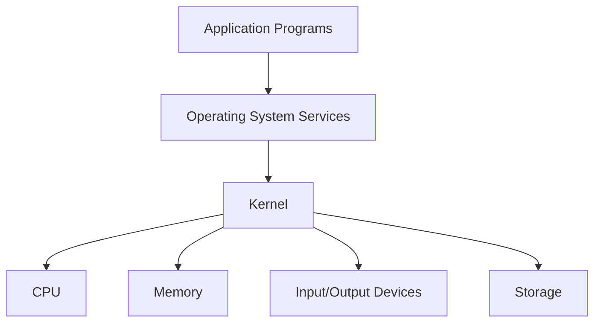

### Basic Features of a Kernel

1. **Process Management:** Manages processes and CPU scheduling.
2. **Memory Management:** Allocates and manages memory.
3. **Device Management:** Controls hardware devices.
4. **File Management:** Provides access to storage and files.
5. **System Calls:** Provides an interface between applications and operating system services.

---

## Q5. What is the difference between Process, Program, and Software?

| Program                                          | Process                                         | Software                                                |
| ------------------------------------------------ | ----------------------------------------------- | ------------------------------------------------------- |
| A set of instructions written to perform a task. | A program that is currently executing.          | A collection of programs, data, and related components. |
| Passive entity.                                  | Active entity.                                  | General term for computer programs.                     |
| Stored on storage devices.                       | Exists in memory while executing.               | Can include system and application programs.            |
| Example: An executable file stored on disk.      | Example: A running instance of that executable. | Example: An operating system or office suite.           |

### Example

Suppose a text editor is installed on a computer.

```text
Installed executable  -> Program
Running text editor   -> Process
Complete application  -> Software
```

---

# Section B

## Q1. Explain the Layered Structure of an Operating System with a Neat Diagram. Discuss the Major Components of an Operating System and Explain How They Interact with Hardware and Application Programs.

A **layered operating system** divides the operating system into different levels. Each layer provides services to the layer above it and uses services from the layer below it.

### Layered Structure

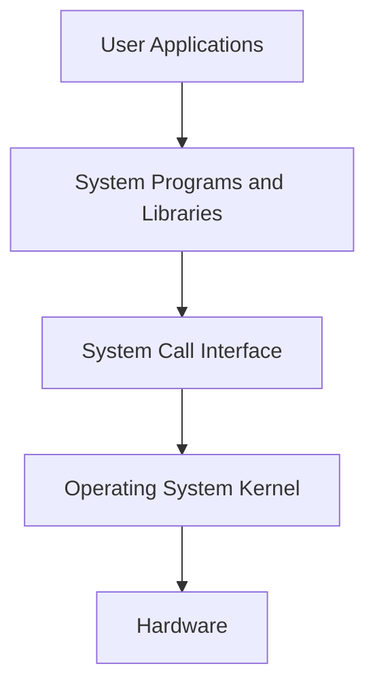

A more detailed view of the major OS components is:

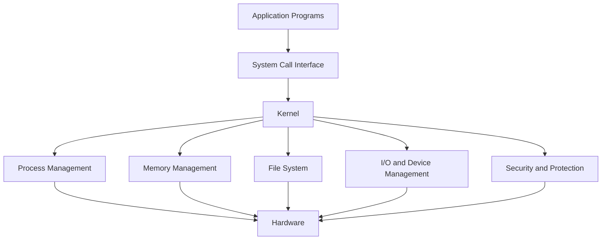

### Major Components

#### 1. Process Management

It manages processes and allocates CPU resources among them.

#### 2. Memory Management

It keeps track of memory usage and allocates memory to processes.

#### 3. File Management

It manages files and directories stored on secondary storage.

#### 4. I/O and Device Management

It manages input/output devices through device drivers.

#### 5. Security and Protection

It controls access to system resources and protects data from unauthorized access.

#### 6. System Call Interface

It provides a controlled interface through which application programs request services from the operating system.

### Interaction with Hardware and Applications

Application programs do not normally access hardware directly. They request services from the OS through system calls. The kernel processes these requests and communicates with the appropriate hardware.

```text
Application
     |
     v
System Call
     |
     v
Operating System Kernel
     |
     v
Hardware
```

Thus, the layered structure provides organization, abstraction, protection, and easier management of the operating system.

---

## Q2. Discuss in Brief: System Calls and Different Components of System Call with a Labelled Diagram.

A **system call** is a mechanism through which a user-level program requests a service from the operating system kernel.

Applications use system calls when they need operations such as creating processes, accessing files, allocating memory, or communicating with devices.

### System Call Flow

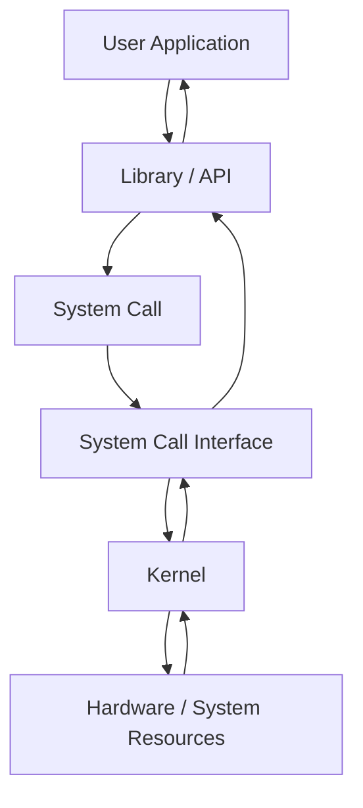

### Components Involved in a System Call

#### 1. User Application

The application requests an operating system service.

#### 2. API or Library Function

The application commonly uses an API or library function that provides a convenient interface to the system call.

#### 3. System Call Interface

It provides the boundary between user-level programs and the kernel.

#### 4. Kernel

The kernel receives and processes the request and performs the required operation.

#### 5. Hardware and System Resources

The kernel may access the CPU, memory, files, or I/O devices to fulfill the request.

### Major Types of System Calls

1. **Process Control:** Create, execute, and terminate processes.
2. **File Management:** Open, read, write, and close files.
3. **Device Management:** Request and release devices.
4. **Memory Management:** Allocate and manage memory.
5. **Communication:** Enable processes to exchange information.
6. **Protection:** Control access to system resources.

System calls provide a controlled method for applications to access operating system services.

---

## Q3. Consider an Operating System that Allows Multiple Users to Execute Programs Simultaneously. Explain How Multiuser, Multiprogramming, and Multitasking Concepts Are Related.

These three concepts are related but describe different aspects of operating system operation.

### 1. Multiuser

A **multiuser operating system** allows multiple users to use the same computer system or its resources.

For example, multiple users can access a server and execute their programs.

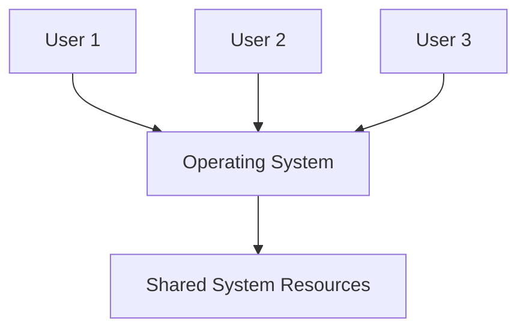

### 2. Multiprogramming

**Multiprogramming** keeps multiple programs in memory at the same time. When one program waits for an I/O operation, the CPU can execute another program.

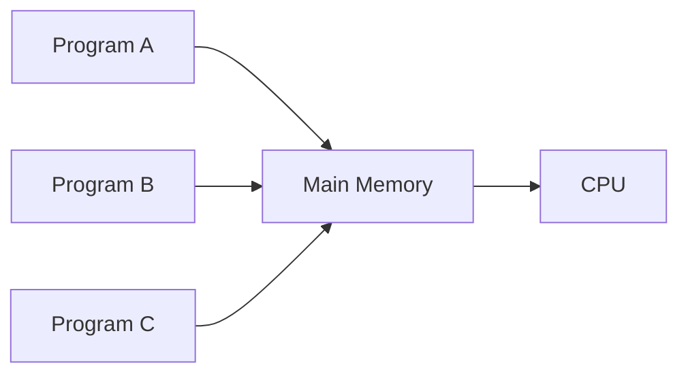

### 3. Multitasking

**Multitasking** allows multiple tasks to make progress during the same period by rapidly switching CPU execution between them.

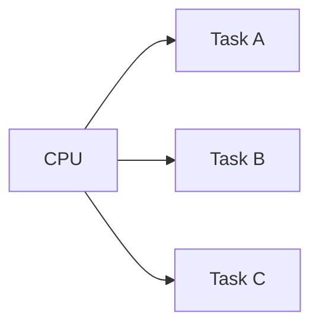

### Relationship

```text
Multiuser
    |
    v
Multiple users run programs
    |
    v
Multiprogramming
    |
    v
Multiple programs kept available for execution
    |
    v
Multitasking
    |
    v
CPU switches among runnable tasks
```

In a multiuser system, several users may run programs simultaneously. Multiprogramming keeps multiple programs available, while multitasking allows the CPU to share execution among active tasks.

---

# Section C

## Q1. Explain How an Operating System Acts as Both a Resource Manager and a Control Program. Explain Different Types of Operating Systems with the Help of a Block Diagram and Examples.

An operating system performs two important roles: **resource manager** and **control program**. The assignment specifically asks for both roles and different types of operating systems. 

## Operating System as a Resource Manager

A computer system has limited resources such as CPU time, memory, storage, and I/O devices. The OS manages these resources and allocates them among different programs.

### Major Resources Managed by the OS

* CPU
* Main memory
* Secondary storage
* Input/output devices
* Files
* Network resources

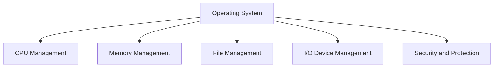

### Example

If several programs need the CPU simultaneously, the operating system uses CPU scheduling to decide which process should execute.

Similarly, it allocates memory to processes and controls access to files and devices.

---

## Operating System as a Control Program

The operating system also acts as a control program by controlling the execution of programs and preventing incorrect or unauthorized use of system resources.

### Functions as a Control Program

1. Controls program execution.
2. Handles errors.
3. Manages hardware devices.
4. Provides protection and security.
5. Controls access to system resources.
6. Prevents processes from interfering improperly with one another.

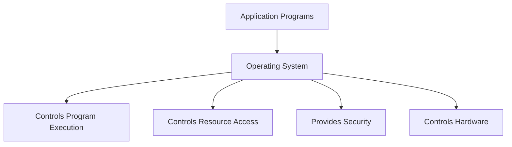

---

# Types of Operating Systems

## 1. Batch Operating System

A batch operating system collects jobs and executes them in batches without requiring continuous user interaction.

**Example:** Early mainframe batch-processing systems.


---

## 2. Multiprogramming Operating System

A multiprogramming OS keeps multiple programs in memory and switches the CPU to another program when the current program is waiting.

**Example:** Early mainframe operating systems supporting multiprogramming.

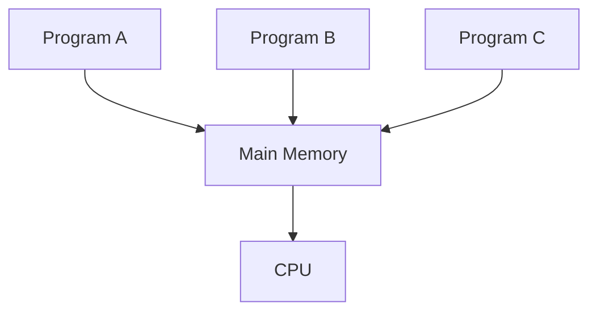

---

## 3. Multitasking Operating System

A multitasking OS allows multiple tasks to make progress by sharing CPU time.

**Examples:**

* Windows
* Linux
* macOS

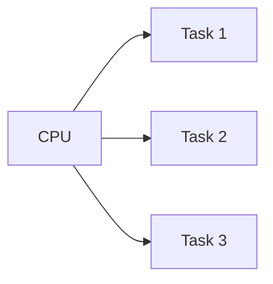

---

## 4. Multiuser Operating System

A multiuser OS allows multiple users to access and use system resources.

**Examples:**

* UNIX
* Linux server systems

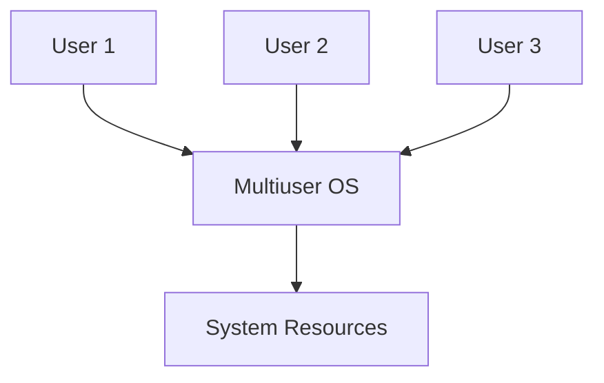

---

## 5. Real-Time Operating System

An RTOS is designed to provide predictable responses within specified time constraints.

**Examples:**

* FreeRTOS
* QNX
* VxWorks

**Applications:**

* Industrial control
* Automotive systems
* Medical equipment
* Embedded systems

---

## 6. Distributed Operating System

A distributed operating system manages resources across multiple connected computers and attempts to provide a coordinated system environment.

**Example:** Distributed computing environments.

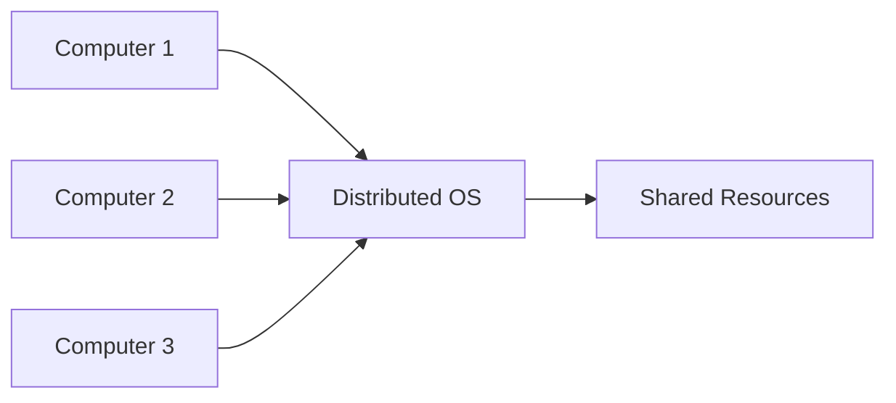

---

## 7. Network Operating System

A network operating system provides services for computers connected through a network.

**Examples:**

* Windows Server
* UNIX/Linux server systems

**Functions:**

* File sharing
* Printer sharing
* User management
* Network security

---

# Summary

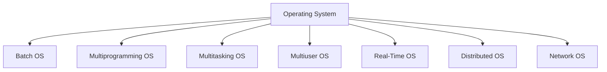

The operating system manages computer resources while also controlling program execution and providing a secure environment for applications.

---

# Q2. Compare Monolithic, Layered, and Microkernel Approaches to OS Design. Discuss the Advantages and Limitations of Each and Identify a Suitable Application Scenario for Each Architecture.

Operating systems can be designed using different architectural approaches. Three important approaches are **Monolithic**, **Layered**, and **Microkernel** architectures. 

## 1. Monolithic Architecture

In a monolithic operating system, most operating system services run together in a large kernel space.

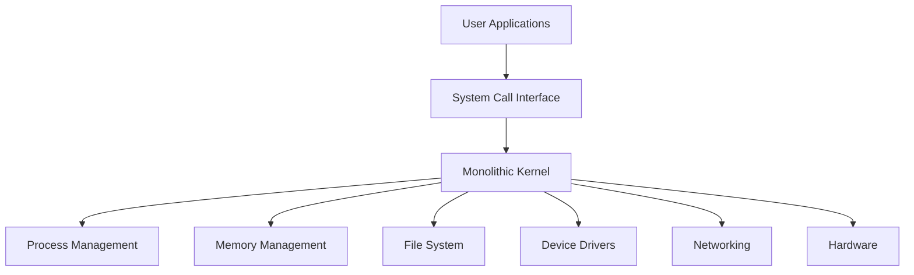

### Advantages

1. High performance because components communicate directly.
2. Efficient access to hardware.
3. Simple communication between kernel components.
4. Suitable for systems requiring high performance.

### Limitations

1. Large kernel size.
2. A bug in one kernel component can affect the entire system.
3. Difficult to maintain as the kernel becomes large.
4. Less isolation between components.

### Suitable Application

General-purpose operating systems where high performance is important can use a monolithic or largely monolithic kernel design.

---

## 2. Layered Architecture

In a layered architecture, the OS is divided into layers. Each layer uses services provided by the layer below it.

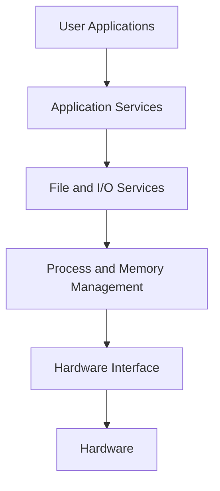

### Advantages

1. Easy to understand.
2. Easier debugging and testing.
3. Better modularity.
4. Changes to one layer can be isolated from other layers.

### Limitations

1. Defining proper layers can be difficult.
2. Additional layer boundaries may introduce overhead.
3. Some functions do not fit naturally into a single layer.

### Suitable Application

Layered architecture is useful for educational systems, structured OS designs, and systems where modularity and maintainability are important.

---

## 3. Microkernel Architecture

A microkernel keeps only essential services inside the kernel. Other services such as file systems and device drivers can run outside the kernel as separate processes or servers.

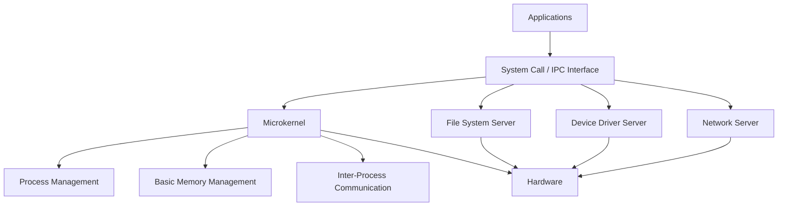

### Advantages

1. Small and modular kernel.
2. Better fault isolation.
3. Improved security.
4. Easier to extend and maintain.
5. Services can run separately from the core kernel.

### Limitations

1. Communication between components can introduce overhead.
2. Design and implementation can be complex.
3. Frequent inter-process communication may reduce performance.

### Suitable Application

Microkernel architectures are suitable for systems requiring reliability, modularity, and strong isolation, such as some embedded, real-time, and security-critical systems.

---

## Comparison

| Feature           | Monolithic                           | Layered                        | Microkernel                           |
| ----------------- | ------------------------------------ | ------------------------------ | ------------------------------------- |
| Kernel Size       | Large                                | Structured into layers         | Small                                 |
| Organization      | Components mostly inside kernel      | Multiple layers                | Minimal kernel with external services |
| Performance       | Generally high                       | Moderate to high               | Can have IPC overhead                 |
| Fault Isolation   | Lower                                | Moderate                       | High                                  |
| Maintainability   | More difficult                       | Easier                         | Easier                                |
| Security          | Depends heavily on kernel design     | Structured                     | Strong isolation possible             |
| Complexity        | Large kernel can become complex      | Easier to understand           | More complex communication            |
| Suitable Scenario | Performance-oriented general systems | Structured and modular systems | Reliable and isolated systems         |

---

# Q3. Define Threads. Differentiate Between Multiprocessing and Multithreading in Terms of Execution Units, Resource Sharing, Performance, and Failure Impact.

A **thread** is the smallest unit of CPU execution within a process. A process can contain one or multiple threads.

Threads belonging to the same process share many resources, such as the process's memory space and open resources, while each thread has its own execution state, including a program counter and stack.

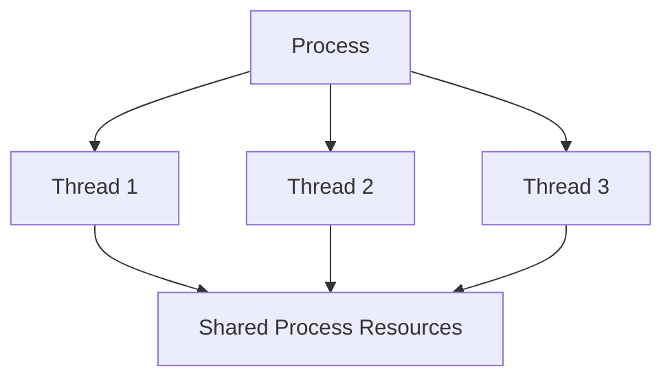

## Multiprocessing

Multiprocessing uses two or more processors or CPU cores to execute processes concurrently.

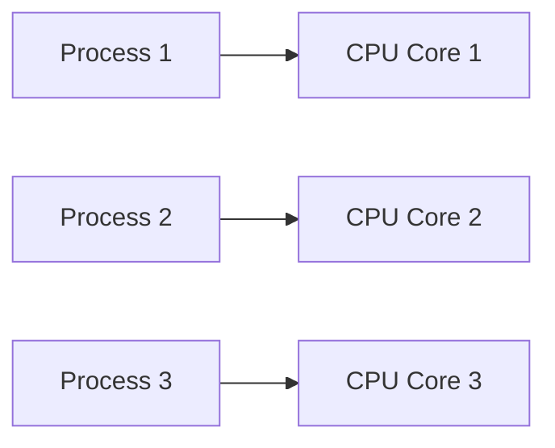

Each process generally has its own address space.

## Multithreading

Multithreading allows multiple threads within a process to execute concurrently.

```mermaid
flowchart LR
    P[Single Process] --> T1[Thread 1]
    P --> T2[Thread 2]
    P --> T3[Thread 3]
```

Threads within the same process share the process's address space and many other resources.

---

## Multiprocessing vs Multithreading

| Feature             | Multiprocessing                                                   | Multithreading                                         |
| ------------------- | ----------------------------------------------------------------- | ------------------------------------------------------ |
| Execution Unit      | Processes                                                         | Threads                                                |
| Number of Processes | Multiple processes                                                | Usually one process containing multiple threads        |
| Resource Sharing    | Processes generally have separate address spaces                  | Threads share the process address space                |
| Memory Usage        | Generally higher                                                  | Generally lower                                        |
| Communication       | Requires inter-process communication mechanisms                   | Can communicate through shared process memory          |
| Creation Overhead   | Generally higher                                                  | Generally lower                                        |
| Context Switching   | Generally more expensive                                          | Generally less expensive                               |
| Performance         | Good for CPU-intensive parallel workloads on multiple cores       | Good for concurrent tasks within the same application  |
| Failure Impact      | Failure of one process is generally isolated from other processes | A serious thread failure can affect the entire process |
| Example             | Running independent programs on multiple CPU cores                | Browser tabs/tasks or server worker threads            |

### Execution

In multiprocessing:

```text
CPU Core 1 -> Process A
CPU Core 2 -> Process B
CPU Core 3 -> Process C
```

In multithreading:

```text
Process A
    |
    +-> Thread 1
    +-> Thread 2
    +-> Thread 3
```

### Resource Sharing

In multiprocessing, processes normally have separate address spaces, which provides stronger isolation.

In multithreading, threads belonging to the same process share memory and other process-level resources. This makes communication faster but requires careful synchronization.

### Performance

Multiprocessing can provide true parallel execution across multiple CPU cores and is particularly useful for independent CPU-intensive tasks.

Multithreading can improve responsiveness and concurrency within an application while usually requiring less memory and creation overhead than separate processes.

### Failure Impact

Processes generally provide better fault isolation because one process can fail without necessarily terminating other processes.

Threads share the same process resources, so a serious failure in one thread can potentially terminate or corrupt the entire process.

### Conclusion

Multiprocessing is suitable when independent processes need strong isolation and parallel execution, while multithreading is suitable when multiple related tasks need to work concurrently while sharing resources within the same application.

