# Operating System — Assignment #2

**B.Tech. (Computer Science and Engineering)**
**Semester:** III
**Subject:** Operating System
**Subject Code:** BCO 0008A
**Unit:** 2
**Marks:** 64

This solution follows the questions and process data given in the uploaded Assignment #2. 

---

# Section A

## A1. State the difference between Process and Program.

A **program** is a passive set of instructions stored on a storage device, whereas a **process** is a program that is currently being executed.

For example, a C++ executable stored on disk is a program. When that executable is loaded into memory and starts running, it becomes a process.

| Program                                    | Process                                                              |
| ------------------------------------------ | -------------------------------------------------------------------- |
| Passive entity.                            | Active entity.                                                       |
| Stored on secondary storage.               | Resides in main memory while executing.                              |
| Contains instructions.                     | Contains instructions, data, program counter, registers, stack, etc. |
| Does not have an execution state.          | Has states such as Ready, Running and Waiting.                       |
| One program can create multiple processes. | A process is an executing instance of a program.                     |

Therefore:

$$
\boxed{\text{Program = passive set of instructions}}
$$

$$
\boxed{\text{Process = program in execution}}
$$

---

## A2. Define Starvation.

**Starvation** is a situation in which a process waits indefinitely because the CPU or required resources are repeatedly allocated to other processes.

It commonly occurs in priority scheduling when a low-priority process continuously remains behind higher-priority processes.

For example, if processes with priorities \(1,2,3,\ldots\) are continuously arriving and priority \(1\) represents the highest priority, a process with priority \(10\) may keep waiting.

Thus:

$$
\boxed{\text{Starvation = indefinite waiting for CPU or required resources}}
$$

A common solution is **aging**, in which the priority of a waiting process is gradually increased.

---

## A3. Define the following terms.

### (a) Burst Time

**Burst Time** is the total amount of CPU time required by a process for its execution.

It is usually denoted by:

$$
\boxed{BT}
$$

---

### (b) Waiting Time

**Waiting Time** is the total time a process spends waiting in the ready queue for CPU allocation.

It is denoted by:

$$
\boxed{WT}
$$

The relation is:

$$
\boxed{WT=TAT-BT}
$$

---

### (c) Turnaround Time

**Turnaround Time** is the total time from the arrival of a process until its completion.

$$
\boxed{TAT=CT-AT}
$$

where:

* \(CT\) = Completion Time
* \(AT\) = Arrival Time

---

### (d) Arrival Time

**Arrival Time** is the time at which a process enters the ready queue and becomes available for execution.

It is denoted by:

$$
\boxed{AT}
$$

---

## A4. What is a Dispatcher?

The **dispatcher** is an operating-system component that gives control of the CPU to the process selected by the short-term scheduler.

Its main functions include:

1. Performing the context switch.
2. Switching the CPU from kernel mode to user mode when required.
3. Starting or resuming execution of the selected process.

The time required by the dispatcher to stop one process and start another is called **dispatch latency**.

$$
\boxed{\text{Dispatcher = component that transfers CPU control to the selected process}}
$$

---

## A5. State the difference between Preemptive and Non-Preemptive Scheduling.

| Preemptive Scheduling                             | Non-Preemptive Scheduling                                               |
| ------------------------------------------------- | ----------------------------------------------------------------------- |
| A running process can be interrupted by the OS.   | A running process normally keeps the CPU until it terminates or blocks. |
| CPU can be taken away from a process.             | CPU is not forcibly taken away.                                         |
| Better responsiveness for interactive systems.    | Simpler to implement.                                                   |
| Context switching may occur more frequently.      | Usually fewer forced context switches.                                  |
| Examples: Round Robin, Preemptive Priority, SRTF. | Examples: FCFS, Non-Preemptive SJF, Non-Preemptive Priority.            |

---

# Section B

## B1. Given the following processes, calculate average waiting time and average turnaround time using SJF Preemptive, Preemptive Priority and Round Robin with \(q=2\) ms.

The process information is given in the assignment as follows. 

| Process | Arrival Time | Burst Time | Priority |
| ------- | -----------: | ---------: | -------: |
| \(P_1\) |            3 |          1 |        5 |
| \(P_2\) |            1 |          4 |        3 |
| \(P_3\) |            4 |          9 |        4 |
| \(P_4\) |            0 |          6 |        2 |
| \(P_5\) |            2 |          5 |        1 |

### Formulae Used

$$
\boxed{TAT=CT-AT}
$$

$$
\boxed{WT=TAT-BT}
$$

For priority scheduling, the standard convention is assumed:

$$
\boxed{\text{Smaller priority number}=\text{higher priority}}
$$

For Round Robin, processes with the same arrival time are initially taken in the order listed.

---

# 1. SJF Preemptive

SJF preemptive is also called **Shortest Remaining Time First (SRTF)**.

### Gantt Chart

```mermaid
gantt
    title SJF Preemptive (SRTF)
    dateFormat  HH:mm
    axisFormat  %H:%M

    section CPU
    P4 :p4, 00:00, 1m
    P2 :p2, 00:01, 2m
    P1 :p1, 00:03, 1m
    P2 :p2b, 00:04, 2m
    P4 :p4b, 00:06, 5m
    P5 :p5, 00:11, 5m
    P3 :p3, 00:16, 9m
```

Thus:

$$
\boxed{0-1:P_4,\quad1-3:P_2,\quad3-4:P_1,\quad4-6:P_2,\quad6-11:P_4,\quad11-16:P_5,\quad16-25:P_3}
$$

### Completion Times

| Process | \(AT\) | \(BT\) | \(CT\) |
| ------- | -----: | -----: | -----: |
| \(P_1\) |      3 |      1 |      4 |
| \(P_2\) |      1 |      4 |      6 |
| \(P_3\) |      4 |      9 |     25 |
| \(P_4\) |      0 |      6 |     11 |
| \(P_5\) |      2 |      5 |     16 |

### Waiting and Turnaround Times

For \(P_1\):

$$
TAT=4-3=1
$$

$$
WT=1-1=0
$$

For \(P_2\):

$$
TAT=6-1=5
$$

$$
WT=5-4=1
$$

For \(P_3\):

$$
TAT=25-4=21
$$

$$
WT=21-9=12
$$

For \(P_4\):

$$
TAT=11-0=11
$$

$$
WT=11-6=5
$$

For \(P_5\):

$$
TAT=16-2=14
$$

$$
WT=14-5=9
$$

| Process | \(WT\) | \(TAT\) |
| ------- | -----: | ------: |
| \(P_1\) |      0 |       1 |
| \(P_2\) |      1 |       5 |
| \(P_3\) |     12 |      21 |
| \(P_4\) |      5 |      11 |
| \(P_5\) |      9 |      14 |

Average waiting time:

$$
\frac{0+1+12+5+9}{5}
=
\frac{27}{5}
$$

$$
\boxed{\text{Average WT}=5.4\text{ ms}}
$$

Average turnaround time:

$$
\frac{1+5+21+11+14}{5}
=
\frac{52}{5}
$$

$$
\boxed{\text{Average TAT}=10.4\text{ ms}}
$$

---

# 2. Preemptive Priority Scheduling

Smaller priority number is assumed to mean higher priority.

Priorities:

$$
P_5(1)>P_4(2)>P_2(3)>P_3(4)>P_1(5)
$$

### Gantt Chart

```mermaid
gantt
    title Preemptive Priority Scheduling
    dateFormat  HH:mm
    axisFormat  %H:%M

    section CPU
    P4 :p4, 00:00, 2m
    P5 :p5, 00:02, 5m
    P4 :p4b, 00:07, 4m
    P2 :p2, 00:11, 4m
    P3 :p3, 00:15, 9m
    P1 :p1, 00:24, 1m
```

Therefore:

$$
\boxed{0-2:P_4,\quad2-7:P_5,\quad7-11:P_4,\quad11-15:P_2,\quad15-24:P_3,\quad24-25:P_1}
$$

### Completion Times

| Process | \(AT\) | \(BT\) | Priority | \(CT\) |
| ------- | -----: | -----: | -------: | -----: |
| \(P_1\) |      3 |      1 |        5 |     25 |
| \(P_2\) |      1 |      4 |        3 |     15 |
| \(P_3\) |      4 |      9 |        4 |     24 |
| \(P_4\) |      0 |      6 |        2 |     11 |
| \(P_5\) |      2 |      5 |        1 |      7 |

### Calculations

For \(P_1\):

$$
TAT=25-3=22
$$

$$
WT=22-1=21
$$

For \(P_2\):

$$
TAT=15-1=14
$$

$$
WT=14-4=10
$$

For \(P_3\):

$$
TAT=24-4=20
$$

$$
WT=20-9=11
$$

For \(P_4\):

$$
TAT=11-0=11
$$

$$
WT=11-6=5
$$

For \(P_5\):

$$
TAT=7-2=5
$$

$$
WT=5-5=0
$$

| Process | \(WT\) | \(TAT\) |
| ------- | -----: | ------: |
| \(P_1\) |     21 |      22 |
| \(P_2\) |     10 |      14 |
| \(P_3\) |     11 |      20 |
| \(P_4\) |      5 |      11 |
| \(P_5\) |      0 |       5 |

Average waiting time:

$$
\frac{21+10+11+5+0}{5}
=
\frac{47}{5}
$$

$$
\boxed{\text{Average WT}=9.4\text{ ms}}
$$

Average turnaround time:

$$
\frac{22+14+20+11+5}{5}
=
\frac{72}{5}
$$

$$
\boxed{\text{Average TAT}=14.4\text{ ms}}
$$

---

# 3. Round Robin, Time Quantum \(q=2\) ms

### Gantt Chart

```mermaid
gantt
    title Round Robin Scheduling (q = 2 ms)
    dateFormat  HH:mm
    axisFormat  %H:%M

    section CPU
    P4 :p4, 00:00, 2m
    P2 :p2, 00:02, 2m
    P5 :p5, 00:04, 2m
    P4 :p4b, 00:06, 2m
    P1 :p1, 00:08, 1m
    P3 :p3, 00:09, 2m
    P2 :p2b, 00:11, 2m
    P5 :p5b, 00:13, 2m
    P4 :p4c, 00:15, 2m
    P3 :p3b, 00:17, 2m
    P5 :p5c, 00:19, 1m
    P3 :p3c, 00:20, 2m
    P3 :p3d, 00:22, 2m
    P3 :p3e, 00:24, 1m
```

Thus:

$$
\boxed{
0-2:P_4,\ 
2-4:P_2,\ 
4-6:P_5,\ 
6-8:P_4,\ 
8-9:P_1,\ 
9-11:P_3,\ 
11-13:P_2,\ 
13-15:P_5,
}
$$

$$
\boxed{
15-17:P_4,\ 
17-19:P_3,\ 
19-20:P_5,\ 
20-22:P_3,\ 
22-24:P_3,\ 
24-25:P_3
}
$$

### Completion Times

| Process | \(AT\) | \(BT\) | \(CT\) |
| ------- | -----: | -----: | -----: |
| \(P_1\) |      3 |      1 |      9 |
| \(P_2\) |      1 |      4 |     13 |
| \(P_3\) |      4 |      9 |     25 |
| \(P_4\) |      0 |      6 |     17 |
| \(P_5\) |      2 |      5 |     20 |

### Waiting and Turnaround Times

$$
TAT=CT-AT
$$

$$
WT=TAT-BT
$$

| Process | \(WT\) | \(TAT\) |
| ------- | -----: | ------: |
| \(P_1\) |      5 |       6 |
| \(P_2\) |      8 |      12 |
| \(P_3\) |     12 |      21 |
| \(P_4\) |     11 |      17 |
| \(P_5\) |     13 |      18 |

Average waiting time:

$$
\frac{5+8+12+11+13}{5}
=
\frac{49}{5}
$$

$$
\boxed{\text{Average WT}=9.8\text{ ms}}
$$

Average turnaround time:

$$
\frac{6+12+21+17+18}{5}
=
\frac{74}{5}
$$

$$
\boxed{\text{Average TAT}=14.8\text{ ms}}
$$

### Final Answer

| Scheduling Algorithm |      Average Waiting Time |    Average Turnaround Time |
| -------------------- | ------------------------: | -------------------------: |
| SJF Preemptive       | \(\boxed{5.4\text{ ms}}\) | \(\boxed{10.4\text{ ms}}\) |
| Priority Preemptive  | \(\boxed{9.4\text{ ms}}\) | \(\boxed{14.4\text{ ms}}\) |
| Round Robin, \(q=2\) | \(\boxed{9.8\text{ ms}}\) | \(\boxed{14.8\text{ ms}}\) |

---

## B2. Differentiate between Long-Term, Medium-Term and Short-Term Schedulers.

The assignment asks for comparison based on function and frequency of execution. 

| Feature           | Long-Term Scheduler                                                  | Medium-Term Scheduler                                                 | Short-Term Scheduler                       |
| ----------------- | -------------------------------------------------------------------- | --------------------------------------------------------------------- | ------------------------------------------ |
| Other name        | Job Scheduler                                                        | Swapper                                                               | CPU Scheduler                              |
| Main function     | Selects processes from secondary storage and loads them into memory. | Temporarily removes processes from memory and later brings them back. | Selects a ready process for CPU execution. |
| Controls          | Degree of multiprogramming.                                          | Memory usage and process swapping.                                    | CPU allocation.                            |
| Frequency         | Relatively infrequent.                                               | Less frequent than short-term scheduling.                             | Very frequent.                             |
| Speed requirement | Can be relatively slow.                                              | Moderate.                                                             | Must be very fast.                         |
| Works mainly with | New jobs/processes.                                                  | Suspended/swapped processes.                                          | Ready processes.                           |

### Long-Term Scheduler

It selects jobs from the job pool on secondary storage and admits selected processes into main memory.

### Medium-Term Scheduler

It temporarily removes processes from memory through **swapping** and can later reintroduce them.

### Short-Term Scheduler

It selects one process from the ready queue and allocates the CPU to it.

Therefore:

$$
\boxed{
\text{Long-term: admission}
}
$$

$$
\boxed{
\text{Medium-term: swapping}
}
$$

$$
\boxed{
\text{Short-term: CPU allocation}
}
$$

---

## B3. Explain the Process State Diagram and Context Switching.

The assignment asks for the process-state diagram and an explanation of context switching. 

# Process State Diagram

A process normally passes through several states during its lifetime.

The basic states are:

1. **New** — process is being created.
2. **Ready** — process is waiting for CPU allocation.
3. **Running** — process is currently executing.
4. **Waiting/Blocked** — process is waiting for an event or I/O operation.
5. **Terminated** — process has completed execution.

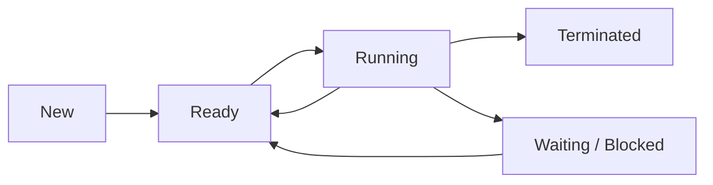

### Important Transitions

**New \(\rightarrow\) Ready**

$$
\text{Process creation and admission}
$$

**Ready \(\rightarrow\) Running**

$$
\text{CPU scheduler selects the process}
$$

**Running \(\rightarrow\) Ready**

$$
\text{Preemption or time quantum expires}
$$

**Running \(\rightarrow\) Waiting**

$$
\text{Process requests I/O or waits for an event}
$$

**Waiting \(\rightarrow\) Ready**

$$
\text{Required event or I/O completes}
$$

**Running \(\rightarrow\) Terminated**

$$
\text{Process finishes execution}
$$

---

# Context Switching

A **context switch** occurs when the CPU stops executing one process and starts executing another.

The OS must save the execution state of the currently running process and load the saved state of the next process.

The process context contains information such as:

* Program Counter (PC)
* CPU registers
* Stack Pointer
* Process state
* Scheduling information
* Memory-management information

### Context-Switch Process

For example:

$$
P_1\rightarrow P_2
$$

The operating system:

1. Saves the context of \(P_1\) in its PCB.
2. Changes the state of \(P_1\).
3. Loads the context of \(P_2\) from its PCB.
4. Gives the CPU to \(P_2\).

### Why is Context Switching Required?

Context switching is required for:

* multitasking,
* CPU scheduling,
* handling interrupts,
* preemptive scheduling,
* switching to another process during I/O waiting.

It allows multiple processes to share a CPU.

However, context switching itself does not perform useful application work, so excessive context switching adds overhead.

---

# Section C

## C1. What is a Thread? Differentiate between User-Level and Kernel-Level Threads. Explain Multithreading Models.

The assignment asks for thread definition, comparison of user- and kernel-level threads, and multithreading models with a diagram. 

## Thread

A **thread** is the smallest unit of CPU execution within a process.

A process may contain one or multiple threads.

Threads of the same process generally share:

$$
\boxed{\text{Code, data, and other process resources}}
$$

while each thread has its own execution-related information such as:

$$
\boxed{\text{Program Counter, registers, and stack}}
$$

For example, a web browser may use separate threads for:

* user interface,
* network operations,
* rendering,
* background tasks.

---

# User-Level Threads vs Kernel-Level Threads

### User-Level Threads

User-level threads are managed by a user-space thread library rather than directly by the operating-system kernel.

### Kernel-Level Threads

Kernel-level threads are managed and scheduled by the operating system kernel.

| User-Level Threads                                                                      | Kernel-Level Threads                                                             |
| --------------------------------------------------------------------------------------- | -------------------------------------------------------------------------------- |
| Managed by a user-level library.                                                        | Managed by the operating system kernel.                                          |
| Kernel may see the process rather than individual user threads, depending on the model. | Kernel directly knows about the threads.                                         |
| Thread operations can be faster because they may not require kernel intervention.       | Thread operations may involve kernel overhead.                                   |
| Blocking system calls can affect the process in many-to-one implementations.            | One blocked thread does not necessarily block other threads of the same process. |
| Scheduling is handled by the thread library in many implementations.                    | Scheduling is performed by the kernel.                                           |

---

# Multithreading Models

The relationship between user threads and kernel threads can be represented using several models.

## 1. Many-to-One Model

Many user-level threads are mapped to a single kernel thread.

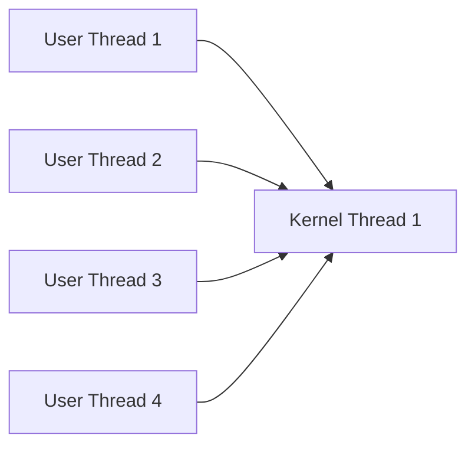

### Characteristics

* Simple implementation.
* Thread management can be fast.
* A blocking system call can block the entire process.
* Cannot achieve true parallel execution on multiple CPU cores through the single kernel thread.

---

## 2. One-to-One Model

Each user thread is mapped to one kernel thread.

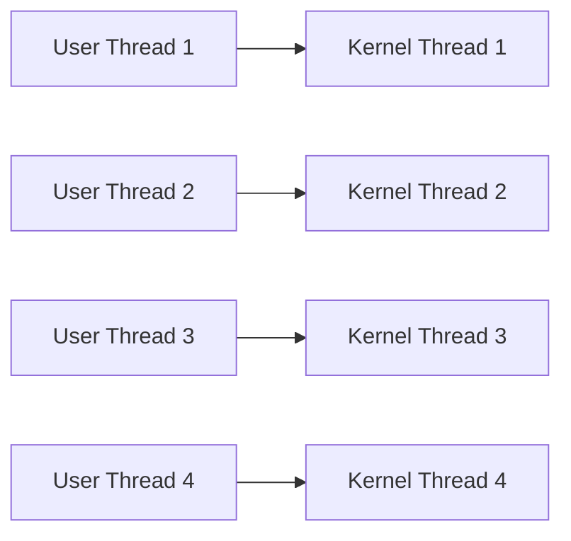

### Characteristics

* Better concurrency.
* One blocked thread does not block all other threads.
* Supports parallel execution on multicore systems.
* Creating many threads can increase kernel overhead.

---

## 3. Many-to-Many Model

Many user threads are mapped onto a smaller or equal number of kernel threads.

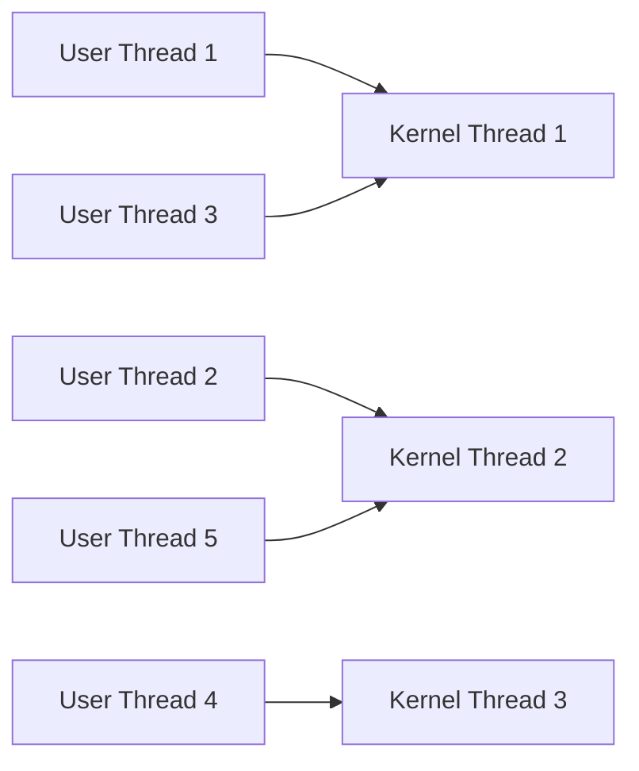

### Characteristics

* Provides flexibility.
* Many user threads can be scheduled over several kernel threads.
* Can support parallelism while avoiding the need for one kernel thread per user thread.

### Summary

$$
\boxed{\text{Many-to-One: Many user threads}\rightarrow\text{one kernel thread}}
$$

$$
\boxed{\text{One-to-One: One user thread}\rightarrow\text{one kernel thread}}
$$

$$
\boxed{\text{Many-to-Many: Many user threads}\rightarrow\text{multiple kernel threads}}
$$

---

# C2. Given the processes below, calculate average waiting time and average turnaround time using FCFS, SJF, Preemptive Priority and Round Robin with \(q=2\).

The process data is given in the assignment as follows. 

| Process | Arrival Time | Priority | Burst Time |
| ------- | -----------: | -------: | ---------: |
| \(P_1\) |            1 |        5 |         11 |
| \(P_2\) |            1 |        2 |          6 |
| \(P_3\) |            6 |        3 |          1 |
| \(P_4\) |            3 |        4 |          6 |
| \(P_5\) |            8 |        1 |          3 |

Again, for priority scheduling:

$$
\boxed{\text{Smaller number}=\text{higher priority}}
$$

For FCFS and Round Robin, when \(P_1\) and \(P_2\) arrive at the same time, \(P_1\) is taken first because it appears first in the question.

The formulas are:

$$
\boxed{TAT=CT-AT}
$$

$$
\boxed{WT=TAT-BT}
$$

---

# 1. FCFS Scheduling

The processes are executed in arrival order:

$$
P_1\rightarrow P_2\rightarrow P_4\rightarrow P_3\rightarrow P_5
$$

CPU is idle from \(0\) to \(1\).

### Gantt Chart

```mermaid
gantt
    title FCFS Scheduling
    dateFormat  HH:mm
    axisFormat  %H:%M

    section CPU
    Idle :idle, 00:00, 1m
    P1 :p1, 00:01, 11m
    P2 :p2, 00:12, 6m
    P4 :p4, 00:18, 6m
    P3 :p3, 00:24, 1m
    P5 :p5, 00:25, 3m
```

### Completion Times

| Process | \(AT\) | \(BT\) | \(CT\) |
| ------- | -----: | -----: | -----: |
| \(P_1\) |      1 |     11 |     12 |
| \(P_2\) |      1 |      6 |     18 |
| \(P_3\) |      6 |      1 |     25 |
| \(P_4\) |      3 |      6 |     24 |
| \(P_5\) |      8 |      3 |     28 |

### Calculations

| Process | \(TAT=CT-AT\) | \(WT=TAT-BT\) |
| ------- | ------------: | ------------: |
| \(P_1\) |   \(12-1=11\) |   \(11-11=0\) |
| \(P_2\) |   \(18-1=17\) |   \(17-6=11\) |
| \(P_3\) |   \(25-6=19\) |   \(19-1=18\) |
| \(P_4\) |   \(24-3=21\) |   \(21-6=15\) |
| \(P_5\) |   \(28-8=20\) |   \(20-3=17\) |

Average waiting time:

$$
\frac{0+11+18+15+17}{5}
=
\frac{61}{5}
$$

$$
\boxed{\text{Average WT}=12.2}
$$

Average turnaround time:

$$
\frac{11+17+19+21+20}{5}
=
\frac{88}{5}
$$

$$
\boxed{\text{Average TAT}=17.6}
$$

---

# 2. SJF Scheduling

Here SJF is taken as **non-preemptive SJF**, since the question separately specifies preemptive priority.

At \(t=1\):

$$
P_1(BT=11),\quad P_2(BT=6)
$$

Therefore \(P_2\) is selected.

At \(t=7\), available processes are \(P_1\), \(P_3\), and \(P_4\), so \(P_3\) with:

$$
BT=1
$$

is selected.

Then \(P_4\), followed by \(P_1\), and finally \(P_5\).

### Gantt Chart

```mermaid
gantt
    title SJF Scheduling
    dateFormat  HH:mm
    axisFormat  %H:%M

    section CPU
    Idle :idle, 00:00, 1m
    P2 :p2, 00:01, 6m
    P3 :p3, 00:07, 1m
    P4 :p4, 00:08, 6m
    P1 :p1, 00:14, 11m
    P5 :p5, 00:25, 3m
```

### Completion Times

| Process | \(AT\) | \(BT\) | \(CT\) |
| ------- | -----: | -----: | -----: |
| \(P_1\) |      1 |     11 |     25 |
| \(P_2\) |      1 |      6 |      7 |
| \(P_3\) |      6 |      1 |      8 |
| \(P_4\) |      3 |      6 |     14 |
| \(P_5\) |      8 |      3 |     28 |

### Waiting and Turnaround

| Process |         \(WT\) | \(TAT\) |
| ------- | -------------: | ------: |
| \(P_1\) | \(25-1-11=13\) |  \(24\) |
| \(P_2\) |    \(7-1-6=0\) |   \(6\) |
| \(P_3\) |    \(8-6-1=1\) |   \(2\) |
| \(P_4\) |   \(14-3-6=5\) |  \(11\) |
| \(P_5\) |  \(28-8-3=17\) |  \(20\) |

Average waiting time:

$$
\frac{13+0+1+5+17}{5}
=
\frac{36}{5}
$$

$$
\boxed{\text{Average WT}=7.2}
$$

Average turnaround time:

$$
\frac{24+6+2+11+20}{5}
=
\frac{63}{5}
$$

$$
\boxed{\text{Average TAT}=12.6}
$$

---

# 3. Preemptive Priority Scheduling

Priority order:

$$
P_5(1)>P_2(2)>P_3(3)>P_4(4)>P_1(5)
$$

### Execution

From \(t=0\) to \(1\):

$$
\text{CPU Idle}
$$

At \(t=1\), \(P_1\) and \(P_2\) arrive. Since \(P_2\) has higher priority:

$$
P_2:1-7
$$

At \(t=6\), \(P_3\) arrives, but:

$$
\text{Priority}(P_2)=2 < 3=\text{Priority}(P_3)
$$

so \(P_2\) continues.

At \(t=7\), \(P_3\), \(P_4\), and \(P_1\) are ready. \(P_3\) has the highest priority:

$$
P_3:7-8
$$

At \(t=8\), \(P_5\) arrives with priority \(1\):

$$
P_5:8-11
$$

Then:

$$
P_4:11-17
$$

Finally:

$$
P_1:17-28
$$

### Gantt Chart

```mermaid
gantt
    title Preemptive Priority Scheduling
    dateFormat  HH:mm
    axisFormat  %H:%M

    section CPU
    Idle :idle, 00:00, 1m
    P2 :p2, 00:01, 6m
    P3 :p3, 00:07, 1m
    P5 :p5, 00:08, 3m
    P4 :p4, 00:11, 6m
    P1 :p1, 00:17, 11m
```

### Completion Times

| Process | \(CT\) |
| ------- | -----: |
| \(P_1\) |     28 |
| \(P_2\) |      7 |
| \(P_3\) |      8 |
| \(P_4\) |     17 |
| \(P_5\) |     11 |

### Calculations

| Process |         \(WT\) | \(TAT\) |
| ------- | -------------: | ------: |
| \(P_1\) | \(28-1-11=16\) |  \(27\) |
| \(P_2\) |    \(7-1-6=0\) |   \(6\) |
| \(P_3\) |    \(8-6-1=1\) |   \(2\) |
| \(P_4\) |   \(17-3-6=8\) |  \(14\) |
| \(P_5\) |   \(11-8-3=0\) |   \(3\) |

Average waiting time:

$$
\frac{16+0+1+8+0}{5}
=
\frac{25}{5}
$$

$$
\boxed{\text{Average WT}=5}
$$

Average turnaround time:

$$
\frac{27+6+2+14+3}{5}
=
\frac{52}{5}
$$

$$
\boxed{\text{Average TAT}=10.4}
$$

---

# 4. Round Robin, \(q=2\)

### Gantt Chart

```mermaid
gantt
    title Round Robin Scheduling (q = 2)
    dateFormat  HH:mm
    axisFormat  %H:%M

    section CPU
    Idle :idle, 00:00, 1m
    P1 :p1, 00:01, 2m
    P2 :p2, 00:03, 2m
    P4 :p4, 00:05, 2m
    P1 :p1b, 00:07, 2m
    P3 :p3, 00:09, 1m
    P2 :p2b, 00:10, 2m
    P4 :p4b, 00:12, 2m
    P5 :p5, 00:14, 2m
    P1 :p1c, 00:16, 2m
    P2 :p2c, 00:18, 2m
    P4 :p4c, 00:20, 2m
    P5 :p5b, 00:22, 1m
    P1 :p1d, 00:23, 2m
    P1 :p1e, 00:25, 2m
    P1 :p1f, 00:27, 2m
    P1 :p1g, 00:29, 1m
```

The resulting completion times are:

| Process | \(CT\) |
| ------- | -----: |
| \(P_1\) |     30 |
| \(P_2\) |     20 |
| \(P_3\) |     11 |
| \(P_4\) |     22 |
| \(P_5\) |     23 |

### Calculations

For \(P_1\):

$$
TAT=30-1=29
$$

$$
WT=29-11=18
$$

For \(P_2\):

$$
TAT=20-1=19
$$

$$
WT=19-6=13
$$

For \(P_3\):

$$
TAT=11-6=5
$$

$$
WT=5-1=4
$$

For \(P_4\):

$$
TAT=22-3=19
$$

$$
WT=19-6=13
$$

For \(P_5\):

$$
TAT=23-8=15
$$

$$
WT=15-3=12
$$

| Process | \(WT\) | \(TAT\) |
| ------- | -----: | ------: |
| \(P_1\) |     18 |      29 |
| \(P_2\) |     13 |      19 |
| \(P_3\) |      4 |       5 |
| \(P_4\) |     13 |      19 |
| \(P_5\) |     12 |      15 |

Average waiting time:

$$
\frac{18+13+4+13+12}{5}
=
\frac{60}{5}
$$

$$
\boxed{\text{Average WT}=12}
$$

Average turnaround time:

$$
\frac{29+19+5+19+15}{5}
=
\frac{87}{5}
$$

$$
\boxed{\text{Average TAT}=17.4}
$$

### Final Comparison

| Algorithm            | Average Waiting Time | Average Turnaround Time |
| -------------------- | -------------------: | ----------------------: |
| FCFS                 |     \(\boxed{12.2}\) |        \(\boxed{17.6}\) |
| SJF                  |      \(\boxed{7.2}\) |        \(\boxed{12.6}\) |
| Preemptive Priority  |      \(\boxed{5.0}\) |        \(\boxed{10.4}\) |
| Round Robin, \(q=2\) |     \(\boxed{12.0}\) |        \(\boxed{17.4}\) |

---

# C3. Explain in Detail: Process Control Block (PCB)

A **Process Control Block (PCB)** is a data structure maintained by the operating system for every process.

It contains all the information required by the OS to manage, schedule, suspend and resume the process.

The assignment specifically asks for a detailed explanation of PCB. 

## PCB Structure

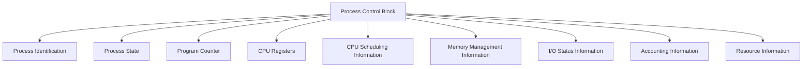

---

## 1. Process Identification

The PCB stores information used to identify the process.

Examples include:

$$
\boxed{PID=\text{Process Identification Number}}
$$

It may also contain the parent process ID and user identification information.

---

## 2. Process State

The current state of the process is stored in the PCB.

Typical states include:

$$
\boxed{\text{New, Ready, Running, Waiting, Terminated}}
$$

For example:

$$
\text{Ready}\rightarrow\text{Running}
$$

when the CPU scheduler selects the process.

---

## 3. Program Counter

The **Program Counter (PC)** stores the address of the next instruction to be executed.

If a process is interrupted, the OS saves the current PC in its PCB so that execution can continue from the correct instruction later.

$$
\boxed{PC=\text{address of next instruction}}
$$

---

## 4. CPU Registers

The PCB stores the values of CPU registers associated with the process.

These may include:

* General-purpose registers
* Stack Pointer
* Status/flag registers
* Instruction-related registers

This information is essential during a context switch.

---

## 5. CPU Scheduling Information

The PCB contains scheduling-related information such as:

* Process priority
* Scheduling-queue information
* Time-related scheduling information
* Other scheduler-specific parameters

For example, in priority scheduling:

$$
\boxed{\text{Priority}=1}
$$

may indicate a high-priority process depending on the scheduling convention.

---

## 6. Memory Management Information

The PCB may contain information about the memory allocated to the process.

Examples include:

* Page tables
* Segment tables
* Base and limit registers
* Address-space information

This allows the operating system to manage the process's memory correctly.

---

## 7. I/O Status Information

The PCB stores information related to the I/O resources used by the process.

This may include:

* Open files
* Allocated I/O devices
* I/O requests
* File descriptors

For example, if a process is waiting for disk I/O, its PCB contains the information needed to track that operation.

---

## 8. Accounting Information

The PCB can contain information used for system accounting and monitoring, such as:

* CPU time used
* Process execution time
* User identification
* Job/account numbers
* Resource usage

This information can help the OS monitor resource consumption.

---

## 9. Resource Information

The PCB may also contain information about resources currently allocated to the process.

For example:

$$
\boxed{\text{Files, memory, I/O devices and other resources}}
$$

---

# PCB and Context Switching

The PCB is particularly important during a **context switch**.

Suppose the CPU changes from:

$$
P_1\rightarrow P_2
$$

The operating system performs approximately the following operations:

The context of \(P_1\), such as:

$$
PC,\quad \text{Registers},\quad \text{Stack Pointer},\quad \text{State}
$$

is saved in \(PCB_1\).

The corresponding context of \(P_2\) is loaded from:

$$
PCB_2
$$

Thus, when \(P_1\) is scheduled again, its previous execution can be resumed.

---

# Importance of PCB

The PCB is essential because the operating system uses it to:

$$
\boxed{\text{Manage processes}}
$$

$$
\boxed{\text{Perform context switching}}
$$

$$
\boxed{\text{Schedule processes}}
$$

$$
\boxed{\text{Track process states}}
$$

$$
\boxed{\text{Manage memory and I/O resources}}
$$

Without a PCB, the OS would not have the required information to suspend, resume, schedule and manage individual processes.

---

# Final Answer Summary

| Topic                          | Key Result                                                     |
| ------------------------------ | -------------------------------------------------------------- |
| Process vs Program             | Process is a program in execution                              |
| Starvation                     | Indefinite waiting for CPU/resource                            |
| Burst Time                     | CPU execution time required                                    |
| Waiting Time                   | \(WT=TAT-BT\)                                                  |
| Turnaround Time                | \(TAT=CT-AT\)                                                  |
| Arrival Time                   | Time at which process enters the ready queue                   |
| Dispatcher                     | Transfers CPU control to selected process                      |
| Preemptive Scheduling          | OS can interrupt a running process                             |
| Non-Preemptive Scheduling      | Running process normally retains CPU until completion/blocking |
| Long-Term Scheduler            | Controls admission of jobs                                     |
| Medium-Term Scheduler          | Performs swapping                                              |
| Short-Term Scheduler           | Selects process for CPU                                        |
| Thread                         | Smallest unit of CPU execution within a process                |
| PCB                            | Data structure containing process-management information       |
| SJF Preemptive, Section B      | Avg WT \(=5.4\), Avg TAT \(=10.4\)                             |
| Priority Preemptive, Section B | Avg WT \(=9.4\), Avg TAT \(=14.4\)                             |
| RR \(q=2\), Section B          | Avg WT \(=9.8\), Avg TAT \(=14.8\)                             |
| FCFS, Section C                | Avg WT \(=12.2\), Avg TAT \(=17.6\)                            |
| SJF, Section C                 | Avg WT \(=7.2\), Avg TAT \(=12.6\)                             |
| Priority Preemptive, Section C | Avg WT \(=5.0\), Avg TAT \(=10.4\)                             |
| RR \(q=2\), Section C          | Avg WT \(=12.0\), Avg TAT \(=17.4\)                            |

